# audio2text

## 王子安同学的实验文档（样例）

### 进展

- [x] 识别语句
  - [x] 测试 Silero torchaudio
    - [x] 生成更多测试数据
  - [x] 测试 whisper
- [x] 解决Punctuation&Capitalization

### 基本思路

找到目前主流的方法，进行效果测试

要求：

- 免费
- python
- 本地化
- 没有次数限制
- 英文为主
- 断句（如果有）
- 满足下游任务其他要求

### 参考

- PyTorch有现成的模块 torchaudio https://pytorch.org/hub/snakers4_silero-models_stt/
- Hugging Face开源的模块 https://huggingface.co/docs/transformers/model_doc/speech_to_text_2

### 简单检索

- openAI whisper [Models - Hugging Face](https://huggingface.co/models?other=whisper)
- facebook wave2vec [facebook/wav2vec2-base-960h · Hugging Face](https://huggingface.co/facebook/wav2vec2-base-960h)

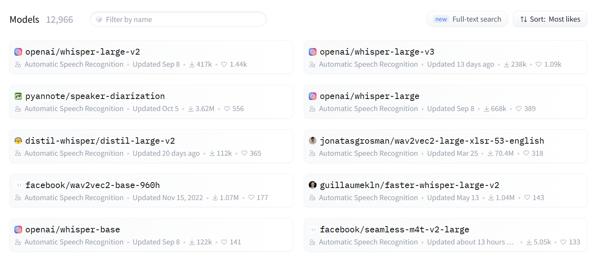

### 下游任务要求

首先本模块应当是作为前置模块来完成转文字工作

因此text方面的要求应当与下游任务一致

一个方法就是尝试查看KIT和HumanML3D中数据集的text，看看其基本要求

 [数据集调研.md](数据集调研.md) 

通过数据集调研，如果仅仅是需要将语音转文本的话，一个主要的要求就是需要有明确的断句，包括逗号（HumanML3D），句号（HumanML3D，KIT）。

一个简单直接的想法：文本-语音-文本查看其效果

### 尝试使用

#### Silero torchaudio

[Silero Speech-To-Text Models | PyTorch](https://pytorch.org/hub/snakers4_silero-models_stt/)

感觉已经非常完善了

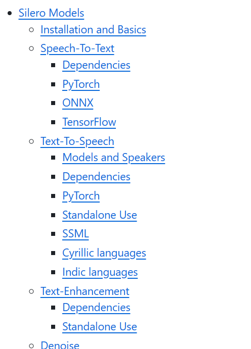

包含的模型如下：

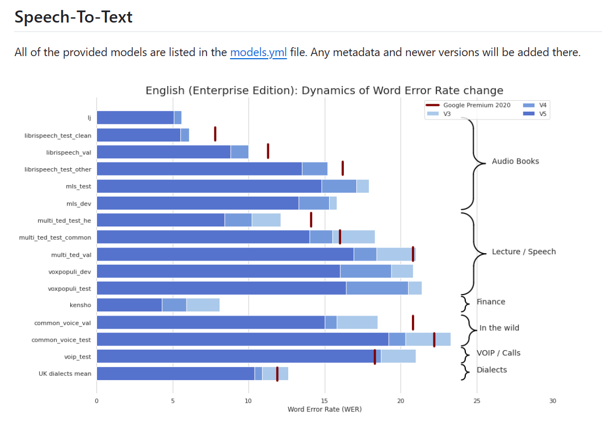

尝试运行示例代码：

[Silero Speech-To-Text Models | PyTorch](https://pytorch.org/hub/snakers4_silero-models_stt/)

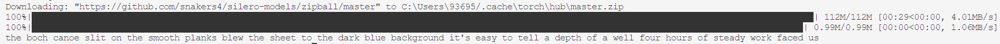

跑起来了，但是好像没有断句，尝试更多例子？

尝试将KIT中的一段话转换成voice再转换成text（通过微软clipclamp合成，速度普通）：

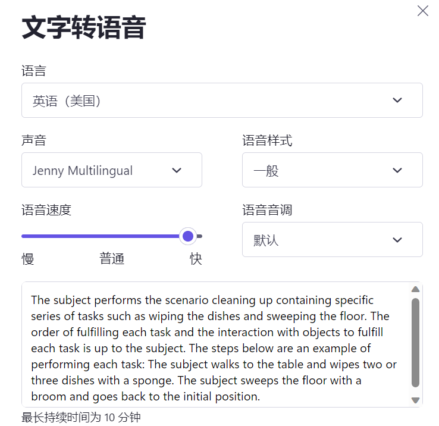

文本来源：KIT，合成：

> The subject performs the scenario cleaning up containing specific series of tasks such as wiping the dishes and sweeping the floor. The order of fulfilling each task and the interaction with objects to fulfill each task is up to the subject. The steps below are an example of performing each task: The subject walks to the table and wipes two or three dishes with a sponge. The subject sweeps the floor with a broom and goes back to the initial position.

结果：

> the subject performs the scenario cleaning up containing specific series of tasks such as wiping the dishes and sweeping the floor the order offulfilling each task and the interaction with objects to fulfill each task is up to the subject the steps below are an example of performing each task the subject walks to the table and wipes two or three dishes with a sponge the subject weeps thefloorwith a room and goes back to the initial position

一些空格部分没有处理好，没有断句，没有首字母大写，也就是说除了Punctuation&Capitalization之外还有分词不清晰的问题（offulfilling）

#### whisper

官方repo：

[openai/whisper: Robust Speech Recognition via Large-Scale Weak Supervision (github.com)](https://github.com/openai/whisper)

follow这篇：

[Using OpenAI whisper python library for speech to text. | by Jagdish Kharatmol | Medium](https://medium.com/@kharatmoljagdish/using-openai-whisper-python-library-for-speech-to-text-dda4f558fccc)

出现问题：

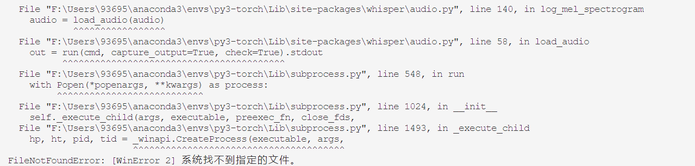

首先好像是load_audio出现问题，采用相对路径以及绝对路径均失败，感觉是_execute_child部分的参数传递有误，尝试更换平台为：

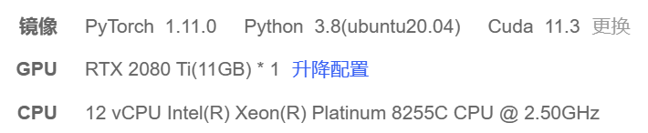

模型选择为base

input（合成）:

> The subject performs the scenario cleaning up containing specific series of tasks such as wiping the dishes and sweeping the floor. The order of fulfilling each task and the interaction with objects to fulfill each task is up to the subject. The steps below are an example of performing each task: The subject walks to the table and wipes two or three dishes with a sponge. The subject sweeps the floor with a broom and goes back to the initial position.

output:

> The text in video:
> The subject performs the scenario cleaning up containing specific series of tasks such as wiping the dishes and sweeping the floor. The order of fulfilling each task and the interaction with objects to fulfill each task is up to the subject. The steps below are an example of performing each task, the subject walks to the table and wipes two or three dishes with a sponge. The subject sweeps the floor with a broom and goes back to the initial position.

大写，断句均无误（除了冒号，但是冒号换成逗号可能影响较小）

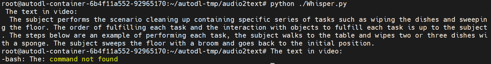

尝试构造更多例子？如逗号、非合成等。

input（合成，文本来自HumanML3D16）：

> while holding their left arm in the air, a person makes a single sawing motion with their right hand.

output:

>  While holding their left arm in the air, a person makes a single-song motion with their right hand.

单词出现错误

采用400MB模型则无误：

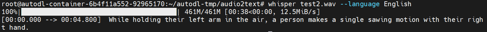

尝试对不同模型尺寸进行结果探究：

官网模型列表

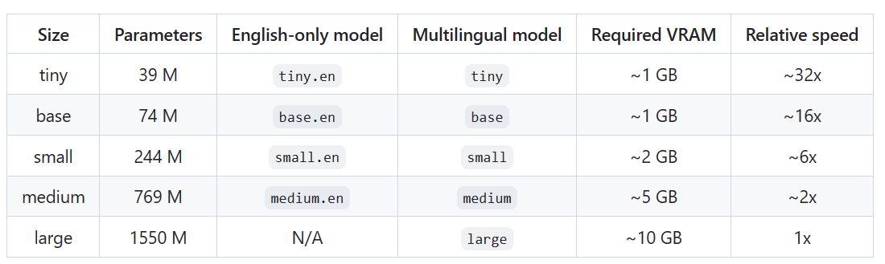

结果（通过whisper指令）：

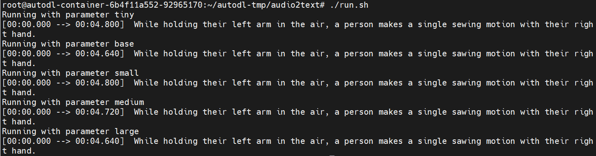

可以看到，仅有tiny出错了

结果（通过python代码）：

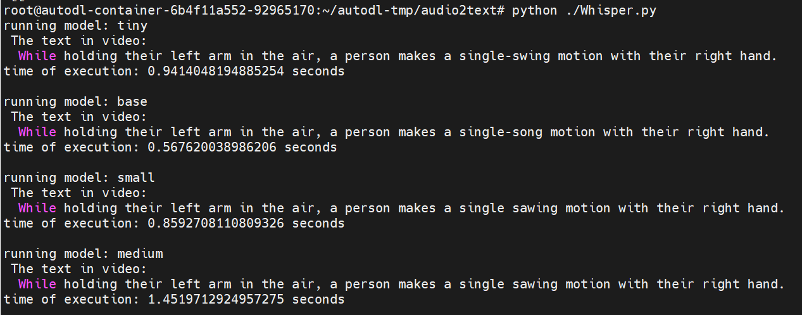

可以看到结果不同，同时large直接爆显存了，而命令则未出现该问题。怀疑是因为通过指令运行是通过CPU

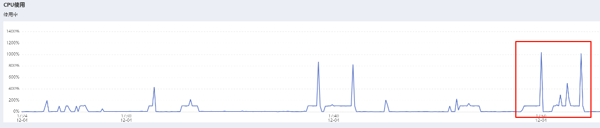

观察CPU执行，基本可以确定

不管如何，基本可以确定small以及medium对于该案例能够提升准确率

查看相关论文

[whisper.pdf (openai.com)](https://cdn.openai.com/papers/whisper.pdf)

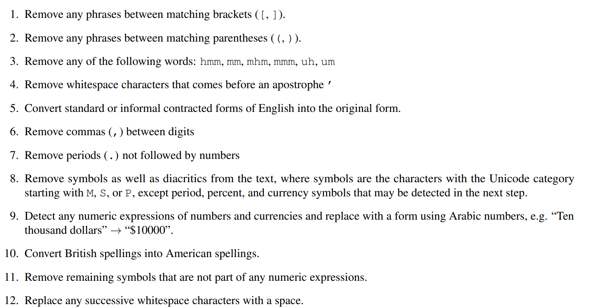

对于format也有较为系统的考虑，感觉还是比较靠谱的

#### wav2vec

该模型将音频转换为词，其结果和Silero torchaudio类似

input:

> The subject performs the scenario cleaning up containing specific series of tasks such as wiping the dishes and sweeping the floor. The order of fulfilling each task and the interaction with objects to fulfill each task is up to the subject. The steps below are an example of performing each task: The subject walks to the table and wipes two or three dishes with a sponge. The subject sweeps the floor with a broom and goes back to the initial position.

output:

> THE SUBJECT PERFORMS THE SCENARIO CLEANING UP CONTAINING SPECIFIC SERIES OF TASKS SUCH AS WIPING THE DISHES AND SWEEPING THE FLOOR THE ORDER OF FULFILLING EACH TASK AND THE INTERACTION WITH OBJECTS TO FULFILL EACH TASK IS UP TO THE SUBJECT THE STEPS BELOW ARE AN EXAMPLE OF PERFORMING EACH TASK THE SUBJECT WALKS TO THE TABLE AND WIPES TWO OR THREE DISHES WITH A SPONGE THE SUBJECT SWEEPS THE FLOOR WITH A BROOM AND GOES BACK TO THE INITIAL POSITION

### 集中测试

针对多种可能的潜在使用条件进行测试。

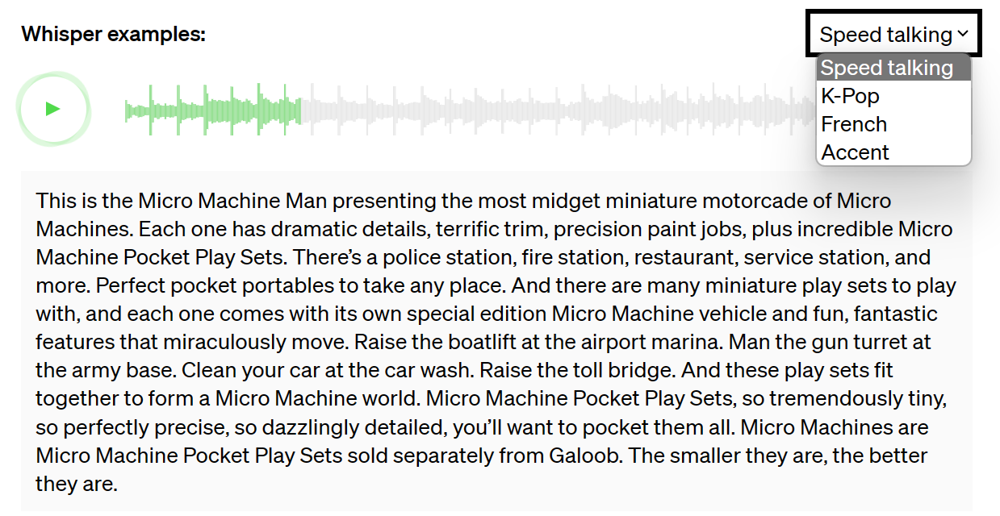

官网已经给出了诸如高速阅读，带有噪声（K-Pop），多语言以及带有口音的应用场景了，感觉简单测试一下应该就行。

合成：

input:

> The subject performs the scenario cleaning up containing specific series of tasks such as wiping the dishes and sweeping the floor. The order of fulfilling each task and the interaction with objects to fulfill each task is up to the subject. The steps below are an example of performing each task: The subject walks to the table and wipes two or three dishes with a sponge. The subject sweeps the floor with a broom and goes back to the initial position.

output:

> The subject performs the scenario cleaning up continuous specific series of tasks, such as wiping the dishes and sweeping the floor. The order of fulfilling each task and their interaction with objects to fulfill each task is up to the subject. The steps below are an example of performing each task. The subject walks through the table and wipes two or three dishes with a sponge. The subject is briefed through the floor with a broom and goes back to the initial position.

自己录了一段：

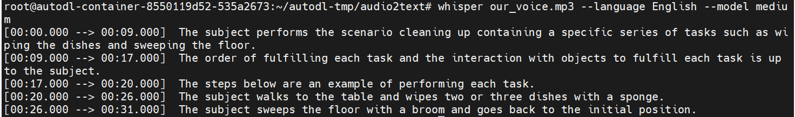

> The subject performs the scenario cleaning up containing a specific series of tasks such as wiping the dishes and sweeping the floor.
> The order of fulfilling each task and the interaction with objects to fulfill each task is up to the subject.
> The steps below are an example of performing each task.
> The subject walks to the table and wipes two or three dishes with a sponge.
> The subject sweeps the floor with a broom and goes back to the initial position.

整体意思上没什么问题，除了一个冠词a

用代码跑：

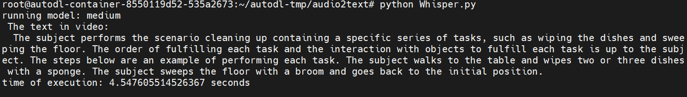

两倍速（通过clip clamp）：

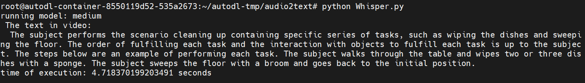

> The subject performs the scenario cleaning up containing specific series of tasks, such as wiping the dishes and sweeping the floor. The order of fulfilling each task and the interaction with objects to fulfill each task is up to the subject. The steps below are an example of performing each task. The subject walks through the table and wipes two or three dishes with a sponge. The subject sweeps the floor with a broom and goes back to the initial position.

没问题

2x+非常吵BGM模拟最极端情况：

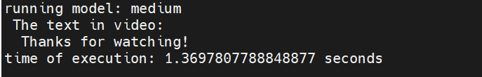

识别失败

将背景音乐降到25%：

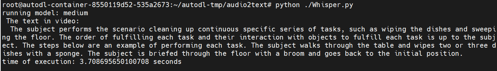

> The subject performs the scenario cleaning up continuous specific series of tasks, such as wiping the dishes and sweeping the floor. The order of fulfilling each task and their interaction with objects to fulfill each task is up to the subject. The steps below are an example of performing each task. The subject walks through the table and wipes two or three dishes with a sponge. The subject is briefed through the floor with a broom and goes back to the initial position.

识别出来后部分语义强相关的动作丢失（如最后一句的sweep）

测试结果汇总：

| 条件                  | 文本来源  | 模型    | 模型尺寸 | 结果                                 |
| --------------------- | --------- | ------- | -------- | ------------------------------------ |
| 合成声音              | KIT       | Silero  |          | 部分空格出现问题，无断句和首字母大写 |
| 合成声音              | KIT       | Wav2vec |          | 仅词，无断句和首字母大写             |
| 合成声音              | HumanML3D | Whisper | all      | base及以上无错，其他有单词错误       |
| 合成声音              | KIT       | Whisper | medium   | good                                 |
| 自己念                | KIT       | Whisper | medium   | 冠词错误                             |
| 自己念2x              | KIT       | Whisper | medium   | good                                 |
| 自己念2x+BGM 100%音量 | KIT       | Whisper | medium   | 识别失败                             |
| 自己念2x+BGM 25%音量  | KIT       | Whisper | medium   | BMG强烈时识别内容错误                |

### Punctuation&Capitalization问题

#### 调研

[The Complete Guide to Punctuation & Capitalization in Speech-to-Text - Deepgram Blog ⚡️ | Deepgram](https://deepgram.com/learn/complete-guide-punctuation-capitalization-speech-to-text)

#### workaround

Google API：

[获取自动加注标点符号功能  | Cloud Speech-to-Text 文档  | Google Cloud](https://cloud.google.com/speech-to-text/docs/automatic-punctuation?hl=zh-cn#speech_transcribe_auto_punctuation-python)

