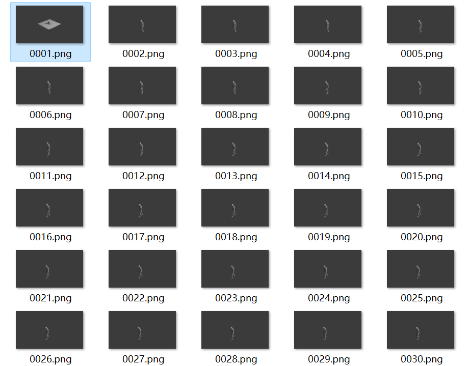

# motion-diffusion-model复现

## 王子安同学的实验文档（样例）

考虑到该仓库中含有渲染的代码，复现这个工作对渲染整体过程的了解是有益的

### 地址

[GuyTevet/motion-diffusion-model: The official PyTorch implementation of the paper "Human Motion Diffusion Model" (github.com)](https://github.com/GuyTevet/motion-diffusion-model)

### 试运行

装库，跑

```
python -m sample.generate --model_path ./save/humanml_trans_enc_512/model000200000.pt --text_prompt "the person walked forward and is picking up his toolbox."
```

出现问题：


怀疑可能是版本问题

[安装 跨模态模型CLIP 或是遇到 AttributeError: module ‘clip‘ has no attribute ‘load‘_attributeerror: module 'clip' has no attribute 'lo-CSDN博客](https://blog.csdn.net/qq_39454370/article/details/127587646)

需要安装的是openai的clip而非"clip"库

换：`pip3 install clip-by-openai`


[解决CUDA error: no kernel image is available for execution on the device-CSDN博客](https://blog.csdn.net/HPGaa/article/details/117230868)

CUDA版本和显卡版本也要匹配

重新根据库内容进行安装

```
pip install git+https://github.com/openai/CLIP.git
```


尝试渲染3D视频

`python -m visualize.render_mesh --input_path /path/to/mp4/stick/figure/file`

`python -m visualize.render_mesh --input_path /root/autodl-tmp/motion-diffusion-model/save/humanml_trans_enc_512/samples_humanml_trans_enc_512_000200000_seed10_the_person_walked_forward_and_is_picking_up_his_toolbox/sample00_rep00.mp4`

```bash
python -m visualize.render_mesh --input_path /root/autodl-tmp/motion-diffusion-model/save/humanml_trans_enc_512/samples_humanml_trans_enc_512_000200000_seed10_the_person_walked_forward_and_is_picking_up_his_toolbox/sample00_rep00.mp4
```


生成了obj！

mesh lab一次性导入所有obj：


可以看到成功导入

#### blender渲染

试图通过blender对其进行渲染

首先需要将一系列obj文件导入：

[OBJ Sequence to animation / OBJ Sequence to Alembic (in Blender) (youtube.com)](https://www.youtube.com/watch?v=KRxDyloJRYU)

而后渲染成动画

[How to Render Your 3d Animation to a Video File (Blender Tutorial) (youtube.com)](https://www.youtube.com/watch?v=OENbinegV2c)

得到结果，一系列png：



修改输出格式：


得到mkv视频

转gif


#### pyrender渲染

[User Guide — pyrender 0.1.45 documentation](https://pyrender.readthedocs.io/en/latest/examples/index.html)


本机上pip安装就不行，必须通过conda

`conda install decorator`


#### openDR 渲染

openDR是可微的渲染器

paper:

[OpenDR: An Approximate Differentiable Renderer - The Robotics Institute Carnegie Mellon University (cmu.edu)](https://www.ri.cmu.edu/event/opendr-an-approximate-differentiable-renderer/)

github:

[Home · mattloper/opendr Wiki (github.com)](https://github.com/mattloper/opendr/wiki)

#### 代码解读

##### 输入

首先研究一下渲染的输入results.npy

首先它是一个字典，包含三个sample的结果

dict_keys(['motion', 'text', 'lengths', 'num_samples', 'num_repetitions'])

motion的尺寸：(3, 22, 3, 196)

length：120

它其中保存的是什么数据呢？


根据vis_utils.py中：

```python
self.num_frames = self.motions['motion'][self.absl_idx].shape[-1]
```

推测，最后一维应当是frame的数量

根据：

```python
motion_tensor, opt_dict = self.j2s.joint2smpl(self.motions['motion'][self.absl_idx].transpose(2, 0, 1))  # [nframes, njoints, 3]
```

得到证实

基于vis_utils.py中：

```python
self.bs, self.njoints, self.nfeats, self.nframes = self.motions['motion'].shape
```

那么四个维度分别为batchsize，joint_num, feature_num, frame

##### 输出

希望通过代码将obj的生成部分进行解读

首先关于输出的数据部分，该脚本的输出包括一个npy文件，eg:`sample00_rep00_smpl_params.npy`

其中包含的data维数：


直接打开出现问题

使用如下方式打开：

`data = np.load("./sample00_rep00_smpl_params.npy", allow_pickle=True)`

结果是个dict，其中：

`dict_keys(['motion', 'thetas', 'root_translation', 'faces', 'vertices', 'text', 'length'])`

不仅含有motion thetas root_translation等参数，还含有faces vertices模型，以及text length生成相关参数

其中，含有多个维度的数据的具体尺寸(length=120)：

| key              | shape                     |
| ---------------- | ------------------------- |
| motion           | (25,6,120)                |
| thetas           | (24,6,120)                |
| root translation | (3,120)                   |
| faces            | (13776,3)                 |
| vertices         | torch.size ([6890,3,120]) |


SMPL的顶点数为6890

那么该输出已经涵盖了所有点的数据（这也正常，因为在得到该输出的过程中，已经通过点的计算得到关节点的位置以生成火柴人）

face也好说，由于face数组仅代表geometry的信息，因此不必随着长度发生变化

motion和thetas中的6猜测为如下含义（至少论文**GestureDiffuCLIP- Gesture Diffusion Model with CLIP Latents**）中是：

[最适合深度学习的三维旋转表示 - 知乎 (zhihu.com)](https://zhuanlan.zhihu.com/p/103893075)

但是并不是：

[SMPL Human Model Introduction - Software Developer (khanhha.github.io)](https://khanhha.github.io/posts/SMPL-model-introduction/)


按理来说theta应当是24x3轴角表示的旋转

motion中的25和thetas中的24是什么含义呢

##### 算法

尝试对整个算法流程进行解读，对于feature维度为3的情况：


theta的来源是SMPLify3D的返回值，而输入至joint2smpl的数据形状为：(196, 22, 3)


也就是说，此处的motion是thetas+root_loc合成的数据

通过matrix_to_rotation_6d这个方式得到6维表达的motion

而后：


最后通过saveobj来保存成obj文件

通过savenpy保存下列内容：

```python
data_dict = {
    'motion': self.motions['motion'][0, :, :, :self.real_num_frames],
    'thetas': self.motions['motion'][0, :-1, :, :self.real_num_frames],
    'root_translation': self.motions['motion'][0, -1, :3, :self.real_num_frames],
    'faces': self.faces,
    'vertices': self.vertices[0, :, :, :self.real_num_frames],
    'text': self.motions['text'][0],
    'length': self.real_num_frames,
}
```


###### joint2smpl

首先，读取motion的第0维frame

根据simplify_loc2rot.py中：

```python
root_loc = torch.tensor(keypoints_3d[:, 0])  # [bs, 3]
```

得知，motion的第二维第一个是root的位置

通过调用SMPLify3D，得到了优化后的joint以及pose,betas，而后将thetas转换为[b,24,3]的形状

而后通过`matrix_to_rotation_6d` 转换为[bs,24,6]

返回的thetas的形状为[1,25,6,196]

其中，第二维包含root_loc以及24个theta

root_loc中，第三维度中，前[0,2]表示root_loc,后[3,5]=0

如下图所示：


###### SMPLify3D

根据其注释：

> """Perform body fitting.
>         Input:
>             init_pose: SMPL pose estimate
>             init_betas: SMPL betas estimate
>             init_cam_t: Camera translation estimate
>             j3d: joints 3d aka keypoints
>             conf_3d: confidence for 3d joints
> 			seq_ind: index of the sequence
>         Returns:
>             vertices: Vertices of optimized shape
>             joints: 3D joints of optimized shape
>             pose: SMPL pose parameters of optimized shape
>             betas: SMPL beta parameters of optimized shape
>             camera_translation: Camera translation
> """

此处pose的形状为：(b,72) （此处b在传入时被赋予了帧数的含义）

该函数的主要作用是将beta/pose等参数传入后生成对应SMPL模型的顶点/关节/pose/beta返回值

在该函数中，为了计算camera-fitting-loss，即渲染后的视频loss，通过优化器来优化camera变换以得到最优的loss

而后，固定camera的位置，调整模型的对齐情况和pose

<u>此处为什么能优化joints？joints不是应当是通过稀疏编码计算出来的么？</u>


###### smplx

该库可以直接将beta,theta转换为对应的顶点

```python
smplx.create(config.SMPL_MODEL_DIR,model_type="smpl", gender="neutral", ext="pkl",batch_size=self.batch_size).to(self.device)
smpl_output = self.smpl(global_orient=global_orient,body_pose=body_pose,betas=betas, return_full_pose=True)
```


