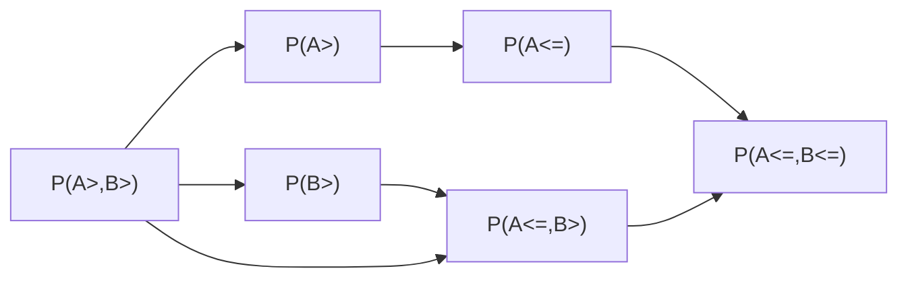

## 资料
视频教程：[随机过程 张颢 2023年春_哔哩哔哩_bilibili](https://www.bilibili.com/video/BV1wj411k7Tj/?spm_id_from=..search-card.all.click&vd_source=510c610b2c7183a3d58c2fa56e23e6d5)
目前看到：[答疑课堂_哔哩哔哩_bilibili](https://www.bilibili.com/video/BV1wj411k7Tj/?p=24&spm_id_from=pageDriver&vd_source=510c610b2c7183a3d58c2fa56e23e6d5)

## 王子安同学的课程学习文档（样例）
## 基本定义
### 随机变量
在概率的代数空间 $`(\Omega,\Sigma,P)`$ 中
定义的一个随机变量
$$
	Z:\Omega \rightarrow \mathbb{R} 
$$
即将样本空间的样本点映射到实数轴上的一个映射，由于样本为实验的结果，其本身并不是数，因此需要通过将其映射到数轴上才能进行研究。

### 随机过程
一组随机变量，着眼于随机变量相互之间的关系和影响。
$$
Z_1,Z_2,\cdots
$$
如果将下标看做时间，则随机过程的过程性就较为明确
不过如果不将下标看做时间，也是随机过程。例如，如果下标是空间，则为随机场 random field
着眼于两种最为重要的关系：相关 co-relation，马尔科夫 Markov，鞅

## 相关

### 基本概念

- 对象：属于同一个概率空间的两个随机变量 $Z,Y$

- 独立：一个对象的取值对另一个取值不影响
  - 概念：$f_{x,y}(x,y)=f_x(x)*f_y(y)$
  - 认知：无论 $x$ 的取值，$y$ 分布不变（考虑随意取 x，则 y 的分布函数都一致）
- 相关：首先非独立，其次有明显的倾向性（同增/同减）

为了探究相关性，引入工具，常见的为度量，度量中常见的为均方度量：
$$
Mean Square=(E(X-Y)^2)^{\frac{1}{2}}=d(X,Y)
$$
其中，$E(X-Y)^2=E(X^2)+E(Y^2)-2E(XY)$

第三项最为重要

- $E(XY)$ 如果：
  - $=E(X)E(Y)$ 独立
  - =0：不相关

另一种定义：
$$
E(X-EX)(Y-EY)=E(XY)-EX*EY
$$
在此不做区分

如果存在不相关且不独立，则能说明相关相比于不独立是更加强的关系，即
$$
\exists X,Y,s.t.\ E(XY)=0,E(X)E(Y)\ne E(XY)
$$
例子如下：$X=sin \theta,Y=cos\theta$，XY相关，不独立

### 相关系数

相关系数：
$$
|\frac{E(XY)}{E(X^2)E(Y^2)}|\le1
$$
即
$$
|E(XY)|\le(E(X^2)E(Y^2))^{\frac{1}{{2}}}
$$
通过柯西不等式能够证明（将相关看做内积）

那么原式化为：
$$
|<X,Y>|\le|<X,X><Y,Y>|^{\frac{1}{2}}
$$
由于内积性质：
$$
g(\alpha)=<\alpha X+Y,\alpha X+Y>
=<X,X>\alpha ^2+2<X,Y>\alpha +<Y,Y>\ge0
$$
关于$\alpha$为二次函数，由于仅有1/0个交点，因此判别式小于等于0，因此有柯西不等式：
$$
|<X,Y>|^{2}\le<X,X><Y,Y>
$$
代换得到上述相关系数结论

参考这个概念，给予相关的几何含义

首先内积->代表角度，那么相关作为随机变量间的内积，那么相关就可以代表随机变量的角度
$$
\angle(X,Y)=arccos(\frac{<X,Y>}{(<X,X><Y,Y>)^{1/2}})=arccos(\frac{EXY}{(EX^2EY^2)^{1/2}})
$$
下面通过一个例子说明以内积看待相关的几何性质如何帮助我们简化问题
首先我们有两个随机变量，$X,Y$，我们希望找到一个$\alpha$，使得$\alpha X$与$Y$最为接近，从代数角度即
$$
min_{\alpha}E(\alpha X-Y)^2\Rightarrow \frac{d}{d\alpha}E(\alpha X-Y)^2=0
$$
求解得到：
$$
\alpha=\frac{E(XY)}{E(X^2)}
$$
从几何角度，则$\alpha X=||Y||cos(\theta)$时，$\alpha X$与$Y$最为接近，其中$\theta$为$X,Y$的夹角，因此：
$$
||\alpha X||=||Y||cos(\theta)=||Y||\frac{<X,Y>}{||X||||Y||}=||\frac{<X,Y>}{||X||^2}X||
$$

### 随机过程中的应用
将随机变量的下标化成连续的
$X(t)$ 是一个连续时间随机过程，实际上，对于每一个 t，都有一个指定的映射（随机变量）
因此实际上可以看成二元函数：$X (\omega, t):\Omega\rightarrow\mathbb{R}$
我们希望研究不同时间上随机变量的关系，定义随机过程的相关函数：
$$
\forall t,s E(X(t)X(s))=R(t,s)
$$
其中，$R(t,s)$ 为相关函数，$R(t,t)$ 为自相关函数
但是它过于复杂，因此我们希望简化，因此引入平稳性
$$
\forall t,s E(X(t)X(s))=E(X(t+\tau)X(s+\tau))=R(\tau)
$$
其中 $\tau=t-s$
即平稳性：相关函数只与时间差有关，与时间无关，具有平移不变性，因此又称宽平稳性

关于相关函数，具有以下性质：
1. $R(0)\ge |R(\tau)|\ge0$，可以通过柯西不等式证明
2. $R(\tau)=R(-\tau)$
3. 如果 $\exists \tau,R(\tau)=R(0),那么\forall t,R(t+\tau)=R(t)$ 
   1. 即如果有一个非零处函数值等于**0点**的函数值，那么这个函数就是**周期函数**
4. 如果相关函数在**0点**是连续的，那么相关函数在**任意点**都是连续的
5. 相关函数是正定的   

- 对于**3的证明**：
首先由于
$$
R(\tau)=R(0)
$$
那么有 (展开平方，拆项，向相关函数上靠）：
$$
E|X(t+\tau)-X(t)|^2=2R(0)-2R(\tau)=0
$$
同时有（此处有柯西不等式）：
$$
|R(t)-R(t+\tau)|=|E(X(t)X(t)-X(t)X(t+\tau))|\le E|X(t)-X(t+\tau)|^2=0
$$
- 对于**4的证明**：
首先由于函数在0点连续，因此有：
$$
R(\tau)\rightarrow R(0),\tau\rightarrow0
$$
那么有：
$$
E|X(t+\tau)-X(t)|^2=2R(0)-2R(\tau)\rightarrow0
$$
后续过程同上

- 对于5，首先需要明确函数正定的概念：
$$
f(t) is p.d \Leftrightarrow \forall n\in N,\forall t_1,t_2,\cdots,t_n\in R,
矩阵：
M_{ij}=f(t_i-t_j)是正定的
$$
证明 R 为正定：
$$
令R对应的随机过程为X=(x_1,x_2,\cdots x_n)^T,则M=E(XX^T)
$$
由于矩阵正定的定义，因此仅需要证明：
$$
\forall \alpha\in R^n,\alpha^TM\alpha\ge0
$$
即(下文中$\alpha^TX$为标量):
$$
\alpha^TM\alpha=\alpha^TE(XX^T)\alpha=E(\alpha^TXX^T\alpha)=E((\alpha^TX)^2)\ge0
$$
- 对于1，借助5证明：
由于R为正定，因此有：
$$
\begin{bmatrix}
R(0)&R(\tau)\\
R(\tau)&R(0)
\end{bmatrix}
\ge0
因此有：
R(0)R(0)-R(\tau)R(\tau)\ge0
$$

> 这些性质的证明中广泛用到了柯西不等式，需要对常见的柯西不等式以及其在相关中的变型进行掌握

### 多元相关
#### 基本概念
##### 解相关
当我们有多个随机变量时，我们希望研究他们之间的相关性，此时我们引入多元相关。
首先我们希望对多个随机变量进行解相关（de-correlation），即：
$$
\exists A\in \mathbb{R}^{n\times n}, Y=AX\in \mathbb{R}^{n\times n},s.t. E(Y_iY_j)=0,i\ne j
$$
也就是找到一个线性映射，使得新的随机变量之间不相关。
此时相关矩阵：
$$
R_Y=E(YY^T)=E(AXX^TA^T)=AE(XX^T)A^T=AR_XA^T
$$
此时由于我们需要解相关，$R_Y$为对角阵。这是一定能做到的么？答案是肯定的。这是因为$R_X$是个对称矩阵，因此可以对角化，即：
$$
R_X=U\cdot diag(\lambda_1,\lambda_2,\cdots,\lambda_n)\cdot U^T=\sum_{i=1}^{n}\lambda_iu_iu_i^T
$$
其中，$U$ 为正交矩阵，$\lambda_i$ 为特征值, 那么只要 $A=U^T$ 即可。

##### 主成分分析
多个随机变量在空间内有着一定的分布，我们希望对这个分布进行简单认知，我们希望找到几个方向，使得该分布在这几个方向上的方差最大/最小，反映的是在某个方向上更加系数或者紧密，这就是主成分分析。
那么也就是寻找：
$$
\alpha\in \mathbb{R}^n,在该方向上的投影为：Proj_{\alpha}X=\frac{<X,\alpha>}{<\alpha,\alpha>}\alpha
$$
那么我们希望找到一个$\alpha$，使得投影的方差最大，即：
$$
E||Proj_{\alpha}X||^2=E(\frac{<X,\alpha>}{<\alpha,\alpha>}\alpha)^2=\frac{1}{<\alpha,\alpha>^2}E(<X,\alpha>)^2=\frac{1}{<\alpha,\alpha>^2}E(\alpha^TX)^2
$$
问题转换为一个优化问题：
$$
\max_\alpha E(\alpha^TX)^2,s.t.||\alpha||=1
$$
约束优化问题可以通过拉格朗日乘子法解决，即：
$$
L(\alpha,\lambda)=E(\alpha^TX)^2-\lambda(\alpha^T\alpha-1)
$$
其中：
$$
E(\alpha^TX)^2=\alpha^TE(XX^T)\alpha=\alpha^TR_X\alpha
$$
带入上式：
$$
L(\alpha,\lambda)=\alpha^TR_X\alpha-\lambda(\alpha^T\alpha-1)
$$
对$\alpha$求导：
$$
\nabla_\alpha L(\alpha,\lambda)=2R_X\alpha-2\lambda\alpha=0\\
\Rightarrow R_X\alpha=\lambda\alpha 
$$
因此，$\alpha$为X相关矩阵的特征值，因此我们希望找到最大的特征值对应的特征向量。
对于更高维的情况，将数据映射到与最大主成分方向垂直的平面上，而后再次进行相应的操作，即可得到第二大主成分方向，以此类推。
> 对于特征矢量，如果仅仅采用最大的主成分，找到的一定是最主要的的，但是并非是最具有差异化的，因此在实际应用时，可以统计不同样本在不同主成分上的差异程度，确认哪个主成分更具有差异化，从而选择主成分。

###### 例子
假设有两个随机变量，$X_1,X_2$，$E_{X1}=E_{X2}=0$，$Var{X1}=Var{X2}=1$, $Conv(X1,X2)=\rho$，那么主成分方向是否和 $\rho$ 有关？

首先需要进行计算，构造相关矩阵：
$$
R_X=\begin{bmatrix}
1&\rho\\
\rho&1
\end{bmatrix}
$$
对该相关矩阵求解特征值：
$$
det(R_X-\lambda I)=0\\
\Leftrightarrow (1-\lambda)^2-\rho^2=0\\
\Leftrightarrow \lambda_1=1+\rho,\lambda_2=1-\rho
$$
因此有：
$$
\alpha_1=\frac{1}{\sqrt 2}\begin{bmatrix}
1\\
1
\end{bmatrix},\alpha_2=\frac{1}{\sqrt 2}\begin{bmatrix}
1\\
-1
\end{bmatrix}
$$
因此主成分方向与 $\rho$ 无关，而 $\rho$ 决定的是分布的胖瘦
而仅有两个随机变量方差才能够决定主成分的方向
##### 随机过程的 KL 分解

从另一个角度看，$Y=U^TX$,则 $X=UY=\sum_{k=1}^{n}U_kY_k$，因此 $Y$ 是 $X$ 的线性组合，因此 $Y$ 是 $X$ 的主成分，而 $U$ 为主成分矩阵，即主成分的方向。此时由于Y的各分量之间相关为零，从随机的角度我们称其为正交，同时由于U为正交矩阵，因此实际上该操作将具有随机性的X进行双正交分解。该式成为KL分解(卡洛南-洛伊变换）。

从离散推广至连续，一个随机过程可以被分解为：
$$
X(t)=\sum_{k=-\infty}^{\infty}a_k\phi_k(t)
$$
对比两式，注意到$\phi$和下标t有关，因此$\phi$应当具有和U类似的性质$A\alpha=\lambda \alpha$，作为特征向量。
$$
\int_T R_X(t,s)\phi_k(s)ds=\lambda_k\phi_k(t)
$$
同时如果该矩阵是对称的（相关矩阵显然是对称的），那么各特征向量是正交的，即：
$$
\int_T \phi_k(t)\phi_l(t)dt=0,k\ne l
$$
KL 分解是相当重要的概念，它将随机过程两个方向上的变化性：统计意义上，变量具有随机性；时间意义上，变量有许多（时间）。而 KL 分解将随机过程分解成了具有随机性的随机以及不具有随机性的过程两个方向。
##### 宽平稳过程的谱表示
我们希望借助该展开工具，对已有的问题（宽平稳信号进行分析）
当 X 是宽平稳且相关函数具有周期性的时候，特征方程：
$$
\int_T R_X(t-s)\phi_k(s)ds=\lambda_k\phi_k(t)
$$
如果我们假设，该信号除了具有宽平稳性以外，还具有周期性，可表示为：
$$
E|X_t-X_{t+\tau}|^2=0 \Leftrightarrow R_X(\tau)=R_X(\tau+T)
$$
盲猜：$\phi_k(t)=e^{2k\pi jt/T}$，那么有：
$$
\int_T R_X(t-s)e^{2k\pi js/T}ds=\lambda_k e^{2k\pi jt/T} (通过换元可得)
$$
通过将 t-s 换元成 u ，而后分离与t相关以及与t无关的部分即可得到上述结论

因此，具有周期性的宽平稳随机过程，进行 KL 分解，得到的基函数可以是 exp 函数。之前说过，直接对 X 进行傅里叶变换是不行的，因为相关函数不满足绝对可积的条件：
$$
X(t)=\frac{1}{2\pi} \sum_{k=-\infty}^{\infty}\frac{2\pi}{T}e^{2k\pi jt/T}\int_T X(t)e^{-2k\pi js/T}ds
$$
上式为正反变换后的结果，上式中被积对象不能保证绝对收敛，因此积分中可能存在某些点发散，因此无法写成傅里叶变换的形式
因此我们此前对相关函数进行傅里叶变换，是通过功率谱密度来完成的。但是功率谱密度毕竟相当于是二阶量，因此不甚方便。
现在我们希望通过另一条路来绕过。
在此之前，对积分进行扩展：
$$
\int X(t)dg(t)
$$
它写成累加的形式如下：
$$
I=\sum_{k=-\infty}^{\infty}X(t_k)(g(t_{k})-g(t_{k-1}))
$$
直接对随机过程进行傅里叶变换：
$$
\hat X(\omega)=\int_{-\infty}^{\infty}X(t)e^{-j\omega t}dt
$$
该式中在某些 $\omega$ 上可能不收敛，因此也无法写成如下形式：
$$
X(t)=\int_{-\infty}^{\infty}\hat X(\omega)e^{j\omega t}d\omega
$$
因此也无法写成如下形式：
$$
X(t)=\int_{-\infty}^{\infty}dF_X(\omega)
$$
其中 F 是 $\hat X(\omega)$ 的原函数，部分点不收敛，因此无法展开。
上式被称为随机过程的谱表示。  
我们通过K-L分解进行展开,通过将离散过程推向连续：
$$
X(t)=\sum_{k=-\infty}^{\infty}a_ke^{2k\pi jt/T}\rightarrow\int_{-\infty}^{\infty}e^{j\omega t}dF_X(\omega)
$$
而由于 K-L 分解的特殊性，$dF_X(\omega)$ 提供了一个正交的增量，即：
$$
E(dF_X(\omega)\overline{dF_X(\omega')})=0,\omega\ne\omega'
$$
直观理解：如果两个频率不同，那么他们的增量应当是正交的。
对 $X$ 求相关函数：
$$
R_X(t,s)=E(X(t)\overline{X(s)})=E(\int_{-\infty}^{\infty}e^{j\omega_1 t}dF_X(\omega_1)\overline{\int_{-\infty}^{\infty}e^{-j\omega_2 s}dF_X(\omega_2)})\\
=E(\int_{-\infty}^{\infty}\int_{-\infty}^{\infty}e^{j\omega_1 t}e^{-j\omega_2 s}dF_X(\omega_1)\overline{dF_X(\omega_2)})\\
$$
由于前两项不具有随机性，因此可以提出来，而后面的两项是正交的：
$$
R_X(t,s)=\int_{-\infty}^{\infty}\int_{-\infty}^{\infty}e^{j\omega_1 t}e^{-j\omega_2 s}E(dF_X(\omega_1)\overline{dF_X(\omega_2)})\\
$$
因此若 $\omega_1\ne\omega_2$，则该项为0，因此可以将两重积分换成单重积分：
$$
R_X(t,s)=\int_{-\infty}^{\infty}e^{j\omega t}e^{-j\omega s}E(dF_X(\omega)\overline{dF_X(\omega)})\\=\int_{-\infty}^{\infty}e^{j\omega (t-s)}E|dF_X(\omega)|^2
$$
于此同时，相关函数还是功率谱的傅里叶反变换，因此有：
$$
R_X(t,s)=\frac{1}{2\pi}\int_{-\infty}^{\infty}e^{j\omega (t-s)}S_X(\omega)d\omega
$$
因此有：
$$
S_X(\omega)=2\pi E|dF_X(\omega)|^2
$$
该 F 称为谱过程。
通过这两个式子，我们可以将随机过程的功率谱密度和谱表示联系起来。

##### 例子
考虑线性系统：
$$
Y(t)=\int_{-\infty}^{\infty}h(t-\tau)X(\tau)d\tau
$$
通过之前对于功率谱密度的分析，我们知道，如果输入为 $X (t)$，输出为 $Y (t)$，那么有：
$$
S_Y(\omega)=|H(\omega)|^2S_X(\omega)
$$
即输出的功率谱密度为输入的功率谱密度乘以系统的频率响应的模的平方。
我们通过谱表示来进行分析：
$$
X(t)=\int_{-\infty}^{\infty}e^{j\omega t}dF_X(\omega)
$$
将该表示带入系统：
$$
Y(t)=\int_{-\infty}^{\infty}h(t-\tau)\int_{-\infty}^{\infty}e^{j\omega \tau}dF_X(\omega)d\tau\\
$$
经典积分换元，将 $t=\tau$ 换成 $u$，则有：
$$
Y(t)=\int_{-\infty}^{\infty}h(u)\int_{-\infty}^{\infty}e^{j\omega (t-u)}dF_X(\omega)du\\
$$
由于我们无法计算 $dF_X (\omega)$，因此我们希望更换积分顺序，将 $dF_X (\omega)$ 提出来，而后进行积分：
$$
Y (t)=\int_{-\infty}^{\infty}e^{j\omega t}\int_{-\infty}^{\infty}e^{-j\omega u}h (u) du\ dF_X (\omega)\\
$$
观察最里层的积分，我们发现，它是系统的冲激响应的傅里叶变换，因此有：
$$
Y(t)=\int_{-\infty}^{\infty}e^{j\omega t}H (\omega) dF_X (\omega)\\
$$
同时，Y 本身也可以谱表示：
$$
Y(t)=\int_{-\infty}^{\infty}e^{j\omega t}dF_Y(\omega)
$$
因此有：
$$
dF_Y(\omega)=H(\omega)dF_X(\omega)
$$
将之前得到的谱过程和功率谱密度的关系带入，也可以得到：
$$
S_Y(\omega)=|H(\omega)|^2S_X(\omega)
$$

## 随机微积分
### 引入
对于微积分，需要了解的最为重要的概念即为极限。
回顾普通的极限定义:
$$
x_n\in \mathbb{R},\lim_{n\rightarrow \infty}x_n=x_0\Leftrightarrow \forall \epsilon>0,\exists N>0,s.t.\forall n>N\Rightarrow |x_n-x_0|<\epsilon
$$
其中，最为重要的是距离度量部分的定义，此处采用的是欧几里得距离。
同样地，对于许多矢量的极限，我们也可以有类似的定义：
$$
x_n\in \mathbb{R}^n,\lim_{n\rightarrow \infty}x_n=x_0\Leftrightarrow \forall \epsilon>0,\exists N>0,s.t.\forall n>N\Rightarrow ||x_n-x_0||<\epsilon
$$
其中，$||\cdot||$ 为欧几里得距离。
对于随机变量，我们也可以有类似的定义，对于随机问题极限的对象为随机变量：
$$
\{X_n\}: \Omega\rightarrow \mathbb{R}
$$
回顾随机变量的定义，它是一个映射，将样本空间映射到实数域，因此我们可以将随机变量看成是一个函数。重温函数的极限，主要分为以下几种：
对于
$$
\{f_n(x)\},f_1\dots f_n:A\rightarrow B
$$
逐点收敛：
$$
\forall x\in A, \forall \epsilon>0,\exists N>0,s.t.\forall n>N\Rightarrow |f_n(x)-f(x)|<\epsilon
$$
一致收敛：
$$
\forall \epsilon>0,\exists N>0,s.t.\forall n>N\Rightarrow \forall x\in A,|f_n(x)-f(x)|<\epsilon
$$
区别在什么地方？逐点收敛是对于每一个 x，都有一个 N，该 N 是依赖于 x 的，而一致收敛是对于所有的 x，都有同一个 N，该 N 不依赖于 x。
这说明一致收敛是更加严格的收敛，它要求函数收敛速度较为一致，同时也有更强的性质：连续函数的一致收敛极限仍然是连续函数，一个典型的例子就是：$f_n(x)=x^n$。

积分收敛：
$$
\int_A|f_n(x)-f(x)|dx\rightarrow 0 (n\rightarrow \infty)
$$
### 均方收敛
首先需要距离的定义，此处采用的是均方距离：
$$
d(X,Y)=(E|X-Y|^2)^{1/2}
$$
那么对于随机变量的**均方极限**，我们有：
$$
\{X_n\},X_n:\Omega\rightarrow \mathbb{R},\lim_{n\rightarrow \infty}X_n=X_0\Leftrightarrow \forall \epsilon>0,\exists N>0,s.t.\forall n>N\Rightarrow d(X_n,X_0)<\epsilon
$$

具有如下性质：
首先1：
$$
X_n\rightarrow X_0,Y_n\rightarrow Y_0\Rightarrow X_n+Y_n\rightarrow X_0+Y_0\\
$$ 

其次2：
$$
X_n\rightarrow X_0,Y_n\rightarrow Y_0\Rightarrow X_nY_n\rightarrow X_0Y_0\\
$$

然后3，柯西收敛判定：
$$
\exists X_0,X_n\rightarrow X_0\Leftrightarrow \forall \epsilon>0,\exists N>0,s.t.\forall n,m>N\Rightarrow d(X_n,X_m)<\epsilon
$$

证明1：
首先有三角不等式：
$$
d(X_n+Y_n,X_0+Y_0)\le d(X_n,X_0)+d(Y_n,Y_0)\rightarrow 0
$$
因此就有左边的极限为0，得到结论。

证明2：
三角不等式：
$$
||X_nY_n-X_0Y_0||\le ||X_nY_n-X_nY_0||+||X_nY_0-X_0Y_0||\\
\le ||X_n||\cdot||Y_n-Y_0||+||Y_0||\cdot||X_n-X_0||\rightarrow 0
$$

### 几乎处处收敛
而后是**几乎处处收敛**：
定义如下：
$$
\{X_n\},X_n:\Omega\rightarrow \mathbb{R},\lim_{n\rightarrow \infty}X_n=X_0\Leftrightarrow P(\{\omega|X_n(\omega)\rightarrow X_0(\omega)\})=1
$$
并非真正意义上的逐点收敛，而是几乎处处收敛，即在**样本空间**中，除了一个零测集以外，其他地方都是收敛的，记作：$X_n\rightarrow X_0,a.s.$ (almost surely)

它和均方收敛的关系如何呢？直观上几乎处处应当不如均方收敛严格，但是实际上他们互相没有包含关系。下面通过例子来说明。
如果添加一个新的约束，即约束$X_n$有界，那么几乎处处收敛包含均方收敛

#### 例子
考虑
$$
\Omega=[0,1],X_n(\omega):=[0,1]\rightarrow \mathbb{R},Borel\ Probability\\
$$
如果我们希望 X 几乎处处收敛，但是不均方收敛：
考虑下列例子（随着 n 增大，横向缩一半，纵向翻一倍）

它是否是几乎处处收敛的呢？答案是肯定的：
$$
\forall \omega\in (0,1],\exists N>0,s.t.\forall n>N\Rightarrow X_n(\omega)=0
$$
丢一个单点0，它是几乎处处收敛的。
但是它并非均方收敛，理由如下：
$$
E|X_n-X_0|^2=\int_{0}^{1}|X_n-X_0|^2d\omega=\int_{0}^{1}X_n^2d\omega=2^n
$$
因此它并非均方收敛

（注意，该积分过程中存在一个易错点即概率密度，此处由于采用的是波莱尔概率，因此实际上对于每个样本的概率密度都是1）

反过来，我们希望构造一个均方收敛，但是不几乎处处收敛的例子：

考虑下列例子

首先考虑其是否均方收敛，答案是肯定的，这是因为随着 n 增大，每段值为1的长度都在减小，均方作为一个积分，其积分区域也越来越小，积分值趋近于0。
其次考虑其是否几乎处处收敛，答案是否定的，这是因为对于任意的 $\omega$，都存在一个 $N$，使得 $X_n(\omega)=1$ 不收敛，因此它不是几乎处处收敛的。

### 依概率收敛
定义如下：
$$
\forall \epsilon>0,P({\omega|d(X_n(\omega),X_0(\omega))\ge\epsilon})\rightarrow 0,n\rightarrow \infty
$$
这个定义是什么意思呢，也就是说，随着N增大，其中不收敛的部分的概率趋近于0。依概率收敛的符号为：$X_n\rightarrow X_0,p$ (in probability)
对比依概率收敛和几乎处处收敛，他们的收敛符号的位置是不同的，在几乎处处收敛中，收敛符号的对象是X，而在依概率收敛中，收敛符号的对象是概率。因此，几乎处处收敛是一个比依概率收敛要强的约束。

下面就要证明这一点：
$$
P(\{\omega:X_n(\omega)\rightarrow X(\omega)\})=1\Leftrightarrow P(\{\omega:X_n(\omega)\nrightarrow X(\omega)\})=0\\
\Leftrightarrow P(\cup_{\epsilon>0}\cap_{N\in \mathbb{N}}\cup_{n>N}\{\omega:d(X_n(\omega),X(\omega))\ge\epsilon\})=0\\
$$
> 命题中“任意”修饰条件可以转换为集合的交，因为任意最后剩下的元素需要满足所有值下的条件，因此为所有该条件集合的交集，而“存在”修饰条件可以转换为集合的并，因为存在最后剩下的元素只需要满足其中一个值所对应的条件，因此为所有该条件集合的并集

$$
\Rightarrow P(\cap_{N\in \mathbb{N}}\cup_{n>N}\{\omega:d(X_n(\omega),X(\omega))\ge\epsilon\})=0\\
$$
这一步是固定了$\epsilon$而作为一堆集合并的子集，其概率只会更小，但是已经为0，因此概率为0
$$
\Rightarrow \lim_{N\rightarrow \infty}P(\cup_{n>N}\{\omega:d(X_n(\omega),X(\omega))\ge\epsilon\})=0\\
$$
这一步是因为，对于一堆集合的交，随着参与交的成员越来越多，交的结果只会越来越小，而由于所有的N都交遍的结果是0，也就是说这个集合上的递减序列最后的极限是0。
注意到所有的n并在一起都是0了，那么有下列极限：
$$
\lim_{n\rightarrow \infty}P(\{\omega:d(X_n(\omega),X(\omega))\ge\epsilon\})=0\\
$$
因此几乎处处收敛推出依概率收敛。
反过来却不能成立，这是因为如上例子，尽管不收敛的区段长度收敛于0，但是在任何一个时刻该长度仍然不是一个零测集，因此依概率收敛不能推出几乎处处收敛。

#### 例子：大数定律
大数定律：
给定一组独立同分布的随机变量$\{X_n\}$，$E(X_n)=\mu$，那么有：
$$
\frac{1}{n}\sum_{i=1}^{n}X_i\rightarrow \mu,a.s.
$$
称为强大数定律（SLLN），它的意义是，随着样本数量的增加，样本均值趋近于期望值。
而弱大数定律（WLLN）则是：
$$
\frac{1}{n}\sum_{i=1}^{n}X_i\rightarrow \mu,p
$$

那么我们试图探究是否有均方收敛？
$$
E|\frac{1}{n}\sum_{i=1}^{n}X_i-\mu|^2=E|\frac{1}{n}\sum_{i=1}^{n}(X_i-\mu)|^2\\
=\frac{1}{n^2}E|\sum_{i=1}^{n}(X_i-\mu)|^2=\frac{1}{n^2}E\sum_{i=1}^{n}(X_i-\mu)^2+\frac{1}{n^2}E\sum_{i\ne j}(X_i-\mu)(X_j-\mu)\\
$$
由于$X_i$独立同分布，因此$X_i-\mu$与$X_j-\mu$独立，因此第二项为0，因此有：
$$
=\frac{1}{n^2}E\sum_{i=1}^{n}(X_i-\mu)^2=\frac{1}{n^2}n\sigma^2=\frac{\sigma^2}{n}
$$
因此在原分布方差有限的情况下，均方收敛成立，即：
$$
\frac{1}{n}\sum_{i=1}^{n}X_i\rightarrow \mu,m.s.
$$
接下来我们试图证明依概率收敛：
##### 切比雪夫不等式
首先需要一个小工具：切比雪夫不等式：
$$
P(|X|\ge\epsilon)\le \frac{E|X|^2}{\epsilon^2}
$$
简单证明：
$$
E|X|^2=\int_{|X|\ge\epsilon}|X|^2f_X(x)dx+\int_{|X|<\epsilon}|X|^2f_X(x)dx\\
\ge \int_{|X|\ge\epsilon}|X|^2f_X(x)dx\ge \int_{|X|\ge\epsilon}\epsilon^2f_X(x)dx=\epsilon^2P(|X|\ge\epsilon)
$$
因此切比雪夫作为一个很弱的不等式，给我们提供帮助
##### 弱大数定律的证明
回到大数定律，容易根据切比雪夫不等式得到：
$$
P(|X-EX|\ge\epsilon)\le \frac{E|X-EX|^2}{\epsilon^2}=\frac{\sigma^2}{\epsilon^2}
$$
根据上文的结论，我们有：
$$
\sigma^2(\frac{1}{n}\sum_{i=1}^{n}X_i-\mu)^2=\frac{1}{n}\sigma^2(X)
$$
因此有：
$$
P(|\frac{1}{n}\sum_{i=1}^{n}X_i-\mu|\ge\epsilon)\le \frac{\sigma^2}{n\epsilon^2}
$$
当 $n\rightarrow \infty$ 时，右边趋近于0，因此依概率收敛成立。

### 依分布收敛
定义如下：
对于一个随机变量序列$\{X_n\}$，$X_n:\Omega\rightarrow \mathbb{R}$，$X_0:\Omega\rightarrow \mathbb{R}$，如果：
$$
X_n\sim F_{X_n}(x)=P(X_n\le x),X_0\sim F_{X_0}(x)=P(X_0\le x)
$$
那么当且仅当在分布函数的连续点上：
$$
\lim_{n\rightarrow \infty}F_{X_n}(x)=F_{X_0}(x)
$$
则称$X_n$依分布收敛于$X_0$，记作$X_n\rightarrow X_0,d$ (in distribution)
依分布收敛是一个很弱的收敛，仅需要保证分布函数在连续点上收敛即可。
为说明该问题，举一个例子：
$$
X\sim N(0,1),X_n=(-1)^nX
$$
那么$X_n$依分布收敛于$X$，因为$-X\sim N(0,1)$，因此尽管$X_n$来回翻转，其分布函数也不发生变化，因此依分布收敛成立，而上文中其他三种收敛均不成立。

#### 例子：中心极限定理
假设一组独立同分布的随机变量$\{X_n\}$，$E(X_n)=0$，$D(X_n)=1$，那么有：
$$
\frac{1}{\sqrt{n}}\sum_{i=1}^{n}X_i\rightarrow N(0,1),d
$$

与大数定律不同，此处除的数是$\sqrt{n}$，因此它的约束强度更弱，而最终得到的也不是一个常数而是一个确定的分布，即正态分布。

##### 工具：随机变量的特征函数
关于该定理的证明，我们需要用到特征函数的概念：
$$
\phi_X(t)=E(e^{jXt})=\int_{-\infty}^{\infty}e^{jxt}f_X(x)dx
$$
实际上就是概率密度的傅里叶反变换，因此它具有傅里叶变换的性质。
例如在理解随机变量和的时候，我们可以通过特征函数来理解：
对于
$$
X\sim f_X(x),Y\sim f_Y(y),X,Y\ independent
Z=X+Y, f_Z(z)=f_X(z)\circledast f_Y(z)
$$
这个卷积的理解是比较困难的，但是如果我们将其转换到特征函数上，就会变得简单：
$$
\phi_Z(t)=E(e^{jZt})=E(e^{j(X+Y)t})=E(e^{jXt}e^{jYt})\\
=E(e^{jXt})E(e^{jYt})=\phi_X(t)\phi_Y(t)
$$
而傅里叶变换+乘积，就是卷积

##### 证明中心极限定理
对于$\{X_n\}$，$E(X_n)=0$，$D(X_n)=1$，那么：
$$
let Z_n=\frac{1}{\sqrt{n}}\sum_{i=1}^{n}X_i\\
$$
那么有：
$$
\phi_{Z_n}(t)=E(e^{jZ_nt})=E(e^{j\frac{1}{\sqrt{n}}\sum_{i=1}^{n}X_it})\\
=E(\prod_{i=1}^{n}e^{j\frac{1}{\sqrt{n}}X_it})=\prod_{i=1}^{n}E(e^{j\frac{1}{\sqrt{n}}X_it})\\
=\prod_{i=1}^{n}\phi_{X_i}(\frac{t}{\sqrt{n}})=(\phi_{X_1}(\frac{t}{\sqrt{n}}))^n
$$
此时该式的极限给我们一个感觉，它就是基本的指数函数（这是因为傅里叶中dc部分为1），因此将其展开(exp在0附近的泰勒)：
$$
\phi_{X_1}(\frac{t}{\sqrt{n}})=E(e^{j\frac{t}{\sqrt{n}}Z})\\
=E(1+j\frac{t}{\sqrt{n}}Z-\frac{t^2}{2n}Z^2+o(\frac{1}{n}))\\
$$
此处为什么仅仅展开到第二项？这需要更加深刻的关于伊藤积分的理解。
假设展开到第一项就停了，那么我们可以得到：
$$
=E(1+j\frac{t}{\sqrt{n}}Z+o(\frac{1}{\sqrt n}))\\
$$
注意到基本极限的形式：
$$
\lim_{n\rightarrow \infty}(1+\frac{a}{n}+o(\frac{1}{n}))^n=e^a\\
\lim_{n\rightarrow \infty}(1+\frac{a}{\sqrt{n}}+o(\frac{1}{\sqrt n}))^n=?
$$
因此需要展开到第二项，此时我们有：
$$
=1+E(j\frac{t}{\sqrt{n}}Z)-\frac{t^2}{2n}E(Z^2)+o(\frac{1}{n})\\
$$
其中由于$E(Z)=0$，因此第二项为0，而$E(Z^2)=1$，因此有：
$$
=1-\frac{t^2}{2n}+o(\frac{1}{n})\\
$$
带回原式：
$$
\phi_{Z}(\frac{t}{\sqrt{n}})=(\phi_{X_1}(\frac{t}{\sqrt{n}}))^n=(1-\frac{t^2}{2n}+o(\frac{1}{n}))^n\\
$$
当$n\rightarrow \infty$时，右边趋近于$e^{-\frac{t^2}{2}}$，因此有：
$$
\lim_{n\rightarrow \infty}\phi_{Z_n}(t)=e^{-\frac{t^2}{2}}
$$
而这恰好就是高斯分布的傅里叶变换因此有：
$$
\lim_{n\rightarrow \infty}Z_n\rightarrow N(0,1),d
$$

#### 依概率收敛与依分布收敛的关系
依概率收敛一定依分布收敛，其证明如下：
首先我们要搭起分布函数和概率的桥梁，即：
$$
F_{X_n}(x)=P(X_n\le x)=P(X_n\le x,X \in\mathbb{R})
$$
为了引出绝对值，采用一个技巧：
$$
任取y>X,则有\\
=P(X_n\le x,X > y)+P(X_n\le x,X \le y)\\
$$
左边，可以进行放缩，因为：

所以：
$$
\{X_n\le x,X> y\}\Rightarrow \{|X_n-X|>y-x\}\\
$$
因此原式：
$$
\le P(|X_n-X|>y-x)+P(X_n\le x,X \le y)\\
$$
右边，可以进行放缩:
$$
\le P(|X_n-X|>y-x)+P(X \le y)=P(|X_n-X|>y-x)+F_X(y)
$$
然后在式子两边同时取极限，由于左边极限不一定存在（非连续），因此需要取上极限：
$$
\limsup_{n\rightarrow \infty}F_{X_n}(x)\le F_X(y)
$$
同样地，将下极限找到, 取 x 大于 z：
$$
F_X(z)=P(X\le z)=P(X\le z,X_n>x)+P(X\le z,X_n\le x)\\
\le P(|X_n-X|>x-z)+P(X_n\le x)\\
$$
两边同时取下极限：
$$
F_X(z)\le\liminf_{n\rightarrow \infty}F_{X_n}(x)\le \limsup_{n\rightarrow \infty}F_{X_n}(x)\le F_X(y)
$$
由于x是F的连续点，令$y\rightarrow z$，根据夹逼定理，有：
$$
\lim_{n\rightarrow \infty}F_{X_n}(x)=F_X(x)
$$

### 收敛性总结
各收敛性关系可归结为：

## 随机过程的谱分析
我们希望借助针对确定信号上的谱分析的思路来解决随机过程问题，但是不太行
一般的确定信号的谱分析顺序：
- 首先针对周期函数
  周期函数的谱为基频的谐波
- 针对非周期函数
  在区间之内进行分析，而区间之外则继续周期下去，背离了原本的非周期信号
  因此我们将周期推至无穷
- 针对随机过程
  由于傅里叶分析要求信号在无穷区间上绝对可积，而随机过程的相关函数并不满足这一条件，因此无法直接进行傅里叶分析
一种方法是,考虑随机过程的功率谱密度：
$$
\lim_{T\rightarrow\infty}\frac{1}{T}E|\int_{-T/2}^{T/2}X(t)e^{-j\omega t}dt|^2
$$
通过一系列变换最终变成R的傅里叶变换形式
$$
S(\omega)=\int_{-\infty}^{\infty}R(\tau)e^{-j\omega\tau}d\tau\\
R(\tau)=\frac{1}{2\pi}\int_{-\infty}^{\infty}S(\omega)e^{j\omega\tau}d\omega
$$
因此随机过程的相关函数和随机过程的功率谱密度是一对傅里叶变换对
为什么称为密度？
因为该函数积分后为常数：
$$
\int_{-\infty}^{\infty}S(\omega)d\omega=2\pi R(0)
$$

由于R为偶函数，因此功率谱密度为偶函数
进一步地：
$$
S(\omega)=\int_{-\infty}^{\infty}R(\tau)e^{-j\omega\tau}d\tau\\=2\int_{0}^{\infty}R(\tau)cos(\omega\tau)d\tau+2j\int_{0}^{\infty}R(\tau)sin(\omega\tau)d\tau
$$
而由于R为偶函数，sin为奇函数，因此第二项为0，因此：
$$
S(\omega)=2\int_{0}^{\infty}R(\tau)cos(\omega\tau)d\tau
$$

## 随机过程过线性系统
对于一个线性系统H，其输入为$X(t)$，输出为$Y(t)$，那么有：
$$
Y(t)=\int_{-\infty}^{\infty}h(t-\tau)X(\tau)d\tau
$$
其中，$h(t)$为系统的冲激响应，即输入为冲激函数时的输出（上式为响应函数与输入的卷积）

> 看卷积的小窍门：将函数自变量加在一起如果会把积分变量（d的那个）消掉，那么就是卷积

那么对于随机过程，我们希望研究其输出的相关函数，即：
$$
R_y(t,s)=E(Y(t)Y(s))=E(\int_{-\infty}^{\infty}h(t-\tau)X(\tau)d\tau\int_{-\infty}^{\infty}h(s-\tau)X(\tau)d\tau)
$$
因此有：
$$
R_y(t,s)=\int_{-\infty}^{\infty}\int_{-\infty}^{\infty}h(t-\tau)h(s-r)R_x(\tau-r)d\tau dr
$$
此处难看成卷积，这是因为将函数自变量加在一起，$t-\tau+s-r+\tau-r=t+s-2r$，因此如果将中间那一项调换，令$\hat h(t)=h(-t)$，则有：
$$
R_y(t,s)=\int_{-\infty}^{\infty}\int_{-\infty}^{\infty}h(t-\tau)h(r-s)R_x(\tau-r)d\tau dr
$$
此时可以看成卷积，因此有：
$$
R_y(t,s)=\int_{-\infty}^{\infty}h(t-\tau)h(r-s)R_x(\tau-r)d\tau dr=（h*\hat h*R_x)(t-s)
$$
对卷积进行傅里叶变换，有：
$$
S_y(\omega)=H(\omega)\hat H(\omega)S_x(\omega)
$$
因为$\hat h(t)=h(-t)$，因此有：
$$
H=\bar{\hat H}
$$
因此：
$$
S_y(\omega)=|H(\omega)|^2S_x(\omega)
$$

### 非平稳随机过程
首先介绍严平稳，其定义如下：
如果有随机过程，其任意时刻的概率分布都相同，则称其为严平稳随机过程
即：
$$
\forall t_1,t_2,\cdots,t_n\in R,\forall \tau\in R^n\\
F_{X(t_1),X(t_2),\cdots,X(t_n)}(x_1,x_2,\cdots,x_n)=F_{X(t_1+\tau),X(t_2+\tau),\cdots,X(t_n+\tau)}(x_1,x_2,\cdots,x_n)
$$
由于严平稳过程过于严苛，因此较少用到
下面所说的非平稳过程指的是非宽平稳过程
非平稳的分类讨论：
#### 周期平稳
##### 条件期望
首先介绍一下条件期望：
$$
E(X|Y)，其中X，Y为随机变量
$$
首先最为重要的是，条件期望是随机变量，这是由Y的随机性带来的
但是为了方便研究，我们暂时将Y看做常数
那么有如下性质：
**性质1**：
$$
E_{X,Y}(g(X,Y))=E_Y(E_X(g(X,Y)|Y))
$$
理解：对于多个带有随机性的表达式，先固定住一个，然后再对另一个求期望，最后再对固定的那个求期望
为了便于理解，可以将 $E_m(X)$ 看成 $\int_mXf(m)dm$，是一个关于X的函数。
注意到上文中针对内层的E，其实是一个关于y的函数
因此可以将其看做一个常数，即：
**性质2**：
$$
E(g(Y)X|Y)=g(Y)E(X|Y)
$$
理解：因为 g (Y)是关于 Y 的函数，因此可以看做常数，因此可以提出来

我们希望构建起条件期望的直观理解，下面将通过例子来说明
**例子1：**
假设有一组独立同分布的随机变量:
$$
X_1,X_2,\cdots,X_N
$$
其中个数N也是一个随机变量，那么他们总和的期望是多少？
利用条件期望来完成：
$$
E(X_1+X_2+\cdots+X_N)=E(E(X_1+X_2+\cdots+X_N|N))=E(N*E(X_1))=E(N)*E(X_1)
$$

**例子2：**
假设有随机变量X,Y，希望找到：
$$
\argmin_{g}E|Y-g(X)|^2
$$
即希望找到一个 g，使得 Y 与 g (X)最为接近
首先：
$$
E|Y-g(X)|^2=E(Y-E(Y|X)+E(Y|X)-g(X))^2
$$
完全平方展开：
$$
=E|Y-E(Y|X)|^2+E|E(Y|X)-g(X)|^2+2E(Y-E(Y|X))(E(Y|X)-g(X))
$$
下面证明第三项=0：
$$
第三项\propto E(Y-E(Y|X))(E(Y|X)-g(X))\\
$$
注意到这里面四个都是随机的，而其中三个随机性由X带来，其中一个随机性由Y带来
> 面对多个随机性，我们需要最有效地固定，也就是希望固定后的随机性尽可能少

因此选择固定X：
$$
=E(E((Y-E(Y|X))(E(Y)-g(X))|X))\\
$$
由于第二项为常数，因此提前：
$$
=E(常数E(Y-E(Y|X)|X))\\
$$
下面证明第二项为0：
$$
=E(Y-E(Y|X)|X)\\
=E(Y|X)-E(E(Y|X)|X)\\
=E(Y|X)-E(Y|X)E(1|X)\\
=E(Y|X)-E(Y|X)\\
=0
$$

##### 引入
定义：
$$
\exists T>0,\forall t\in R,\forall \tau\in R\\
R(t,s)=R(t+T,s+T)
$$
即存在一个周期，使得相关函数为周期函数
> 一般来说这种非XXX，希望通过将其转换为XXX来利用已有的知识
在这里，我们的做法是在下标处添加一个新的噪声，使得其为宽平稳，然后再去掉这个噪声，即：
$$
\theta\sim U(0,T)\\
Y(t)=X(t+\theta)
$$
这种下标中出现随机性的时候，我们需要采用条件期望。
注意到含$\theta$的多，因此我们需要固定住$\theta$，因此有：
$$
R_Y(t,s)=E(Y(t)Y(s))=E(E(Y(t)Y(s)|\theta))=E(E(X(t+\theta)X(s+\theta)|\theta))\\
=E(R(t+\theta,s+\theta))=\frac{1}{T}\int_{0}^{T}R(t+\theta,s+\theta)d\theta\\
\forall \tau\in R,R_Y(s+\tau,t+\tau)=\frac{1}{T}\int_{0}^{T}R(t+\theta+\tau,s+\theta+\tau)d\theta\\
\because R_Y(t,s)=R_Y(s+T,t+T)\\
\therefore \frac{1}{T}\int_{0}^{T}R(t+\theta,s+\theta)d\theta=\frac{1}{T}\int_{0}^{T}R(t+\theta+\tau,s+\theta+\tau)d\theta=R_Y(s+\tau,t+\tau)
$$
最后一步是由于周期函数的性质，因此起始相位不影响结果
因此调制后的随机过程为宽平稳过程

事实上，在通信方面，很多信号都是周期平稳的
##### 实例
例子：
$$
X(T)=\sum_{-\infty}^{\infty}a_n\phi(t-nT)
$$
就是将信号沿时间分成许多码片,$\Phi$为波形函数是周期为T的函数，上式中唯一的随机性来自信息 a，同时假设调制的信息 a 是宽平稳的
那么，计算其相关函数：
$$
R(t,s)=E(X(t)X(s))=E(\sum_{-\infty}^{\infty}a_k\phi(t-kT)\sum_{-\infty}^{\infty}a_n\phi(s-nT))\\
=\sum_{k=-\infty}^{\infty}\sum_{n=-\infty}^{\infty}R_a(k-n)\phi(t-kT)\phi(s-nT)\\
$$
该函数很难宽平稳，但是是周期平稳的：
$$
R_X(t+T,s+T)=\sum_{k=-\infty}^{\infty}\sum_{n=-\infty}^{\infty}R_a(k-n)\phi(t+T-kT)\phi(s+T-nT)\\
$$
由于$\phi$是周期函数，同时有：
$$
R_X(t+T,s+T)=R_X(t,s)
$$
因此该函数是周期平稳的
那么我们就采用针对周期平稳的一般方法：加 $\theta$ 调制：
即：
$$
Y(t)=X(t+\theta)
$$
那么，有：
$$
R_Y(t,s)=E(Y(t)Y(s))=E(X(t+\theta)X(s+\theta))\\
=\frac{1}{T}\sum_{k=-\infty}^{\infty}\sum_{n=-\infty}^{\infty}R_a(k-n)\int_{0}^{T}\phi(t+\theta-kT)\phi(s+\theta-nT)d\theta\\
$$
此时我们对该式进行分析，我们不希望两个求和变量同时出现在前后项中，希望通过换元简化式子
因此，令：
$$
k'=k-n\\
n'=n
$$
那么：
$$
R_Y(t,s)=\frac{1}{T}\sum_{k'=-\infty}^{\infty}\sum_{n'=-\infty}^{\infty}R_a(k')\int_{0}^{T}\phi(t+\theta-k'T-n'T)\phi(s+\theta-n'T)d\theta\\
$$
我们发现第一项已经较为简单，但是积分里面还是过于复杂，考虑换元，令：
$$
\theta'=s+\theta-n'T
$$
则:
$$
R_Y(t,s)=\frac{1}{T}\sum_{k'=-\infty}^{\infty}\sum_{n'=-\infty}^{\infty}R_a(k')\int_{s-n'T}^{s-(n'-1)T}\phi(t+\theta'-k'T-n'T-s)\phi(\theta')d\theta'\\
$$
结合无穷求和，以及积分上下限，我们发现，可以将两者合并：
$$
R_Y(t,s)=\frac{1}{T}\sum_{k'=-\infty}^{\infty}R_a(k')\int_{-\infty}^{\infty}\phi(t+\theta'-k'T-s)\phi(\theta')d\theta'\\
$$
我们注意到，积分项中由正无穷积分至负无穷，因此实际上初相位并没有影响，因此有：
$$
R_\phi(\tau)=\int_{-\infty}^{\infty}\phi(t+\tau)\phi(t)dt
$$
因此有：
$$
R_Y(t,s)=\frac{1}{T}\sum_{k'=-\infty}^{\infty}R_a(k')R_\phi(t-s-k'T)\\
$$
在这个时候，我们通过傅里叶变换继续分析：
$$
S_Y(\omega)=\int_{-\infty}^{\infty}R_Y(\tau)e^{-j\omega\tau}d\tau\\
=\frac{1}{T}\sum_{k'=-\infty}^{\infty}R_a(k')\int_{-\infty}^{\infty}R_\phi(t-s-k'T)e^{-j\omega\tau}d\tau\\
$$
此处有个比较精妙的过程：由于无穷求和以及$R_a$因此我们希望将其也进行傅里叶变换，这就需要获得$e^{-j\omega k'}$项
$$
S_Y(\omega)=\frac{1}{T}\sum_{k'=-\infty}^{\infty}R_a(k')\int_{-\infty}^{\infty}R_\phi(t-s)e^{-j\omega\tau}e^{-j\omega k'T}d\tau\\
=\frac{1}{T}\sum_{k'=-\infty}^{\infty}R_a(k')\int_{-\infty}^{\infty}R_\phi(t-s)e^{-j\omega(\tau+k'T)}d\tau\\
=\frac{1}{T}\sum_{k'=-\infty}^{\infty}R_a(k')e^{-j\omega k'T}\int_{-\infty}^{\infty}R_\phi(t-s)e^{-j\omega\tau}d\tau\\
$$
注意到前面的部分相当于离散傅里叶变换，因此有：
$$
S_Y(\omega)=\frac{1}{T}S_a(\omega)S_\phi(\omega)\\
$$
#### 正交增量
##### 引入
定义：
$$
对于随机过程X(t),X(0)=0,且如果\forall t_1<t_2\le t_3<t_4\\
有X(t_2)-X(t_1)\perp X(t_4)-X(t_3)\\
$$
那么称该随机过程为正交增量过程
直观理解：任意两个时间段的增量是正交的(相关=0)
下面证明他非宽平稳：
> 思路：需要借助所有的题目条件，因此引入新时间点0作为基准
$$
R_X(t,s)=E(X(t)X(s))=E((X(t)-X(s)+X(s))X(s))=E(X(s)^2)\\
=E(X^2(min(s,t)))=g(min(s,t))
$$
那么，如果相关函数能写成 min 的函数，是否就能证明它是正交增量过程呢？
$$
E((X(t2)-X(t1))(X(t4)-X(t3)))=E(X(t2)X(t4)-X(t2)X(t3)-X(t1)X(t4)+X(t1)X(t3))\\
=g(t2)-g(t2)-g(t1)+g(t1)=0
$$
因此，如果相关函数能写成min的函数，那么就是正交增量过程
##### 例子
布朗运动，定义：
首先$B(t)$是正交增量过程，其次$B(t)-B(s)\sim N(0,t-s)$
针对布朗运动，我们希望求解其相关函数：
$$
R_B(t,s)=E(B^2(min(t,s)))=\sigma^2min(t,s)
$$
这是由于$B(t)-B(0)\sim N(0,\sigma^2t)$，参考方差的定义，可以得到上述结论
我们希望将其变换成宽平稳过程，因此令：
$$
Y(t)=\frac{d}{dt}B(t)
$$
那么 $Y(t)$ 是宽平稳过程，证明：
$$
R_Y(t,s)=E(Y(t)Y(s))=E(\frac{d}{dt}B(t)\frac{d}{ds}B(s))\\
=\frac{\partial^2}{\partial t\partial s}E(B(t)B(s))\\
$$
最后一步用到了导数和期望的交换

$$
=\frac{\partial^2}{\partial t\partial s}R_B(t,s)=\frac{\partial^2}{\partial t\partial s}\sigma^2min(t,s)\\
=\sigma^2\frac{\partial^2}{\partial t\partial s}min(t,s)
$$
这个要如何求解呢？
此处补充一些小知识：
$$
min(t,s)=\frac{1}{2}(t+s-|t-s|)\\
$$
$$
\frac{d}{d x}|x|=sgn(x)\\
\frac{d}{d x}sgn(x)=\frac{d}{dx}(u(x)-u(-x))=2\delta(x)\\
$$
其中 sgn 是符号函数，u 是单位阶跃函数，$\delta$ 是狄拉克函数

$$
\sigma^2\frac{\partial^2}{\partial t\partial s}min(t,s)=\sigma^2\frac{\partial^2}{\partial t\partial s}\frac{1}{2}(t+s-|t-s|)\\=\sigma^2\delta(t-s)
$$
因此，布朗运动的导数是白噪声，这是由于对相关函数傅里叶变换获得功率谱密度函数 S 后是一个常数，即对于任意波长（颜色），其功率都是一样的，因此称为白噪声（于此相对地，如果功率谱密度函数并非常数，则称为有色噪声）
同时由于$R_Y$仅与时间差有关，因此是宽平稳过程

## 高斯过程
### 高斯分布
#### 例子：扩散
首先介绍爱因斯坦对于扩散现象的研究。
在一维空间中的一堆粒子，究竟会以一种什么方式扩散？
首先描述这个问题：
最后扩散后的粒子分布：$f(x,t)$即为$x$位置在$t$时刻的粒子密度
为了求解$f$，引入一个新的分布$\rho(y,\tau)$,即为经过$\tau$时刻后粒子位移为$y$的粒子占比
那么根据这个定义，首先能得到$\rho$的几个性质：
$$
\int_{-\infty}^{\infty}\rho(y,\tau)dy=1\\
$$
这是因为$\rho$是一个密度函数
$$
\int_{-\infty}^{\infty}y\rho(y,\tau)dy=0\\
$$
这约束了粒子向两侧扩散的概率相等
$$
\int_{-\infty}^{\infty}y^2\rho(y,\tau)dy=D(\tau)\\
$$
这是因为扩散的方差是随时间变化的(考虑时间越来越短，粒子密度一定是越来越集中的)，因此引入$D(\tau)$来表示
那么，我们希望求解$f$，即：
$$
f(x,t+\tau)=\int_{-\infty}^{\infty}f(x-y,t)\rho(y,\tau)dy\\
$$
该方程的含义为每个点的粒子概率等于从各点扩散过来的粒子概率之和
为了能够用上$\rho$的各种性质，对积分内部$f$进行泰勒展开：
$$
f(x-y,t)=f(x,t)-y\frac{\partial f(x,t)}{\partial x}+\frac{y^2}{2}\frac{\partial^2 f(x,t)}{\partial x^2}+\cdots\\
$$
尽管在此处进行泰勒展开是不严谨的，这是因为泰勒展开要求对于展开点附近的函数，而此处的函数是在$x-y$处展开的，$y$的积分限过大，因此不满足条件。但是还是通过此近似求解，取前三项带入原式：
$$
f(x,t+\tau)=\int_{-\infty}^{\infty}f(x,t)\rho(y,\tau)dy-\int_{-\infty}^{\infty}y\frac{\partial f(x,t)}{\partial x}\rho(y,\tau)dy+\int_{-\infty}^{\infty}\frac{y^2}{2}\frac{\partial^2 f(x,t)}{\partial x^2}\rho(y,\tau)dy\\
=f(x,t)+\frac{D(\tau)}{2}\frac{\partial^2 f(x,t)}{\partial x^2}
$$
左右两边同时除以$\tau$，并令$\tau\rightarrow0$，令$\frac{D(\tau)}{\tau}=D$，则有：
$$
\partial_t f(x,t)=\frac{D}{2}\partial_x^2 f(x,t)
$$
这是一个扩散方程，解偏微分方程，在初值为$f(x,0)=\delta(x)$的情况下，有：
$$
f(x,t)=\frac{1}{\sqrt{2\pi Dt}}e^{-\frac{x^2}{2Dt}}
$$
可以看到，扩散后的粒子密度是一个高斯分布。 

#### 例子：最大熵
首先对于一个概率密度函数，满足以下性质：
$$
f(x)\ge0\\
\int_{-\infty}^{\infty}f(x)dx=1\\
$$
可以定义其熵为：
$$
H(f)=-\int_{-\infty}^{\infty}f(x)lnf(x)dx
$$
该熵能够衡量随机变量的随机程度，熵越大
那么对于有限支撑集的随机变量，均匀分布拥有最大的熵
对于无限支撑集的随机变量，求解其最大熵的分布函数是一个难题，即：
$$
\max_{f}H(f)\\
$$
注意到优化的对象空间是一个无穷维空间，因此难以求解，对此我们需要使用变分法Vairational Method
变分法的基本思路是：假定最优解为$f_0$，那么构造辅助函数：
$$
g(t)=H(f_0+t h)
$$
注意到辅助函数是一个关于t的函数，因此可以对其求导
由于$f_0$是最优解，同时当$t=0$时，$h(t)$取得最大值，因此有：
$$
\frac{dg(t)}{dt}|_{t=0}=0
$$
这样就将无穷维空间的优化问题转换为了一维空间的优化问题
那么，我们希望求解$\frac{dh (t)}{dt}$，首先对$h (t)$进行展开：
$$
g(t)=H(f_0+th )=-\int_{-\infty}^{\infty}(f_0(x)+th(x))ln(f_0(x)+th(x))dx\\
$$
对于该问题，我们需要进一步地约束，这是因为如果不加约束，那么对于任意的$X$，都可以构造$\lambda X$，其中$\lambda$为大于1常数，则构造出的随机变量具有更大的随机性。
因此通过一阶矩和二阶矩来约束：
$$
\int_{-\infty}^{\infty}x^2(f_0+th)(x)dx=\sigma^2\\
\int_{-\infty}^{\infty}x(f_0+th)(x)dx=m\\
\int_{-\infty}^{\infty}(f_0+th)(x)dx=1\\

$$
对于约束优化问题，我们可以通过拉格朗日乘子法来求解，即：
$$
L(t,\lambda_1,\lambda_2,\lambda_3)=H(f_0+th )+\lambda_1(\int_{-\infty}^{\infty}x^2(f_0+th)
-\sigma^2)+\lambda_2(\int_{-\infty}^{\infty}x(f_0+th)
-m)+\lambda_3(\int_{-\infty}^{\infty}(f_0+th)
-1)\\
$$
对$t$求导：
$$
\frac{dL(t)}{dt}=\int_{-\infty}^{\infty}h(x)(ln(f_0(x)+th(x))+1)dx+\lambda_1\int_{-\infty}^{\infty}x^2h(x)dx+\lambda_2\int_{-\infty}^{\infty}xh(x)dx+\lambda_3\int_{-\infty}^{\infty}h(x)dx\\
$$
整理：
$$
\frac{dL(t)}{dt}=\int_{-\infty}^{\infty}h(x)(ln(f_0(x)+th(x))+1+\lambda_1x^2+\lambda_2x+\lambda_3)dx\\
$$
带入$t=0$，有：
$$
\frac{dL(t)}{dt}|_{t=0}=\int_{-\infty}^{\infty}h(x)(ln(f_0(x))+1+\lambda_1x^2+\lambda_2x+\lambda_3)dx\\
$$
现在精髓的地方在于，无论$h$究竟是什么，该积分式一定为0，因此有：
$$
ln(f_0(x))+1+\lambda_1x^2+\lambda_2x+\lambda_3=0\\
$$
因此有：
$$
f_0(x)=Ce^{ \lambda_1x^2-\lambda_2x}\\
$$
直接通过三个约束条件，可以求解出$\lambda_1,\lambda_2,\lambda_3$，从而求解出$f_0$，即：
$$
f_0(x)=\frac{1}{\sqrt{2\pi\sigma^2}}e^{-\frac{(x-m)^2}{2\sigma^2}}
$$
这就是高斯分布，因此高斯分布是最大熵分布

#### 例子：随机游走

一维空间上，有一个粒子，每次以相同的概率不动或向右移动一个单位距离，那么经过n次移动后，粒子的位置是多少？

$$
S_n=\sum_{i=1}^{n}X_i\\
$$
其中：
$$
X_i\sim \begin{pmatrix}
  1 & 0\\
  \frac{1}{2} & \frac{1}{2}
\end{pmatrix}
$$
那么我们有：
$$
E(X_i)=\frac{1}{2}\\
Var(X_i)=\frac{1}{4}\\
$$
我们希望从离散过渡到连续，即步长随时间间隔减小
$$
X_i\sim \begin{pmatrix}
  \Delta_x & -\Delta_x\\
   \frac{1}{2} & \frac{1}{2}
\end{pmatrix}
$$
那么有：
$$
E(X_i)=0\\
Var(X_i)=\Delta_x^2\\
$$
假设整个过程花费的时间为$[0,t]$，那么其中走的步数：
$$
n=\frac{t}{\Delta_t}\\
$$
为了使用中心极限定理（因为有多个随机变量相加），我们需要将其标准化：
$$
\tilde X_i=\frac{X_i-E(X_i)}{\sqrt{Var(X_i)}}=\frac{X_i}{\Delta_x}\\
$$
反解得：
$$
X_i=\Delta_x\tilde X_i\\
$$
带回原式：
$$
S_n=\sum_{i=1}^{n}X_i=\Delta_x\sum_{i=1}^{n}\tilde X_i\\
$$
注意到第二项没有随机性，对比中心极限定理，我们需要将等式整理：
$$
\frac{\sum_{i=1}^{n}\tilde X_i}{\sqrt n}=\frac{S_n}{\Delta_x\sqrt n}\\
$$
将$n=\frac{t}{\Delta_t}$带入：
$$
\frac{S_n}{\Delta_x\sqrt n}=\frac{S_n}{\Delta_x\sqrt{\frac{t}{\Delta_t}}}=\frac{S_n}{\sqrt{t}\sqrt{\frac{\Delta_x^2}{\Delta_t}}}\\
$$
其中类比扩散中的$D=\frac{\Delta_x^2}{\Delta_t}$，有：
$$
\frac{S_n}{\sqrt{t}\sqrt{\frac{\Delta_x^2}{\Delta_t}}}=\frac{S_n}{\sqrt{t}\sqrt{D}}\\
$$
等式左右两边取极限$\Delta t\rightarrow0$，有：
$$
S_n\rightarrow N(0,Dt)\\
$$
### 高斯过程定义
如果一个随机过程的任意有限个随机变量的联合分布都是高斯分布，则称该随机过程为高斯过程，即：
$$
X(t),\forall n\in R,\forall t_1,t_2,\cdots,t_n\\
let\ \vec X=(X(t_1),X(t_2),\cdots,X(t_n))^T\\
\vec X\sim N(\vec\mu,\Sigma)\\
$$
其中$\vec\mu$为均值向量，$\Sigma$为协方差矩阵：
$$
\Sigma_{ij}=E(X(t_i)-\mu_i)(X(t_j)-\mu_j)^T\\
$$
#### 高维高斯分布
在此之前，需要了解一下高维高斯分布，通过矢量和矩阵来简化表示：
$$
X\in \mathbb R^n,X\sim N(\mu,\Sigma),\mu\in \mathbb R^n,\Sigma\in \mathbb R^{n\times n}\\
f_X(x)=\frac{1}{\sqrt{(2\pi)^n|\Sigma|}}e^{-\frac{1}{2}(x-\mu)^T\Sigma^{-1}(x-\mu)}\\
$$
通过检查其性质来熟悉该表达
首先检查非负性：
因为$\Sigma$是协方差矩阵，因此是正定矩阵，因此有：$f_X(x)\ge0$
其次检查其积分是否为1：
$$
\int_{\mathbb R^n}f_X(x)dx=\int_{\mathbb R^n}\frac{1}{\sqrt{(2\pi)^n|\Sigma|}}e^{-\frac{1}{2}(x-\mu)^T\Sigma^{-1}(x-\mu)}dx\\
=\frac{1}{\sqrt{(2\pi)^n|\Sigma|}}\int_{\mathbb R^n}e^{-\frac{1}{2}(x-\mu)^T\Sigma^{-1}(x-\mu)}dx\\
$$
该积分较为困难，主要原因在于$\Sigma^{-1}$并非一定是对角阵，如果是对角阵的话则可以对于每个变量分开进行积分（由于没有交叉项），因此我们需要将其转换为对角阵
我们回顾一下$\Sigma$的性质：
$$
\Sigma=\Sigma^T\\
\Sigma\ is\ p.d\\
$$
因此可以进行特征值分解：
$$
\Sigma=U^T\Lambda U\\
$$
那么：
$$
\sigma^{-1}=(U^T\Lambda U)^{-1}=U^T\Lambda^{-1} U\\
$$
由于$\Sigma$正定，因此其所有的特征值都是正的，因此$\Lambda^{-1}$的所有特征值也是正的，因此$\Lambda^{-1}$也是正定的，因此可以进行开方：
$$
\Lambda^{-1/2}=(\Lambda^{-1})^{1/2}\\
\Sigma^{-1}=U^T\Lambda^{-1/2}\Lambda^{-1/2} U=B^TB\\
$$
积分换元，启动：
$$
e^{-\frac{1}{2}(x-\mu)^T\Sigma^{-1}(x-\mu)}dx\\
=e^{-\frac{1}{2}(x-\mu)^TB^TB(x-\mu)}dx\\
=e^{-\frac{1}{2}(B(x-\mu))^TB(x-\mu)}dx\\
let\ y=B(x-\mu)\\
$$
注意，此处的y是向量。
那么需要求解雅戈比行列式：
$$
\frac{\partial y}{\partial x}=B\\
dy=\frac{\partial y}{\partial x}dx=|B|^{-1}dx\\
=[(\prod_{i=1}^{n}\lambda_i)^{-1/2}]^{-1}dx\\
=|\Sigma|^{\frac{1}{2}}dx\\
$$
由于B是可逆的矩阵，因此积分限不变，原积分式为：
$$
=\frac{1}{\sqrt{(2\pi)^n|\Sigma|}}\int_{\mathbb R^n}e^{-\frac{1}{2}y^Ty}|\Sigma|^{\frac{1}{2}}dy\\
=\frac{1}{\sqrt{(2\pi)^n}}\int_{\mathbb R^n}e^{-\frac{1}{2}y^Ty}dy\\
=\frac{1}{\sqrt{(2\pi)^n}}\int_{\mathbb R^n}e^{-\frac{1}{2}\sum_{i=1}^{n}y_i^2}dy\\
=\frac{1}{\sqrt{(2\pi)^n}}\prod_{i=1}^{n}\int_{\mathbb R}e^{-\frac{1}{2}y_i^2}dy_i\\
=\frac{1}{\sqrt{(2\pi)^n}}(\sqrt{2\pi})^n=1\\
$$

其中倒数第二步的来源，有一个经典技巧：
即为了求：
$$
I=\int_{-\infty}^{+\infty}e^{-\frac{1}{2}x^2}dx\\
$$
该式子很难求，因此我们将其平方：
$$
I^2=(\int_{-\infty}^{+\infty}e^{-\frac{1}{2}x^2}dx)^2\\
=\int_{-\infty}^{+\infty}e^{-\frac{1}{2}x^2}dx\int_{-\infty}^{+\infty}e^{-\frac{1}{2}y^2}dy\\
=\int_{-\infty}^{+\infty}\int_{-\infty}^{+\infty}e^{-\frac{1}{2}(x^2+y^2)}dxdy\\
=\int_{0}^{2\pi}\int_{0}^{+\infty}e^{-\frac{1}{2}r^2}rdrd\theta\\
=\int_{0}^{2\pi}d\theta\int_{0}^{+\infty}e^{-\frac{1}{2}r^2}rdr\\
=\int_{0}^{2\pi}d\theta\\
=2\pi\\
\therefore I=\sqrt{2\pi}\\
$$
这个式子的精髓在于，通过构造平方而后写成重积分的形式后，该式子便可以通过极坐标来求解，因此可以得到最终结果

尽管通过向量和矩阵表达的高维高斯分布，可以简化表达，但是其形式仍然相对复杂，复杂性主要来源于协方差矩阵，因此我们希望通过高维分布的特征函数来简化表达

#### 高维高斯的特征函数
$$
X\in \mathbb R^n\ r.v ,X\sim N(\boldsymbol{\mu},\Sigma)\\
\phi_X(\boldsymbol \omega)=E(e^{j\boldsymbol \omega^T\boldsymbol X})\\
$$
注意该特征函数为多元函数，因此$\boldsymbol \omega$为向量
多元高斯分布的特征函数：
$$
=\frac{1}{\sqrt{(2\pi)^n|\Sigma|}}\int_{\mathbb R^n}e^{j\boldsymbol \omega^T\boldsymbol x}e^{-\frac{1}{2}(\boldsymbol x-\boldsymbol \mu)^T\Sigma^{-1}(\boldsymbol x-\boldsymbol \mu)}d\boldsymbol x\\
$$
此也可以参考上文来做，通过换元等方法来去掉交叉项，也可以通过一种非正式的方法来做，即将向量等类比一维情况。
首先，积分符号内部指数部分：
$$
j\boldsymbol \omega^T\boldsymbol x-\frac{1}{2}(\boldsymbol x-\boldsymbol \mu)^T\Sigma^{-1}(\boldsymbol x-\boldsymbol \mu)\\
$$
换到一维情况，即：
$$
j\omega x-\frac{1}{2\sigma^2}(x-\mu)^2\\
$$
注意到该式两项中都含有积分变量$x$，因此通过配方的方式将其融入：
$$
=-\frac{1}{2\sigma^2}(x-\mu-j\sigma^2\omega)^2+j\omega\mu-\frac{1}{2}\sigma^2\omega^2\\
$$
将该式换到多维情况：
$$
=-\frac{1}{2}(\boldsymbol x-\boldsymbol \mu-j\Sigma\boldsymbol \omega)^T\Sigma^{-1}(\boldsymbol x-\boldsymbol \mu-j\Sigma\boldsymbol \omega)+j\boldsymbol \omega^T\boldsymbol \mu-\frac{1}{2}\boldsymbol \omega^T\Sigma\boldsymbol \omega\\
$$
观察该指数，可以看到第一项刚好就是均值为$\boldsymbol \mu+j\Sigma\boldsymbol \omega$，协方差矩阵为$\Sigma$的高斯分布函数的指数部分，因此其积分结果为1：
$$
\frac{1}{\sqrt{(2\pi)^n|\Sigma|}}\int_{\mathbb R^n}e^{-\frac{1}{2}(\boldsymbol x-\boldsymbol \mu-j\Sigma\boldsymbol \omega)^T\Sigma^{-1}(\boldsymbol x-\boldsymbol \mu-j\Sigma\boldsymbol \omega)}d\boldsymbol x=1\\
$$
而后面的部分和积分变量$x$无关,直接当常数提出，因此高维高斯分布的特征函数形式为：
$$
\phi_X(\boldsymbol \omega)=e^{j\boldsymbol \omega^T\boldsymbol \mu-\frac{1}{2}\boldsymbol \omega^T\Sigma\boldsymbol \omega}\\
$$
可以发现，高维高斯分布的特征函数没有$\Sigma^{-1}$，其形式更加简单。
简记高斯分布的特征函数，即为exp指数部分有两项，一项为j乘上$\omega$与某东西做内积，另一项为$\Omega$和某正定对称矩阵做二次型。
#### 高维高斯分布的性质
##### 线性性
首先比较重要的是**线性性**：
$$
\boldsymbol X\in \mathbb{R}^n,\boldsymbol X\sim N(\boldsymbol \mu,\Sigma),\boldsymbol A\in \mathbb{R}^{m\times n}\\
$$
那么：
$$
let\ \boldsymbol Y=\boldsymbol A\boldsymbol X \in \mathbb{R}^m\\
\Rightarrow \boldsymbol Y\sim N(\boldsymbol A\boldsymbol \mu,\boldsymbol A\Sigma\boldsymbol A^T)\\
$$
该性质对于任意矩阵$A$都成立，这是非常强的性质
对于该性质的证明，由于此前的例子中我们至少要求$\boldsymbol A$是可逆的，因为需要计算$\boldsymbol Y$与$\boldsymbol X$的雅克比行列式，但是此处并没有要求，因此需要其他工具来证明。
采用特征函数来证明：
$$
\phi_Y(\boldsymbol \omega)=E(e^{j\boldsymbol \omega^T\boldsymbol Y})\\
=E(e^{j\boldsymbol \omega^T\boldsymbol A\boldsymbol X})\\
=\phi_X(\boldsymbol A^T\boldsymbol \omega)\\
$$
此处是通过形式对应的方式换成$X$的特征函数，由于$X$的分布已知，我们可以将该式展开为：
$$
\exp(j\boldsymbol \omega^T\boldsymbol A\boldsymbol \mu-\frac{1}{2}\boldsymbol \omega^T\boldsymbol A\Sigma\boldsymbol A^T\boldsymbol \omega)\\
$$
我们发现它满足一般高斯分布的特征函数，因此对号入座：
$$
let\ \mu_y=\boldsymbol A\boldsymbol \mu\\
\Sigma_y=\boldsymbol A\Sigma\boldsymbol A^T\\
$$
观察到$\Sigma_y$是对称矩阵同时是正定矩阵，
因此上述公式即为高斯分布的特征函数，因此有：
$$
\boldsymbol Y\sim N(\boldsymbol A\boldsymbol \mu,\boldsymbol A\Sigma\boldsymbol A^T)\\
$$

##### 高斯分布的边缘分布
其次是高斯分布任意的边缘都是高斯分布，即：
$$
\boldsymbol{X}=(X_1,X_2,\cdots,X_n)^T\in \mathbb{R}^n,\boldsymbol{X}\sim N(\boldsymbol{\mu},\Sigma)\\
\Rightarrow \forall {n_1,n_2,\cdots,n_k}\subseteq \{1,2,\cdots,n\},\\
\tilde{X}=(X_{n_1},X_{n_2},\cdots,X_{n_k})^T\sim N(\tilde{\mu},\tilde{\Sigma})\\
$$
即为原向量中随意挑选维数，组成的向量仍然符合多维高斯分布
证明很简单，取矩阵$A$为mask矩阵，即对于$A$的第$i$行，第$j$列，如果$i=j$，则为1，否则为0，那么根据线性性，$\tilde{X}=\boldsymbol{AX}\sim N(\tilde{\mu},\tilde{\Sigma})$

反过来，如果边缘分布是高斯分布，那么联合分布一定是高斯么？答案是否定的。
为了构造这个例子，我们首先挑选二维情况。
$$
f(x1,x2)=\frac{1}{2\pi} \exp(-\frac{1}{2}(x_1^2+x_2^2))+g(x1,x2)\\
$$
我们希望构造出一个$g$，使得$f$的边缘分布为高斯分布，但是$f$的联合分布不是高斯分布，为保证边缘分布不变，我们需要让其沿边缘积分为0，即：
$$
\int_{-\infty}^{+\infty}g(x_1,x_2)dx_2=0\\
\int_{-\infty}^{+\infty}g(x_1,x_2)dx_1=0\\
$$
为保证$f(x1,x2)$仍然是分布函数，我们需要保证结果非负性，以及积分为0
改了改形式：
$$
f(x1,x2)=\frac{1}{2\pi} \exp(-\frac{1}{2}(x_1^2+x_2^2))(1+\sin x_1\sin y_1)\\
$$
由于对称性因此满足要求，但是联合分布不是高斯分布

##### 联合高斯分布的判据
直观上理解，仅仅将一堆沙子推向两个方向，可能会导致部分瑕疵被淹没，如果我们加强条件，要求推向任何方向都满足高斯，则可以保证联合分布为高斯分布，即：
$$
\boldsymbol{X}\in \mathbb{R}^n,\boldsymbol{X}\sim N(\boldsymbol{\mu},\Sigma) \Leftrightarrow \forall \boldsymbol{\omega}\in \mathbb{R}^n,\boldsymbol{\omega}^T\boldsymbol{X}\sim N\\
$$

从左到右容易通过线性性得到，从右往左则需要证明
首先我们观察$X$的特征函数：
$$
\phi_X(\omega)=E(e^{j\omega^TX})\\
$$
其中出现了我们所需要的$\omega^TX$，同时观察该式的形式，将$\omega^TX$看做整体，可以将其看成：
$$
E(e^{j\omega^TX})=\phi_{\omega^TX}(1)\\
$$
同时由于我们知道对于任意$\omega^TX\sim N$，因此其特征函数的形式我们可以得知：
$$
=\exp(j1^T\mu_{\omega^TX}-\frac{1}{2}1^T\Sigma_{\omega^TX}1)\\
=\exp(j\mu_{\omega^TX}-\frac{1}{2}\sigma^2_{\omega^TX})\\
$$
对于线性变换后的均值：
$$
\mu_{\omega^TX}=E(\omega^TX)=\omega^TE(X)=\omega^T\mu\\
$$
对于线性变换后的方差：
$$
\sigma^2_{\omega^TX}=Var(\omega^TX)=E(\omega^TX-\omega^T\mu)^2\\
=E(\omega^T(X-\mu))^2=E(\omega^T(X-\mu)(X-\mu)^T\omega)\\
=\omega^TE((X-\mu)(X-\mu)^T)\omega\\
=\omega^T\Sigma\omega\\
$$
带入原式得：
$$
=\exp(j\omega^T\mu-\frac{1}{2}\omega^T\Sigma\omega)\\
$$
满足高斯分布的特征函数形式，因此右推左成立
##### 多元高斯的相关性
然后是**相关性**方面的性质：
对于多维高斯分布，不相关和独立能互相推出
$$
\boldsymbol{X}\in \mathbb{R}^n,\boldsymbol{X}\sim N(\boldsymbol{\mu},\Sigma)\\
$$
其中$X_i$互相不相关，那么：
$$
\Sigma_{ij}=E(X_i-\mu_i)(X_j-\mu_j)=E(X_iX_j)-E(X_i)E(X_j)=0,j\ne i\\
$$
那么此时$\Sigma$为对角阵：
$$
\Sigma=diag(\sigma_1^2,\sigma_2^2,\cdots,\sigma_n^2)\\
$$
此时，我们希望证明$X_i$互相独立，我们观察分布函数：
$$
f(x_1,x_2,\cdots,x_n)=\frac{1}{\sqrt{(2\pi)^n|\Sigma|}}\exp(-\frac{1}{2}(x-\mu)^T\Sigma^{-1}(x-\mu))\\
=\frac{{1}}{\sqrt{(2\pi)^n\prod_{i=1}^{n}\sigma_i^2}}\exp(-\frac{1}{2}\sum_{i=1}^{n}\frac{(x_i-\mu_i)^2}{\sigma_i^2})\\
=\prod_{i=1}^{n}\frac{1}{\sqrt{2\pi}\sigma_i}\exp(-\frac{1}{2}\frac{(x_i-\mu_i)^2}{\sigma_i^2})=\prod_{i=1}^{n}f_i(x_i)\\
$$
即联合分布等于边缘分布的乘积，因此$X_i$互相独立
ICA独立成分分析，即通过观察多维高斯分布的相关性，来推断出独立成分
对高斯来说，PCA就是ICA，因为高斯分布的相关性和独立性是等价的

对于一个标准多维正态分布：
$$
\boldsymbol{X}\in \mathbb{R}^n,\boldsymbol{X}\sim N(\boldsymbol{0},I)\\
$$
我们可以构造一个新的随机变量：
$$
\boldsymbol{\tilde{X}}=\Sigma^{1/2}(\boldsymbol{X}+\Sigma^{-1/2}\boldsymbol{\mu})\sim N(\boldsymbol{\mu},\Sigma)\\
$$
##### 样本均值和样本方差
下一个性质是**样本方差和样本均值**的独立性，即：
$$
let\ X_1, X_2,\cdots, X_n\sim N (\mu,\sigma^2), i.i.d\\
\overline{X}=\frac{1}{n}\sum_{i=1}^{n}X_i\\
S^2=\frac{1}{n-1}\sum_{i=1}^{n}(X_i-\overline{X})^2\\
\Rightarrow \overline{X}\ and\ S^2\ are\ independent\\
$$
我们对$S^2$进行变换：
$$
(n-1)S^2=\sum_{i=1}^{n}(X_i-\overline{X})^2=\sum_{i=1}^{n}(X_i^2-2X_i\overline{X}+\overline{X}^2)\\
=\sum_{i=1}^{n}X_i^2-n\overline{X}^2\\
$$
此时仍然存在$\overline X$，以及平方项，为了证明不相关，我们希望将这个式子向已知的高斯线性性上靠，为此我们需要一个矩阵，该矩阵需要满足：能够反映平方和性质，能够反映均值性质的。
对于前者，我们可以构造正交阵，这是因为正交阵仅表示旋转，不会改变长度。
对于后者，我们希望有一行能够全为$1/n$，这样就能够反映样本的均值。
构造的矩阵形式如下：
$$
A=\begin{pmatrix}
  \frac{1}{n} & \frac{1}{n} & \cdots & \frac{1}{n}\\
  \vdots & \ddots &   & \\
  \vdots &  & \ddots  & \\
  ? & \cdots & \cdots & ?\\
\end{pmatrix}\\
$$
给定第一行，我们就可以直接构造出正交阵，而后施加在$X$上：
$$
\boldsymbol{Y}=A\boldsymbol{X}=(Y_1,Y_2,\cdots,Y_n)^T\\
$$
那么：
$$
Y_1=\frac{1}{n}\sum_{i=1}^{n}X_i=\overline{X}\\
\sum_{i=1}^{n}Y_i^2=\sum_{i=1}^{n}X_i^2\\
$$
同时：$Y_i$互相独立，这是因为$\boldsymbol{X}$为多维高斯分布，同时：
$$
\Sigma_Y=A\Sigma_XA^T=AIA^T=AA^T=I\\
$$
那么有：
$$
(n-1)S^2=\sum_{i=1}^{n}X_i^2-n\overline{X}^2=\sum_{i=1}^{n}Y_i^2-nY_1^2\\
$$
如果第二项的$n$能够去掉就好了，因此我们调整一下 A 矩阵为如下形式：
$$
A=\begin{pmatrix}
  \frac{1}{\sqrt n} & \frac{1}{\sqrt n} & \cdots & \frac{1}{\sqrt n}\\
  \vdots & \ddots &   & \\
  \vdots &  & \ddots  & \\
  ? & \cdots & \cdots & ?\\
\end{pmatrix}\\
$$
那么就能得到：
$$
(n-1)S^2=\sum_{i=1}^{n}X_i^2-n\overline{X}^2=\sum_{i=1}^{n}Y_i^2-Y_1^2=\sum_{i=2}^{n}Y_i^2\\
$$
而:
$$
Y_1=\frac{1}{\sqrt n}\sum_{i=1}^{n}X_i=\sqrt {n}*\overline{X}\\
$$
由于$Y_i$互相独立，因此样本均值和样本方差独立
同时注意到样本方差的自由度仅有$n-1$，这是因为计算的过程中使用的是样本的均值，如果使用的是真实的均值，则自由度为$n$

##### 多元高斯的条件分布
多元高斯以某部分为条件的分布仍然是高斯分布
假设：
$$
(\boldsymbol{X_1},\boldsymbol{X_2})\sim N
\begin{pmatrix}
  \begin{pmatrix}
    \mu_1\\
    \mu_2
  \end{pmatrix},
  \begin{pmatrix}
    \Sigma_{11} & \Sigma_{12}\\
    \Sigma_{21} & \Sigma_{22}
  \end{pmatrix}
\end{pmatrix}\\
\boldsymbol{X_1},\mu_1\in \mathbb{R}^m,\boldsymbol{X_2},\mu_2\in \mathbb{R}^n\\
$$
上述表达有点复杂，但是从中也不难看出：
$$
\boldsymbol{X_1}\sim N(\mu_1,\Sigma_{11})\\
\boldsymbol{X_2}\sim N(\mu_2,\Sigma_{22})\\
$$
考察条件分布：
$$
f_{X_2|X_1}(x_2|x_1)=\frac{f_{X_1,X_2}(x_1,x_2)}{f_{X_1}(x_1)}\\
$$
试图证明结果是高斯，对结果进行展开：
$$
=C*\exp(-\frac{1}{2}(x_1^T-\mu_1^T,\ x_2^T-\mu_2^T)\begin{pmatrix}
  \Sigma_{11} & \Sigma_{12}\\
  \Sigma_{21} & \Sigma_{22}
\end{pmatrix}^{-1}\begin{pmatrix}
  x_1-\mu_1\\
  x_2-\mu_2
\end{pmatrix}-\frac{1}{2}(X_1-\mu_1)^T\Sigma_{11}^{-1}(X_1-\mu_1))\\
$$
最困难的地方在于矩阵的逆，我们需要对其进行分块对角化，注意我们需要保留 $\Sigma_{11}$ 来和后面的消掉，所谓对角化，即是让左下与右上块为0, 首先左乘通过行变换消去左下角：
$$
\begin{pmatrix}
  I & 0\\
  -\Sigma_{21}\Sigma_{11}^{-1} & I
\end{pmatrix}
\begin{pmatrix}
  \Sigma_{11} & \Sigma_{12}\\
  \Sigma_{21} & \Sigma_{22}
\end{pmatrix}
=\begin{pmatrix}
  \Sigma_{11} & \Sigma_{12}\\
  0 & \Sigma_{22}-\Sigma_{21}\Sigma_{11}^{-1}\Sigma_{12}
\end{pmatrix}
$$
然后右乘通过列变换消去右上角：
$$
\begin{pmatrix}
  \Sigma_{11} & \Sigma_{12}\\
  0 & \Sigma_{22}-\Sigma_{21}\Sigma_{11}^{-1}\Sigma_{12}
\end{pmatrix}
\begin{pmatrix}
  I & -\Sigma_{11}^{-1}\Sigma_{12}\\
  0 & I
\end{pmatrix}
=\begin{pmatrix}
  \Sigma_{11} & 0\\
  0 & \Sigma_{22}-\Sigma_{21}\Sigma_{11}^{-1}\Sigma_{12}
\end{pmatrix}
$$
因此：
$$
\begin{pmatrix}
  \Sigma_{11} & \Sigma_{12}\\
  \Sigma_{21} & \Sigma_{22}
\end{pmatrix}=
\begin{pmatrix}
  I & 0\\
  \Sigma_{21}\Sigma_{11}^{-1} & I
\end{pmatrix}
\begin{pmatrix}
  \Sigma_{11} & 0\\
  0 & \Sigma_{22}-\Sigma_{21}\Sigma_{11}^{-1}\Sigma_{12}
\end{pmatrix}
\begin{pmatrix}
  I & \Sigma_{11}^{-1}\Sigma_{12}\\
  0 & I
\end{pmatrix}
$$
所以：
$$
\begin{pmatrix}
  \Sigma_{11} & \Sigma_{12}\\
  \Sigma_{21} & \Sigma_{22}
\end{pmatrix}^{-1}=
\begin{pmatrix}
  I & -\Sigma_{11}^{-1}\Sigma_{12}\\
  0 & I
\end{pmatrix}
\begin{pmatrix}
  \Sigma_{11}^{-1} & 0\\
  0 & (\Sigma_{22}-\Sigma_{21}\Sigma_{11}^{-1}\Sigma_{12})^{-1}
\end{pmatrix}
\begin{pmatrix}
  I & 0\\
  -\Sigma_{21}\Sigma_{11}^{-1} & I
\end{pmatrix}
$$
把它放入原式的矩阵部分：
$$
(x_1^T-\mu_1^T,x_2^T-\mu_2^T)
\begin{pmatrix}
  \Sigma_{11} & \Sigma_{12}\\
  \Sigma_{21} & \Sigma_{22}
\end{pmatrix}^{-1}
\begin{pmatrix}
  x_1-\mu_1\\
  x_2-\mu_2
\end{pmatrix}
$$
此处我们要明确我们的计算目的，只要做出来左边和右边是转置的关系即可，这是因为中间作为对称阵，其逆也是对称阵，拆解出来的左右两部分分别结合后，能够形成二次型的样式。
$$
= ((x_1-\mu_1)^T , (x_2-\mu_2)^T-(x_1^T-\mu_1^T)\Sigma_{21}\Sigma_{11}^{-1})\begin{pmatrix}
  \Sigma_{11}^{-1} & 0\\
  0 & (\Sigma_{22}-\Sigma_{21}\Sigma_{11}^{-1}\Sigma_{12})^{-1}
\end{pmatrix}
\begin{pmatrix}
  (x_1-\mu_1)\\
  (x_2-\mu_2)-\Sigma_{21}\Sigma_{11}^{-1}(x_1-\mu_1)
\end{pmatrix}
$$
可以看到，左边和右边是转置关系，因此可以化简为：
$$
=(x_1^T-\mu_1^T)\Sigma_{11}^{-1}(x_1-\mu_1)+(x_2^T-\mu_2^T-\Sigma_{21}\Sigma_{11}^{-1}(x_1-\mu_1))^T(\Sigma_{22}-\Sigma_{21}\Sigma_{11}^{-1}\Sigma_{12})^{-1}(x_2-\mu_2-\Sigma_{21}\Sigma_{11}^{-1}(x_1-\mu_1))\\
$$
注意到第一项被后面那一项消掉了，因此最终结果为：
$$
f_{X_2|X_1}(x_2|x_1)=C*\exp(-\frac{1}{2}(x_2^T-\mu_2^T-\Sigma_{21}\Sigma_{11}^{-1}(x_1-\mu_1))^T(\Sigma_{22}-\Sigma_{21}\Sigma_{11}^{-1}\Sigma_{12})^{-1}(x_2-\mu_2-\Sigma_{21}\Sigma_{11}^{-1}(x_1-\mu_1)))\\
$$
因此:
$$
X_2|X_1\sim N(\mu_2+\Sigma_{21}\Sigma_{11}^{-1}(x_1-\mu_1),\Sigma_{22}-\Sigma_{21}\Sigma_{11}^{-1}\Sigma_{12})\\
$$
此处注意有柯西不等式，因此后面这个矩阵一定是正定的
为了更好地理解，采用一维情况：
$$
X_1,X_2\in \mathbb{R},E(X_2|X_1)=\mu_2+\frac{\sigma_{12}}{\sigma_{11}}(X_1-\mu_1)\\
$$
可以看到后面这项类似投影，在有$X_1$先验的基础上，通过投影来修正$X_2$的后验分布的均值
考虑方差：
$$
Var(X_2|X_1)=\sigma_{22}-\frac{\sigma_{12}^2}{\sigma_{11}}\\
$$
有了先验知识后，方差会减小，这是因为我们知道了$X_1$的信息，因此$X_2$的方差会减小，对$X_2$的估计会更加准确，由于柯西不等式因此该结果一定大于等于0

###### 例子
例1：
假设：
$$
X_1,X_2\sim N(0,1), i.i.d\\
E(X_1+X_2|X_1-X_2)=?\\
$$
首先，我们可以通过条件分布来求解，为了利用之前的结论，我们需要将目标和条件看做两个整体，然后找到这两个整体符合怎样的联合高斯分布。

即找到：
$$
(X_1+X_2,X_1-X_2)\sim N(\mu,\Sigma)\\
$$
通过线性变换：
$$
\begin{pmatrix}
  X_1+X_2\\
  X_1-X_2
\end{pmatrix}=
\begin{pmatrix}
  1 & 1\\
  1 & -1
\end{pmatrix}
\begin{pmatrix}
  X_1\\
  X_2
\end{pmatrix}\\
$$
因此，我们可以得到：
$$
\mu=\begin{pmatrix}
  0\\
  0
\end{pmatrix}\\
\Sigma=AIA^T=2I\\
$$
因此：
$$
(X_1+X_2,X_1-X_2)\sim N(\begin{pmatrix}
  0\\
  0
\end{pmatrix},2I)\\
$$
套公式：
$$
E(X_1+X_2|X_1-X_2)=0\\
$$

那么$E((X_1+X_2)^2|X_1-X_2)=?$
由于：
$$
E(X_1+X_2)(X_1-X_2)=E(X_1^2-X_2^2)=0\\
$$
因此 $X_1+X_2$ 与 $X_1-X_2$ 不相关，因此条件期望等于无条件期望：
$$
E((X_1+X_2)^2|X_1-X_2)=E((X_1+X_2)^2)=Var(X_1+X_2)=2\\
$$
其实该过程给出了一个看法，即“条件变量”：
$$
let \ Y_{X_2|X_1}\sim N(\mu',\Sigma')\\
$$
那么计算上式，就是计算：
$$
E(Y_{X_2|X_1}^2)=Var(Y_{X_2|X_1})+E(Y_{X_2|X_1})^2\\
$$
通过这个看法，我们能够更好理解如下计算：
$$
E((X_1+X_2)^n|X_1-X_2)=?\\
$$
即：
$$
E(Y^n)=?,Y\sim N(0,\sigma^2)\\
$$
对于奇数情况，由于高斯分布的对称性，因此结果为0：
$$
C\int_{-\infty}^{+\infty}y^n\exp(-\frac{y^2}{2\sigma^2})dy=0\\
$$
对于偶数情况,采用分部积分：
$$
I_{2k}=\frac{1}{\sqrt{2\pi}\sigma}\int_{-\infty}^{+\infty}y^{2k}\exp(-\frac{y^2}{2\sigma^2})dy\\
=-\frac{\sigma}{\sqrt{2\pi}}\int_{-\infty}^{+\infty}y^{2k-1}d(-\exp(-\frac{y^2}{2\sigma^2}))\\
=-y^{2k-1}\exp(-\frac{y^2}{2\sigma^2})|_{-\infty}^{+\infty}+(2k-1)\sigma^2\frac{1}{\sqrt{2\pi}\sigma}\int_{-\infty}^{+\infty}y^{2k-2}\exp(-\frac{y^2}{2\sigma^2})dy\\
=0+(2k-1)\sigma^2I_{2k-2}\\
$$
一直递推下去，可以得到：
$$
I_{2k}=(2k-1)!!\sigma^{2k}\\
$$
因此：
$$
E((X_1+X_2)^n|X_1-X_2)=(2k-1)!!\sigma^{2k}\\
$$

继续：
$$
E(3X_1+2X_2|2X_1+3X_2)=?\\
$$
我们可以通过线性变换来构造：
$$
\begin{pmatrix}
  3 & 2\\
  2 & 3
\end{pmatrix}
\begin{pmatrix}
  X_1\\
  X_2
\end{pmatrix}
$$
因此：
$$
(3X_1+2X_2,2X_1+3X_2)\sim N(\begin{pmatrix}
  0\\
  0
\end{pmatrix},\begin{pmatrix}
  13 & 12\\
  12 & 13
\end{pmatrix})\\
$$
因此：
$$
E(3X_1+2X_2|2X_1+3X_2)=0+\frac{12}{13}(2X_1+3X_2)\\
$$
继续：
$$
E(cos(3X_1+2X_2)|2X_1+3X_2)=?\\
$$
通过条件变量看法：
$$
E(cos(Y_{3X_1+2X_2|2X_1+3X_2})),Y_{3X_1+2X_2|2X_1+3X_2}\sim N(\frac{12}{13}(2X_1+3X_2),13-\frac{12^2}{13})\\
$$
对于高斯分布的三角函数相关问题，我们可以通过特征函数来解决：
$$
E(cos(Y))=\frac{1}{2}E(e^{jY})+\frac{1}{2}E(e^{-jY})\\
=\frac{1}{2}E\phi_Y(1)+\frac{1}{2}E\phi_Y(-1)\\
$$
注意到给定$Y$的分布后，Y的特征函数就确定了，因此：
$$
=\frac{1}{2}\phi_Y(1)+\frac{1}{2}\phi_Y(-1)\\
$$
对于高斯分布，其特征函数为：
$$
\phi_Y(\omega)=\exp(j\omega^T\mu-\frac{1}{2}\omega^T\Sigma\omega)\\
$$
直接带入即可

继续深入：
$$
X\sim N(\mu,\Sigma_X),Y=BX+Z\\
其中Z与X独立，Z\sim N(0,\sigma^2I)\\
$$
求解：
$$
(X,Y)\sim N ?
$$
首先，我们希望探究 $(X,Z)\sim N ?$
由于$X,Z$独立，因此概率密度函数为：
$$
f_{X,Z}(x,z)=f_X(x)f_Z(z)\\
=C\exp(-\frac{1}{2}(x-\mu)^T\Sigma_X^{-1}(x-\mu)-\frac{1}{2}z^T\sigma^{-1}Iz)\\
=C\exp(-\frac{1}{2}(x-\mu)^T\begin{pmatrix}
  \Sigma_X & 0\\
  0 & \sigma^{-1}I
\end{pmatrix}^{-1}(x-\mu))\\
\sim N(\mu,\begin{pmatrix}
  \Sigma_X & 0\\
  0 & \sigma^{-1}I
\end{pmatrix})\\
$$
因此由于：
$$
\begin{pmatrix}
  X\\
  Y
\end{pmatrix}=
\begin{pmatrix}
  I & B\\
  0 & I
\end{pmatrix}
\begin{pmatrix}
  X\\
  Z
\end{pmatrix}\\
$$
所以：
$$
(X,Y)\sim N
$$
求解：
$$
X|Y的分布
$$
该问题的意义在于，$Y$相当于是对$X$的一种观测（含噪声），因此我们希望通过$Y$来推断$X$的分布
首先需要对$(X, Y)$的联合分布进行分析：
$$
\Sigma_{XY}=E((X-\mu_X)(Y-\mu_Y)^T)\\
=E ((X-\mu_X)(BX+Z-B\mu_X)^T)\\
=E((X-\mu_X)(BX-B\mu_X)^T)\\
=E((X-\mu_X)((X-\mu_X))^TB^T)\\
=\Sigma_XB^T\\
$$
同时：
$$
\Sigma_{Y,Y}=E((Y-\mu_Y)(Y-\mu_Y)^T)\\
=B\Sigma_XB^T+\sigma^2I\\
$$
因此：
$$
E(X|Y)=\mu_X+\Sigma_{XY}\Sigma_{Y,Y}^{-1}(Y-\mu_Y)=\Sigma_XB^T(B\Sigma_XB^T+\sigma^2I)^{-1}(Y-B\mu_X)\\
\Sigma_{X|Y}=\Sigma_X-\Sigma_{XY}\Sigma_{Y, Y}^{-1}\Sigma_{YX}\\
=\Sigma_X-\Sigma_XB^T (B\Sigma_XB^T+\sigma^2I)^{-1}B\Sigma_X\\
$$

##### 高斯与非线性
高斯通过线性系统还是高斯，但是通过非线性系统，不一定是高斯，对于几种典型的非线性系统，进行研究
###### 平方非线性
首先探究的是平方非线性：
$$
Y(t)=X^2(t)\\
$$
在假定 X 为宽平稳随机过程的前提下，
首先我们希望探究$Y(t)$的均值：
$$
E(Y(t))=E(X^2(t))=R_X(t,t)=R_X(0)=0\\
$$
然后探究 $Y(t)$ 的自相关函数：
$$
R_Y(t_1,t_2)=E(Y(t_1)Y(t_2))=E(X^2(t_1)X^2(t_2))\\
$$
实际上就是高斯的高阶矩
为了探究这个问题，我们将高斯高阶矩形式化表达：
$$
(X_1,X_2,X_3,X_4)\sim N, E(X_i)=0, E(X_1X_2X_3X_4)=?\\
$$
简单想象这个积分，实际上仅和 $\Sigma$ 矩阵有关系，但是在概率密度函数中 $\Sigma$ 矩阵是以逆的形式出现的，为了消掉逆，我们使用特征函数进行转化。
首先要将特征函数和矩的关系表达出来，回顾特征函数的定义：
$$
X=(X_1,X_2,\cdots,X_n)^T\rightarrow \phi_X(\omega)=E(e^{j\omega^TX})\\
=E(e^{j\omega_1X_1}e^{j\omega_2X_2}\cdots e^{j\omega_nX_n})\\
$$
那么，我们希望将这个式子转化为矩的形式，即用特征函数的某种表达式来表示：$E(X_1)$
想要做到这个，我们就希望将指数里的 $X_1$ 提出来，这可以通过微分的方式来实现，而为了令$exp$最后消失，我们仅需要让所有的$\omega=0$即可
即：
$$
E(X_1)=\frac{1}{j}\frac{\partial \phi_X(\omega)}{\partial \omega_1}|_{\omega_i=0}\\
$$
进一步推广：
$$
E(X_1^{\alpha_1}X_2^{\alpha_2}\cdots X_n^{\alpha_n})=\frac{1}{j^{\alpha_1+\alpha_2+\cdots+\alpha_n}}\frac{\partial^{\alpha_1+\alpha_2+\cdots+\alpha_n} \phi_X(\omega)}{\partial \omega_1^{\alpha_1}\partial \omega_2^{\alpha_2}\cdots \partial \omega_n^{\alpha_n}}|_{\omega_i=0}\\
$$
在高斯的背景下，直接得出结果：
$$
E(X_1X_2X_3X_4)=\frac{1}{j^4}\frac{\partial^4 \phi_X(\omega)}{\partial \omega_1\partial \omega_2\partial \omega_3\partial \omega_4}|_{\omega_i=0}=E(X_1X_2)E(X_3X_4)+E(X_1X_3)E(X_2X_4)+E(X_1X_4)E(X_2X_3)\\
$$
推广的公式：
$$
E(X_1^{\alpha_1}X_2^{\alpha_2}\cdots X_n^{\alpha_n})=\begin{cases}
  0 & \sum_{i=1}^{n}\alpha_i\ is\ odd\\
  (\alpha_1-1)!!(\alpha_2-1)!!\cdots(\alpha_n-1)!!\sigma_1^{\alpha_1}\sigma_2^{\alpha_2}\cdots\sigma_n^{\alpha_n} & \sum_{i=1}^{n}\alpha_i\ is\ even
\end{cases}\\
$$
奇数项：由于每项都是二阶矩的乘积乘上一个一阶矩，而一阶矩为0，因此结果为0

回到之前的问题：
$$
E(X^2(t_1)X^2(t_2))=E(X^2(t_1))E(X^2(t_2))+2E^2(X(t_1)X(t_2))=R_X^2(0)+2R_X^2(t_1-t_2)\\
$$
###### 符号非线性
$$
g(x)=sgn(x)=\begin{cases}
  1 & x\ge0\\
  -1 & x<0
\end{cases}\\
$$
那么一个高斯过程通过符号非线性后，得到的信号的性质
首先探究均值，如果原本X的均值为0，那么：
$$
E(g(X(t)))=P(X(t)\ge0)-P(X(t)<0)=\frac{1}{2}-\frac{1}{2}=0\\
$$
然后探究自相关函数：
$$
let Y_t=g (X (t))\\
R_Y(t_1,t_2)=E(Y(t_1)Y(t_2))=1*P(Y(t_1)Y(t_2)=1)+(-1)*P(Y(t_1)Y(t_2)=-1)\\
=2P (Y (t_1) Y (t_2)=1)-1=2P (X (t_1) X (t_2)\ge0)-1\\
$$
那么为了计算该概率，就需要对第一、第三象限的联合概率密度函数进行积分：
$$
(\int_{-\infty}^{0}\int_{-\infty}^{0}+\int_{0}^{+\infty}\int_{0}^{+\infty})f_{X_1,X_2}(x_1,x_2)dx_1dx_2\\
$$
将二维高斯分布的概率密度函数带入：
$$
=(\int_{-\infty}^{0}\int_{-\infty}^{0}+\int_{0}^{+\infty}\int_{0}^{+\infty})\frac{1}{2\pi\sqrt{1-\rho^2}}\exp (-\frac{1}{2 (1-\rho^2)}(x_1^2+x_2^2-2\rho x_1x_2)) dx_1dx_2\\
$$
首先可以看到，由于高斯分布的对称性，上式中的第一象限和第三象限的积分是相等的，因此：
$$
=\int_{0}^{+\infty}\int_{0}^{+\infty}\frac{2}{2\pi\sqrt{1-\rho^2}}\exp(-\frac{1}{2(1-\rho^2)}(x_1^2+x_2^2-2\rho x_1x_2))dx_1dx_2\\
$$
其次，对于中间的交叉项$2\rho x_1x_2$是比较麻烦的，我们希望将其消掉，这可以通过线性变换来实现：
$$
let x_1=u+v,x_2=u-v\\
$$
那么：
$$
=\iint_S\frac{4}{2\pi\sqrt{1-\rho^2}}\exp (-\frac{1}{2 ({1-\rho^2})}(2u^2+2v^2-2\rho (u+v)(u-v))) dudv\\
=\iint_S\frac{4}{2\pi\sqrt{1-\rho^2}}\exp(-\frac{1}{2({1-\rho^2})}(2u^2+2v^2-2\rho (u^2-v^2)))dudv\\
=\iint_S\frac{4}{2\pi\sqrt{1-\rho^2}}\exp(-\frac{1}{({1-\rho^2})}(u^2(1-\rho)+v^2(1+\rho)))dudv\\
$$
其中积分区域$S$为：

（可以通过带入特殊点的方式得到）

为了消掉系数，继续换元：
$$
let u=\sqrt{1-\rho}s,v=\sqrt{1+\rho}t\\
$$
带入得到：
$$
=\iint_{S'}\frac{4}{2\pi\sqrt{1-\rho^2}}\exp(-(s^2+t^2))dsdt\\
$$
其中积分区域$S'$为：

经典的极坐标变换：
$$
let s=r\cos\theta,t=r\sin\theta\\
$$
带入得到：
$$
=\int_{-\phi}^{\phi}\int_{0}^{+\infty}\frac{4}{2\pi\sqrt{1-\rho^2}}\exp(-r^2)rdrd\theta\\
=\frac{1}{\pi}\phi
$$
其中：
$$
\arctan(\frac{\sqrt{1+\rho}}{\sqrt{1-\rho}})=\phi\\
$$
此时我们如果将 $\rho$ 展开为相关函数表达的形式：
$$
\rho=\frac{R_X(t_1,t_2)}{\sqrt{R_X(t_1,t_1)R_X(t_2,t_2)}}\\
=\frac{E(X_tX_s)}{(EX^2_tEX^2_s)^{1/2}}=\frac{R_X(t-s)}{R_X(0)}\\
$$
因此仅与时间差有关
都是根号，不喜欢，通过万能公式：
$$
2\phi=\frac{\pi}{2}+\arcsin(\rho)
$$
原积分结果：
$$
P(X(t_1)X(t_2)\ge0)=\frac{1}{2}+\frac{1}{\pi}\arcsin(\rho)\\
$$
检验一下，如果 $\rho=0$，即 $X(t_1)$ 与 $X(t_2)$ 不相关，那么 $P=\frac{1}{2}$

###### 更广泛的非线性
假定一个非线性函数：
$$
g(X_1,X_2),X_1,X_2\sim N(0,0,\sigma_1^2,\sigma_2^2,\rho)\\
E(g(X_1,X_2))=?
$$
那么有：
$$
\frac{\partial E(g(X_1,X_2))}{\partial \rho}=\sigma_1\sigma_2 E(\frac{\partial g(X_1,X_2)}{\partial X_1}\frac{\partial g(X_1,X_2)}{\partial X_2})\\
$$
该式子被称为 prize 定理，使用该定理需要以下几个步骤：
1. 找到g
2. 寻找g的二阶混合偏导数
3. 通过prize定理计算

通过上述的符号非线性为例子，进行计算：
$$
g(X_1,X_2)=sgn(X_1)sgn(X_2)\\
$$
计算二阶混合偏导数：
$$
\frac{\partial^2g(X_1,X_2)}{\partial X_1\partial X_2}=4\delta(X_1)\delta(X_2)\\
$$
那么想要求解E，则需要计算该混合偏导数的期望：
$$
E(\frac{\partial^2g(X_1,X_2)}{\partial X_1\partial X_2})=4E(\delta(X_1)\delta(X_2))\\
=\int_{-\infty}^{+\infty}\int_{-\infty}^{+\infty}4\delta(x_1)\delta(x_2)\frac{1}{2\pi\sqrt{1-\rho^2}\sigma_1\sigma_2}\exp(-\frac{1}{2(1-\rho^2)}(\frac{x_1^2}{\sigma_1^2}+\frac{x_2^2}{\sigma_2^2}-\frac{2\rho x_1x_2}{\sigma_1\sigma_2}))dx_1dx_2\\
$$
由于 $\delta$ 函数的特性，该积分仅在 $x_1=0,x_2=0$ 时有值，因此：
$$
=\frac{2}{\pi\sqrt{1-\rho^2}\sigma_1\sigma_2}
$$
因此：
$$
\frac{\partial E(g(X_1,X_2))}{\partial \rho}=\frac{2}{\pi\sqrt{1-\rho^2}}\\
$$
解微分方程：
$$
E(g(X_1,X_2))=\frac{2}{\pi}\arcsin(\rho)+E(g(X_1,X_2))|_{\rho=0}\\
$$
注意，当 $\rho=0$ 时，$X_1,X_2$ 为独立，因此两个变量的$sgn$互相不影响，分开计算，$E(g(X_1,X_2))|_{\rho=0}=0$，因此：
$$
E(g(X_1,X_2))=\frac{2}{\pi}\arcsin(\rho)\\
$$
与上文得到的结论符合

再举平方非线性的例子：
$$
g(X_1,X_2)=X_1^2X_2^2\\
$$
计算二阶混合偏导数：
$$
\frac{\partial^2g(X_1,X_2)}{\partial X_1\partial X_2}=4X_1X_2\\
$$
计算期望：
$$
E(\frac{\partial^2g(X_s,X_t)}{\partial X_s\partial X_t})=4E(X_sX_t)=4R_X(t-s)\\
$$
由于：
$$
\sigma_1^2=E(X_1^2)=R_X^2(0),\sigma_2^2=E(X_2^2)=R_X^2(0)\\
\sigma_1\sigma_2=R_X^2(0)\\
$$
因此：
$$
\frac{\partial E(g(X_1,X_2))}{\partial \rho}=R_X^2(0)\cdot 4 R_X(t-s)\\
$$
由于：
$$
\rho=\frac{R_X(t-s)}{R_X(0)}\\
$$
因此：
$$
=R_X^2(0)\cdot 4 \rho
$$
解微分方程：
$$
E(g(X_1,X_2))=\int_0^\rho R_X^2(0)\cdot 4 t dt+E(g(X_1,X_2))|_{\rho=0}\\
$$
注意，当 $\rho=0$ 时，$X_1,X_2$ 为独立，因此两个变量的平方乘积期望等于平方期望乘积，分开计算，$E(g(X_1,X_2))|_{\rho=0}=R_X^2(0)$，因此：
$$
E(g(X_1,X_2))=R_X^2(0)\cdot 2R_X^2(t-s)\\
$$

由此观之，prize定理很好用，但是应当如何证明呢?
首先展开期望：
$$
\frac{\partial E(g(X_1,X_2))}{\partial \rho}=\frac{\partial}{\partial \rho}\int_{-\infty}^{+\infty}\int_{-\infty}^{+\infty}g(x_1,x_2)f_{X_1,X_2}(x_1,x_2)dx_1dx_2\\
$$
但是此处对$\rho$求导问题非常复杂，无法下手，这主要是因为$f_{X_1,X_2}(x_1,x_2)$中的$\Sigma$是以逆的形式出现的，因此我们需要将其转化为特征函数的形式：
$$
\phi_{X_1,X_2}(\omega_1,\omega_2)=E(\exp (-\frac{1}{2}(\omega_1\omega_2)R(\omega_1,\omega_2)^T))\\
$$
其中：
$$
R(\omega_1,\omega_2)=\begin{pmatrix}
  E(X_1^2) & \rho E(X_1X_2)\\
  \rho E(X_1X_2) & E(X_2^2)
\end{pmatrix}\\
$$
因此：
$$
\phi_{X_1, X_2}(\omega_1,\omega_2)=\exp (-\frac{1}{2}(\sigma_1^2\omega_1^2+2\rho\sigma_1\sigma_2\omega_1\omega_2+\sigma_2^2\omega_2^2))\\
$$
该式子对于$\rho$求导非常简单，因此希望结合特征函数来求解：
$$
E (g (X_1, X_2))=\int_{-\infty}^{+\infty}\int_{-\infty}^{+\infty}g (x_1, x_2) f_{X_1, X_2}(x_1, x_2) dx_1dx_2\\=\int_{-\infty}^{+\infty}\int_{-\infty}^{+\infty}g (x_1, x_2)\int_{-\infty}^{+\infty}\int_{-\infty}^{+\infty}\phi_{X_1, X_2}(\omega_1,\omega_2) e^{-j (\omega_1x_1+\omega_2x_2)}dx_1dx_2d\omega_1d\omega_2\\
$$
而在这些式子中，仅$\phi$与$\rho$有关，因此我们进行计算，由于特征函数是概率密度函数的傅里叶反变换，因此需要添加一个傅里叶正变换$\exp$项：
$$
\frac{\partial}{\partial \rho}E(g(X_1,X_2))=\frac{\partial}{\partial \rho}\int_{-\infty}^{+\infty}\int_{-\infty}^{+\infty}g(x_1,x_2)\int_{-\infty}^{+\infty}\int_{-\infty}^{+\infty}\phi_{X_1,X_2}(\omega_1,\omega_2)e^{-j(\omega_1x_1+\omega_2x_2)}dx_1dx_2d\omega_1d\omega_2\\
=\int_{-\infty}^{+\infty}\int_{-\infty}^{+\infty}g(x_1,x_2)\int_{-\infty}^{+\infty}\int_{-\infty}^{+\infty}\frac{\partial}{\partial \rho}\phi_{X_1,X_2}(\omega_1,\omega_2)e^{-j(\omega_1x_1+\omega_2x_2)}dx_1dx_2d\omega_1d\omega_2\\
=\int_{-\infty}^{+\infty}\int_{-\infty}^{+\infty}g(x_1,x_2)\int_{-\infty}^{+\infty}\int_{-\infty}^{+\infty}-\sigma_1\sigma_2\omega_1\omega_2\phi_{X_1,X_2}(\omega_1,\omega_2)e^{-j(\omega_1x_1+\omega_2x_2)}dx_1dx_2d\omega_1d\omega_2\\
$$
此时我们需要凑等式右边的形式，注意到对于$exp$项，对$x_1,x_2$求导后，刚好就是前面的系数，因此：
$$
rhs=\sigma_1\sigma_2\int_{-\infty}^{+\infty}\int_{-\infty}^{+\infty}g(x_1,x_2)\frac{\partial^2}{\partial x_1\partial x_2}\int_{-\infty}^{+\infty}\int_{-\infty}^{+\infty}\omega_1\omega_2\phi_{X_1,X_2}(\omega_1,\omega_2)e^{-j(\omega_1x_1+\omega_2x_2)}dx_1dx_2d\omega_1d\omega_2\\
$$
概率密度转变成特征函数的目的已经达成，因此恢复回去：
$$
rhs=\sigma_1\sigma_2\int_{-\infty}^{+\infty}\int_{-\infty}^{+\infty}g(x_1,x_2)\frac{\partial^2}{\partial x_1\partial x_2}f_{X_1,X_2}(x_1,x_2)dx_1dx_2\\
$$
接下来对比要证明的形式，我们注意到应当是对 g 求混合偏导而后计算期望，为了调整形式我们需要使用分部积分：
$$
rhs=\sigma_1\sigma_2\int_{-\infty}^{+\infty}\int_{-\infty}^{+\infty}(\frac{\partial^2}{\partial x_1\partial x_2}g(x_1,x_2))f_{X_1,X_2}(x_1,x_2)dx_1dx_2\\
=E (\frac{\partial^2}{\partial X_1\partial X_2}g (X_1, X_2))\\
$$
得证

此处与我们认知中的形式有较大差异，对此进行解释
一方面，分部积分的边界：
$$
g(x_1,x_2)f_{X_1,X_2}(x_1,x_2)|_{-\infty}^{+\infty}=0\\
$$
这是为什么呢，原因在于高斯分布的概率密度是指数上的二次型，因此在无穷远处，指数项趋于0，因此概率密度趋于0，对于绝大部分g，该项的值都为0

另外，形式上与传统分布积分有一个负号的差异，这是因为我们实际上是在两重积分中进行了两次分部积分（分别针对dx1,dx2)，因此负号相乘，最终结果为正

再来一个例子：
$$
g_{X_1,X_2}(x_1,x_2)=\exp(x_1+x_2)\\
$$
那么我们首先用prize定理试试：
$$
\frac{\partial^2 g}{\partial x_1\partial x_2}=\exp(x_1+x_2)=g(x_1,x_2)\\
\therefore \frac{\partial E(g(X_1,X_2))}{\partial \rho}=E(g(X_1,X_2))\\
$$
因此解微分方程得到：
$$
E(g(X_1,X_2))=E(g(X_1,X_2))|_{\rho=0}\exp(\rho)\\
$$
但是该题有更加简单的解法，我们可以直接计算期望：
$$
E(g(X_1,X_2))=\int_{-\infty}^{+\infty}\int_{-\infty}^{+\infty}\exp(x_1+x_2)f_{X_1,X_2}(x_1,x_2)dx_1dx_2\\
=\phi_{X_1,X_2}(-j,-j)\\
$$
直接带入就 ok

### 布朗运动
布朗运动，最早是由布朗开始研究，而爱因斯坦在此基础上进行了推广，因此也被称为布朗运动，维纳对其进行了数学上的严格定义，因此也被称为维纳过程
#### 布朗运动的定义
对于布朗运动，有许多等价的定义
**定义1**：
$$
B(0)=0\\
$$
独立增量，同时增量符合高斯分布：
$$
B(t_2)-B(t_1)\sim N(0,\sigma^2(t_2-t_1))\\
$$
同时样本轨道连续，即：
$$
B(t)\ is\ continuous\ in\ t\\
$$

**定义2**：
$$
B(0)=0\\
$$
B需要为高斯过程，具体来说：
$$
E(B(t))=0\\
R_B(t_1,t_2)=E(B(t_1)B(t_2))=\sigma^2 min(t_1,t_2)\\
$$
同时样本轨道连续

**定义3**：
$$
B(0)=0\\
$$
样本轨道连续，且：
$$
E(B(t))=0\\
R_B(t_1,t_2)=E(B(t_1)B(t_2))=\sigma^2 min(t_1,t_2)\\
$$
只要增量为独立且平稳即可
平稳增量的含义是：
$$
B(t_2)-B(t_1)\sim G(t_2-t_1)\\
$$
该增量仅和时间差有关，而与具体的时间点无关

不同定义之间的联系：
定义1和定义2之间的等价性在于何处呢
首先由于定义二的相关函数要求为min，因此它一定是正交增量过程，再加上高斯过程的条件，则增量一定独立
而对于定义1，高斯增量+独立增量=高斯过程，证明如下：
涉及到增量这一线性关系，我们希望借助高斯过程的线性性质来辅助证明
对于高斯过程的定义：
$$
\forall n,x_1,x_2,\cdots,x_n\in R^n,(B_1,B_2,\cdots,B_n)^T\sim N\\
$$
而增量过程：
$$
(B(t_1),B(t_2)-B(t_1),\cdots,B(t_n)-B(t_{n-1}))^T\sim N\\
$$
原因在于：
$$
\begin{pmatrix}
  B(t_1)\\
  B(t_2)-B(t_1)\\
  \vdots\\
  B(t_n)-B(t_{n-1})
\end{pmatrix}=
\begin{pmatrix}
  1 & 0 & \cdots & 0\\
  -1 & 1 & \cdots & 0\\
  \vdots & \vdots & \ddots & \vdots\\
  0 & 0 & \cdots & 1
\end{pmatrix}
\begin{pmatrix}
  B(t_1)\\
  B(t_2)\\
  \vdots\\
  B(t_n)
\end{pmatrix}\\
$$
高斯+线性变换还是高斯，因此有独立增量+高斯增量=高斯过程

#### 布朗运动的性质
- $B(t)$是布朗运动，且$\sigma^2=1$，那么$B(3)$的均值和方差为？
直接用定义一：
$$
B(3)\sim N(0,3)\\
$$

- $B(t)$是布朗运动，且$\sigma^2=1,B(2)=4$，$E(B(4)|B(2)=4)=?$
还是用定义1：
$$
E(B(4)|B(2)=4)=E(B(4)-B(2)+B(2)|B(2)=4)\\
$$
该步我们试图利用定义1中增量独立的性质，将$B(4)$拆分为$B(4)-B(2)+B(2)$
$$
=E(B(4)-B(2)|B(2)=4)+E(B(2)|B(2)=4)\\
=E(B(4)-B(2))+E(B(2))\\
=4=B(2)\\
$$
这是因为独立增量的性质，$B(4)-B(2)$与$B(2)$独立，因此$E(B(4)-B(2)|B(2)=4)=E(B(4)-B(2))$，条件分布等于无条件分布，条件期望等于无条件期望

同时我们注意到，以当前时刻的值作为条件，未来的值与当前相等，满足这类性质的过程被称为鞅
- $B(t)$是布朗运动，且$\sigma^2=1,B(2)=4$，$P(B(4)>5|B(2)=4)=?$
最为土的方法，硬套条件分布公式即可
此处我们进一步：
$$
B(4)=B(2)+B(4)-B(2)\\
$$
而由于$B(4)-B(2)$与$B(2)$独立，且都是高斯,通过最基本的高斯加减规律，此处$B(2)$为常数，因此：
$$
var(B(4))=var(B(4)-B(2))=1*2=2\\
E(B(4))=E(B(4)-B(2))+E(B(2))=0+4=4\\
$$
因此：
$$
B(4)|B(2)=4\sim N(4,2)\\
$$
而后直接套标准高斯的单位标准差数据即可

- $B(t)$是布朗运动，$Y(t)=\frac{1}{c}B(c^2t)$是布朗运动么
尝试靠定义2：
$$
Y(0)=\frac{1}{c}B(0)=0
$$
是否是高斯过程？
$$
\forall n,x_1,x_2,\cdots,x_n\in R^n,(Y_1,Y_2,\cdots,Y_n)^T=(\frac{1}{c}B(c^2x_1),\frac{1}{c}B(c^2x_2),\cdots,\frac{1}{c}B(c^2x_n))^T\sim N\\
$$
接下来：
$$
E(Y(t))=E(\frac{1}{c}B(c^2t))=\frac{1}{c}E(B(c^2t))=0\\
$$
协方差：
$$
E(Y(t_1)Y(t_2))=\frac{1}{c^2}E(B(c^2t_1)B(c^2t_2))=\frac{1}{c^2}\sigma^2 min(c^2t_1,c^2t_2)=\sigma^2 min(t_1,t_2)\\
$$
因此$Y(t)$是布朗运动

- $B(t)$是布朗运动，$Y(t)=tB(1/t),Y(0)=0$是布朗运动么
采用定义2：
它是高斯过程么？
只要满足这些随机变量的任意线性组合是否为一维高斯即可：
$$
\forall n,x_1,x_2,\cdots,x_n\in R^n, \forall a_1,a_2,\cdots,a_n\in R, \sum_{i=1}^{n}a_iY_i=\sum_{i=1}^{n}a_ix_iB(1/x_i)\\
$$
此处由于$1/x_i$均为常数，因此$Y(t)$是高斯过程
均值：
$$
E(Y(t))=E(tB(1/t))=tE(B(1/t))=0\\
$$
协方差：
$$
E(Y(t_1)Y(t_2))=E(t_1t_2B(1/t_1)B(1/t_2))=t_1t_2E(B(1/t_1)B(1/t_2))=t_1t_2\sigma^2 min(1/t_1,1/t_2)\\
$$
因此$Y(t)$是布朗运动

- $M(t)=\max_{0\le s\le t}B(s)$，它的性质如何
首先值得注意的是，首达时间hitting time:
$$
T_x=min\{s:B(s)=x\}
$$
那么有：
$$
P(M(t)\ge x)=P(T_x\le t)\\
$$
这要如何理解呢，M为一段时间内的最大值，而T为达到某个值的时间，因此M大于等于x，说明一定在t时间内达到了x（连续函数介值定理），因此M大于等于x的概率等于达到x的概率
对于该问题，我们可以通过求解$T_x$的概率来求解$M(t)$的概率

$$
B(t)=B(t)+B(T_x)-B(T_x)=B(t)-B(T_x)+x\\
$$
注意到该项可以看成高斯+常数，因此对于某个x的hitting time，在此之后的布朗运动由一个高斯来决定，因此走势是镜像的，该式子被称为reflection trick

根据全概率公式
$$
P(B(t)>x)=P(B(t)>x|T_x\le t)P(T_x\le t)+P(B(t)>x|T_x>t)P(T_x>t)\\
$$
注意到第二项根本不可能发生，这是因为如果$T_x>t$，那么$B(t)$一定小于x，因此：
$$
P(B(t)>x)=P(B(t)>x|T_x\le t)P(T_x\le t)\\
$$
由于reflection trick：
$$
P(B(t)\ge x|T_x\le t)=P(B(t)\le x|T_x\le t)= \frac{1}{2}\\
$$
因此：
$$
P(B(t)>x)=\frac{1}{2}P(T_x\le t)\\
$$
因此：
$$
P(T_x<t)=2P(B(t)>x)\\
$$
由于$B(t)$是高斯过程，分布已知$B(t)\sim N (0,\sigma^2)$，因此:
$$
F_{T_x}(t)=P(T_x\le t)=2P(B(t)>x)=2\frac{1}{\sqrt{2\pi}\sigma}\int_{x}^{+\infty}\exp(-\frac{y^2}{2\sigma^2})dy\\
$$
求导得到概率密度
其中，还有一个重要的结论：
$$
P(M(t)>x)=2P(B(t)>x)
$$

- Quadratic Variation 二次变差性
$$
B(t)\sim N(0,t),E(B^2(t))=t
$$
即布朗运动的方差是时间的线性函数
如果将$[0,t]$的时间分成n段，那么每段的长度为$\Delta t=\frac{t}{n}$，那么每段时间的增量：
$$
B(\frac{k}{n}t)-B(\frac{k-1}{n}t)\sim \Delta B(\frac{k}{n})
$$
那么我们试图证明：
$$
\lim_{n\to\infty}\sum_{k=1}^{n}(\Delta B(\frac{k}{n}))^2=t\ m.s
$$
即证：
$$
\lim_{n\to\infty}E(\sum_{k=1}^{n}(\Delta B(\frac{k}{n}))^2-t)^2=0\\
$$
对该式进行展开：
$$
E=E(\sum_{k=1}^{n}(\Delta B(\frac{k}{n}))^2-t)^2\\
=E(\sum_{k=1}^{n}(\Delta B(\frac{k}{n})^2-\frac{1}{n}t)^2+\sum_{i\ne j}E(\Delta B(\frac{i}{n})^2-\frac{1}{n}t)(\Delta B(\frac{j}{n})^2-\frac{1}{n}t))\\
$$
注意看交叉项，由于布朗运动的增量具有独立性，因此可以分开计算期望，而由于$\Delta B(\frac{i}{n})\sim N(0,\frac{t}{n})$因此分开算的期望都是0，因此交叉项为0，因此：
$$
=E(\sum_{k=1}^{n}(\Delta B(\frac{k}{n})^2-\frac{1}{n}t)^2)\\
=E(\sum_{k=1}^{n}(\Delta B(\frac{k}{n})^4-\frac{2}{n}t\Delta B(\frac{k}{n})^2+\frac{1}{n^2}t^2))\\
=\frac{2t^2}{n}\rightarrow 0
$$
其中，最后一步用到了之前对于高阶矩的性质，即：
$$
E(\Delta B(\frac{k}{n})^4)=3\frac{t^2}{n^2}\\
$$
得证

##### 伊藤公式
- 接下来，尝试探究存在布朗运动的情况下对于微积分的影响
$$
let\ g(t,B(t))\rightarrow dg(t,B(t))\\
=\frac{\partial g}{\partial t}dt+\frac{\partial g}{\partial B}dB
$$
但是这样是做不出来的，这是因为 $dB\sim \sqrt{dt}$，因此 dB 是一个半阶项，而我们需要的是一个一阶项，因此我们要修改
$$
dg(t,B(t))=\frac{\partial g}{\partial t}dt+\frac{\partial g}{\partial B}dB+\frac{1}{2}\frac{\partial^2 g}{\partial B^2}dt\\
$$
此处采用了泰勒展开，将 $dB^2$ 展开为 $dt$ 的形式，这样就可以进行积分了，该式子被称为伊藤公式，奠定了随机微积分的基础

下面简单感受一下：
在简单微积分场合下：
$$
\int_{0}^{1}B(t)d(B(t))=\frac{1}{2}B^2(t)|_{0}^{1}=\frac{1}{2}B^2(1)\\
$$
但是这在随机微积分中这是错误的，其原因在于：
$$
d(\frac{1}{2}B^2{t})\ne B(t)d(B(t))\\
d(\frac{1}{2}B^2{t})=B(t)dB(t)+\frac{1}{2}dt\\
$$
因此在随机微积分中：
$$
\int_{0}^{1}B(t)d(B(t))=\frac{1}{2}B^2(t)|_{0}^{1}-\frac{1}{2}\int_{0}^{1}dt=\frac{1}{2}B^2(1)-\frac{1}{2}\\
$$

下面介绍伊藤公式最典型的应用——期权定价公式
首先简单介绍一下期权：
期权是一种金融衍生品，它是一种金融合约，该合约规定了在未来某个时间点以特定价格买入或卖出某项标的资产的权利，但不是义务，也就是说可以选择是否执行
假设股价为$S(t)$，那么根据Samuelson模型，股价服从几何布朗运动：
$$
S(t)=\exp(\mu t +B(t))
$$
直观理解：股价围绕着均值$\mu t$上下波动，其中$B(t)$为布朗运动
而将期权定义如下：
$$
V(t,S(t))
$$
那么对于期权购买者的资产组合：
$$
P(t)=V(t,S(t))-\alpha S(t)
$$
即通过卖部分股票，而购买看涨期权的方式对冲股票上涨风险
我们希望当前的资产组合跑过无风险利率，因此：
$$
dP(t)=r P dt\\
$$
其中 r 为无风险利率
此处我们希望通过伊藤公式来计算$dP(t)$
首先：
$$
dS=S(\mu dt+dB+\frac{1}{2}dt)\\
$$
因此存在半阶项，因此我们要计算$dS^2$
对于$dS^2$，由于$(\mu dt)^2$为2阶项，而$(dB)(\mu dt)$为1.5阶项，舍去，因此：
$$
dS^2=S^2dt+o(dt)\\
$$
$$
dP(t)=d(V(t,S(t))-\alpha S(t))\\
=dV(t,S(t))-\alpha dS(t)\\
=\frac{{\partial V}}{\partial t}dt+\frac{\partial V}{\partial S}dS+\frac{1}{2}\frac{\partial^2 V}{\partial S^2}dS^2-\alpha dS\\
=\frac{{\partial V}}{\partial t}dt+\frac{\partial V}{\partial S}dS+\frac{1}{2}\frac{\partial^2 V}{\partial S^2}S^2dt-\alpha dS\\
=r(V-\alpha S)dt
$$
而我们希望将$dS$消去，这是因为我们希望排除随机性造成的影响，因此：
$$
\frac{\partial V}{\partial S}=\alpha\\
$$
而后：
$$
\frac{\partial V}{\partial t}+\frac{1}{2}\frac{\partial^2 V}{\partial S^2}S^2-r(V-\frac{\partial V}{\partial S} S)=0\\
$$
这就是著名的Black-Scholes方程，它是一个二阶偏微分方程，我们可以通过求解该方程来计算期权的价格

# 马尔科夫过程
## 泊松过程
泊松过程是马尔科夫过程中比较特殊的一种，也是最简单的一种。
### 引入
泊松过程是一种计数过程，即一段时间内某事件发生的个数，比如一段时间内某个地区的交通事故发生的个数，一段时间内某个地区的犯罪发生的个数等等
其特点在于，两个相邻事件的时间间隔是独立的
令 $N(t)$ 为 $[0,t]$ 时间内发生的事件个数，那么 $N(t)$ 是一个随机过程，其取值为非负整数，且 $N(0)=0$，同时，该过程是离散的。这个过程又被称作计数过程和点过程
由于该过程是一个离散过程，因此我们主要研究其概率分布，即$P(N(t)=k)$
### 定义
首先需要：
$$
N(0)=0
$$
同时需要满足独立增量的性质
（注意，这个性质在现实中是不成立的，因为现实中的事件发生是有规律的，因此这个性质是一个理想化的假设）
此后需要满足平稳增量的性质
满足上述条件的随机过程只有两种：在离散上是泊松分布，在连续上是布朗运动
最后需要满足稀疏性
## 分布计算
尝试通过定义计算泊松过程的分布
为了探究该过程，我们需要使用矩母函数工具Moment Generating Function:
$$
G_{N(t)}(Z)=E(Z^{N(t)})=\sum_{k=0}^{+\infty}P(N(t)=k)Z^k\\
$$
在定义中，我们需要使用增量的性质，因此我们探究增量对应的矩母函数：
$$
let\ \Delta N(t)=N(t+\Delta t)-N(t)\\
$$
矩母函数的增量：
$$
G_{N(t+\Delta t)}(Z)-G_{N(t)}(Z)=E(Z^{N(t+\Delta t)})-E(Z^{N(t)})\\
=E(Z^{N(t)}Z^{\Delta N(t)})-E(Z^{N(t)})\\
=E(Z^{N(t)}(Z^{N(t+\Delta t)-N(t)}-1))\\
$$
由于有独立增量，因此：
$$
=E(Z^{N(t)})E(Z^{N(t+\Delta t)-N(t)}-1)\\
=G_{N(t)}(Z)E(Z^{N(t+\Delta t)-N(t)}-1)
$$
此时我们希望进行计算的话，难度在于$E(Z^{N(t+\Delta t)-N(t)}-1)$无法处理，因此我们尝试左右两边同时除以$\Delta t$，并令$\Delta t\rightarrow 0$，此时使用平稳增量的性质：
$$
=\frac{G_{N(t)}(Z)E(Z^{N(\Delta t)}-1)}{\Delta t}\\
=G_{N(t)}(Z)\frac{E(Z^{N(\Delta t)}-1)}{\Delta t}\\
$$
我们集中攻关后半部分：
$$
E(Z^{N(\Delta t)}-1)=\sum_{k=0}^{+\infty}Z^kP(N(\Delta t)=k)-1\\
=P(N(\Delta t)=0)-1+ZP(N(\Delta t)=1)+o(Z)\\
$$
其中，$o(Z)$为高阶项，尝试先从最简单的第一项，探究其性质：
$$
P(N(t)=0)=P(N(s)=0,N(t)-N(s)=0),\forall 0<s<t\\
$$
这个式子的含义为，如果在$[0,t]$内没有发生事件，那么在$[s,t]$内也不会发生事件，此处又出现了增量，利用性质：
$$
=P(N(s)=0)P(N(t-s)=0)\ (indepedent\ increment)\\
$$
此时借助平稳增量，我们如果令$P(N(t)=0)=g(t)$，那么上述式子可以写为：
$$
g(t)=g(s)g(t-s)\\
$$
换元得到：
$$
g(t+s)=g(t)g(s),\forall t,s\ge0\\
$$
这是一个常见的函数方程，我们可以通过求解该方程来求解$g(t)$，此处补充一个连续性条件（实际不需要），那么：
$$
g(t)=g(t/2)g(t/2)\ge 0\\
if\exists t_0,g(t_0)= 0\rightarrow g(t)=0\ (由连续性可得)\\
$$
由于$g(t)=0$不符合条件要求，因此：
$$
g(t)>0\\
let\ h(t)=\ln(g(t))\\
h(t+s)=h(t)+h(s)\\
if\ n\in N^+:\\
h(n)=h(n-1)+h(1)=nh(1)\\
let \ \lambda=h(1)\\
h(n)=\lambda n\\
if\ n=0:\\
h(0)=h(0)+h(0)\rightarrow h(0)=0\\
if\ n\in Z:\\
h(n)+h(-n)=h(0)=0\rightarrow h(n)=0-h(-n)=\lambda n\\
$$
进一步推广一下，如果$n\in Q$，那么：
$$
h(n/m)=nh(1/m)=n\lambda/m\\
$$
最后一步，如果$n\in R$，那么由于每个无理数都可以用有理数序列逼近，因此：
$$
h(x)=h(\lim_{n\to\infty}x_n)=\lim_{n\to\infty}h(x_n)=\lim_{n\to\infty}x_n\lambda=\lambda x\\
$$
此处用到了连续性
那么h就是线性的，倒回来有：
$$
P(N(t)=0)=g(t)=e^{-\lambda t}, \lambda>0
$$
为了解决剩下的未知量，我们首先要明确稀疏性的概念，即很短时间内时间不会连续发生，换句话说，短时间内发生多于一次事件的概率相比于发生一次要小得多：
$$
ZP(N(\Delta t)=1)+\sum_{k\ge 2}Z^kP(N(\Delta t)=k)\\
=P(N(\Delta t)=1)(1+\sum_{k\ge 2}Z^k\frac{P(N(\Delta t)=k)}{P(N(\Delta t)=1)})
$$
而由于有稀疏性条件，因此：
$$
|\sum_{k\ge 2}Z^k\frac{P(N(\Delta t)=k)}{P(N(\Delta t)=1)}|\le \sum_{k\ge 2}|Z|^k\frac{P(N(\Delta t)=k)}{P(N(\Delta t)=1)}\\
\le \sum_{k\ge 2}\frac{P(N(\Delta t)=k)}{P(N(\Delta t)=1)}\\
\rightarrow 0
$$
进而，由于：
$$
P(N(\Delta t)=0)+P(N(\Delta t)=1)+\sum_{k\ge 2}P(N(\Delta t)=k)=1\\
$$
因此：
$$
\frac{P(N(\Delta t)=1)}{\Delta t}(1+\sum_{k\ge 2}Z^k\frac{P(N(\Delta t)=k)}{P(N(\Delta t)=1)})=\frac{1-P(N(\Delta t)=0)}{\Delta t}
$$
当$\Delta t\rightarrow 0$时：
$$
rhs=\lambda\ (derivative\ of\ 1-e^{-\lambda t})\\
$$
因此：
$$
P(N(\Delta t)=1)/\Delta t\rightarrow \lambda\\
$$
因此：
$$
P(N(\Delta t)=1)=\lambda\Delta t+o(\Delta t)\\
$$
回到之前的式子：
$$
\frac{1}{\Delta t}E(Z^{N(\Delta t)}-1)=\frac{1}{\Delta t}(P(N(\Delta t)=0)-1+P(N(\Delta t)=1)(Z+\sum_{k\ge 2}Z^kP(N(\Delta t)=k)/P(N(\Delta t)=1))\\
$$
当$\Delta t\rightarrow 0$时：
$$
\rightarrow \lambda(Z-1)\\
$$
(此处用到了exp函数在0点的导数)
得到微分方程：
$$
\frac{dG_{N(t)}}{dt}=G_{N(t)}(\lambda(Z-1))\\
$$
给定初值条件：
$$
G_{N(0)}(Z)=1\\
$$
解得：
$$
G_{N(t)}(Z)=\exp(\lambda t(Z-1))\\
$$
根据矩母函数的定义，我们可以得到：
$$
G_{N(t)}(Z)=\sum_{k=0}^{+\infty}P(N(t)=k)Z^k\\
=\exp(\lambda t(Z-1))\\
=\sum_{k=0}^{+\infty}\frac{(\lambda(Z-1) t)^k}{k!}\\
=\sum_{k=0}^{+\infty}\frac{(\lambda t)^k}{k!}\exp(-\lambda t)\\
$$
此处用到 $\exp$ 的泰勒展开
对比形式，因此：
$$
P(N(t)=k)=\frac{(\lambda t)^k}{k!}\exp(-\lambda t)\\
$$
这正是泊松分布的形式，因此该过程得名泊松过程

实际上，上述证明中也可以不使用稀疏性，其原因在于，我们可以同样手撕$N(t)=1$的概率：
$$
P(N(t)=1)=P(N(s)=0,N(t-s)=1)+P(N(s)=1,N(t-s)=0)\\
$$
即在$[0,t]$内发生了一次事件，那么这个事件发生在$[0,s]$内，或者发生在$[s,t]$内，这两个事件是互斥的，根据独立增量：
$$
=P(N(s)=0)P(N(t-s)=1)+P(N(s)=1)P(N(t-s)=0)\\
$$
根据平稳增量：
$$
=P(N(s)=0)P(N(t-s)=1)+P(N(s)=1)P(N(t-s)=0)\\
$$
令$P(N(t)=1)=f(t),P(N(t)=0)=g(t)$，其中$g(t)$为指数函数已经得出，那么：
$$
f(t)=g(s)f(t-s)+f(s)g(t-s)\\
f(t+s)=f(t)g(s)+f(s)g(t)\\
\frac{f(t+s)}{g(s)g(t)}=\frac{f(t)}{g(t)}+\frac{f(s)}{g(s)}\\
$$
由于$g(t)=e^{-\lambda t}$，因此：
$$
=\frac{f(t+s)}{g(t+s)}=\frac{f(t)}{g(t)}+\frac{f(s)}{g(s)}\\
$$
令$h(t)=\frac{f(t)}{g(t)}$，那么：
$$
h(t+s)=h(t)+h(s)\\
$$
确定初值之后得到$h(t)=\lambda t$
因此，由于概率相加等于1：
$$
\frac{1-P(N(\Delta t)=0)}{\Delta t}=\frac{1}{\Delta t}(P(N(\Delta t)=1)+\sum_{k\ge 2}P(N(\Delta t)=k))\\
=\frac{1}{\Delta t}P(N(\Delta t)=1)(1+\sum_{k\ge 2}\frac{P(N(\Delta t)=k)}{P(N(\Delta t)=1)})\\
$$
当$\Delta t\rightarrow 0$时，左边为$\lambda$，右边为：
$$
\lambda(1+\sum_{k\ge 2}\frac{P(N(\Delta t)=k)}{P(N(\Delta t)=1)})\\
\therefore \sum_{k\ge 2}\frac{P(N(\Delta t)=k)}{P(N(\Delta t)=1)}\rightarrow 0\\
$$
因此不需要稀疏性条件，也可以得到泊松分布(但是此处的证明并不严谨，同时仍需说明$h(t)=\lambda t$)

### 性质
结合分布，因此：
$$
P(N(t)-N(s)=k)=\frac{(\lambda (t-s))^k}{k!}\exp(-\lambda (t-s))\\
$$
只与时间间隔有关，与起始时间无关，因此该过程具有平稳增量的性质
$$
E(N(t))=\lambda t\\
$$
也就是说，$\lambda$为单位时间内发生事件的个数
$$
Var(N(t))=\lambda t\\
$$
计算相关函数：
$$
E(N(t)N(s))=E(N(t)N(s)-N(s)^2+N(s)^2)\\
=E((N(t)-N(s)+N(s))N(s))\\
=E((N(t)-N(s))N(s))+E(N(s)^2)\\
=E(N(t)-N(s))E(N(s))+Var(N(s))+E(N(s))^2\\
=\lambda(t-s)\lambda s+\lambda s+\lambda^2 s^2\\
=\lambda^2 ts+\lambda min(t,s)\\
$$
因此该过程非平稳
因此该过程的样本轨道为阶跃函数
而该过程同样是马尔科夫的
尝试对事件之间的间隔进行分析：
$$
T_1=min\{t:N(t)=1\}\\
F_{T_1}(t)=P(T_1\le t)
$$
我们希望将该分布函数和次数分布联系起来，因此：
$$
F_{T_1}(t)=P(T_1\le t)=P(N(t)\ge 1)=1-P(N(t)=0)=1-e^{-\lambda t}\\
$$
因此：
$$
f_{T_1}(t)=\frac{dF_{T_1}(t)}{dt}=\begin{cases}
\lambda e^{-\lambda t},t\ge 0\\
0,otherwise
\end{cases}\\
$$
是指数分布，这因此满足无记忆性，进而满足马尔科夫性
根据平稳增量和独立增量的性质：
$$
(T_1,T_2,\cdots,T_n)\sim Exp(\lambda),\ i.i.d\\
$$
那么我们如果想计算第某次事件发生的时刻，那么也就是计算：
$$
S_k=T_1+T_2+\cdots+T_k\\
$$
对于多个随机变量的和，可以尝试使用特征函数来辅助计算：
$$
\phi_{T_1}(\omega)=\frac{1}{\lambda+j\omega}\\
$$
但是这个的计算涉及复变函数中的留数定理，因此我们尝试通过概率的思维来求解
$$
F_{S_k}(t)=P(S_k\le t)=P(N(t)\ge k)
$$
也就是说，$S_k\le t$的条件是在t时刻之前至少发生了k次事件，因此：
$$
\sum_{n=k}^{+\infty}P(N(t)=n)=\sum_{n=k}^{+\infty}\frac{(\lambda t)^n}{n!}\exp(-\lambda t)\\
f_{S_k}(t)=\frac{dF_{S_k}(t)}{dt}=\sum_{n=k}^{+\infty}(\frac{\lambda(\lambda t)^{n-1}}{(n-1)!}-\frac{\lambda(\lambda t)^n}{n!})\exp(-\lambda t)\\
$$
注意到这些式子随着n的变化前后相消，因此：
$$
=\frac{\lambda(\lambda t)^{k-1}}{(k-1)!}\exp(-\lambda t)-\lim_{n\to\infty}\frac{\lambda(\lambda t)^n}{n!}\exp(-\lambda t)\\
=\frac{\lambda(\lambda t)^{k-1}}{(k-1)!}\exp(-\lambda t)\\
$$
这正是$\Gamma$分布的形式，这是因为$\Gamma$函数：
$$
Ga(x)=\int_{0}^{+\infty}t^{x-1}\exp(-t)dt\\
$$
伽马分布的概率密度函数正好是$\Gamma$函数进行系数修正后的形式
伽马函数和阶乘函数的关系：
$$
\Gamma (n+1)=n!\\
$$
因此阶乘可以推广到实数域
### 扩展
#### 扩展1：平稳增量更换
如果没有平稳增量的性质，而将其改为：
$$
\lim_{\Delta t\rightarrow 0}\frac{1-P(N(\Delta t+t)-N(t)=0)}{\Delta t}=\lambda(t)\\
$$
在此新的条件下，我们可以得到：
$$
\frac{d}{dt}G_{N(t)}(Z)=\lambda(t)(G_{N(t)}(Z)-1)\\
$$
与之前的区别在于，$\lambda$变为了$\lambda(t)$，因此：
$$
G_{N(t)}(Z)=\exp((Z-1)\int_{0}^{t}\lambda(s)ds)\\
$$
(此处假定$G(0)=0$)
那么：
$$
P(N(t)=k)=\frac{(\int_{0}^{t}\lambda(s)ds)^k}{k!}\exp(-\int_{0}^{t}\lambda(s)ds)\\
$$
通过该过程扩展，该强度与时间有关。

#### 扩展2：带效益的泊松过程
为了刻画更加实际的过程，接下来尝试对网络包进行建模，由于每个包的长度是不定的，因此我们不能仅仅进行计数，而是应当计算单位时间内的流量，因此我们定义：
$$
Y(t)=\sum_{k=1}^{N(t)}X_k
$$
其中，$X_k$为第k个包的长度，互相之间独立同分布，而$N(t)$是一个标准的泊松分布。
那么我们如果想要计算$Y(t)$的分布，那么我们就要解决随机变量个随机变量的和，为了计算分布，我们仍然通过矩母函数来计算：
$$
G_{Y(t)}(Z)=E(Z^{Y(t)})\\
=E(Z^{\sum_{k=1}^{N(t)}X_k})\\
=E(E(Z^{\sum_{k=1}^{n}X_k}|N(t)=n))\\
=E(G_{X_1}(Z)^{N(t)})\\
$$
此处借助了$X_i$独立同分布的特性
$$
=E(Z^{N(t)})|_{Z=G_{X_1}(Z)}\\
=G_{N(t)}(G_{X_1}(Z))\\
=\exp(\lambda t(G_{X_1}(Z)-1))\\
$$
因此通常称该过程复合泊松过程

假设来人的时间服从泊松分布，而男女服从二项分布：
$$
\begin{pmatrix}
  M& F\\
  p& 1-p
\end{pmatrix}
$$
如果只看男生，那么我们可以进行如此变换：
$$
X_k \sim \begin{pmatrix}
  1 & 0\\
  p & 1-p
\end{pmatrix}
$$
两点分布，那么：
$$
Y(t)=\sum_{k=1}^{N(t)}X_k\\
$$
这就是只看男生的情况，那么根据扩展2的结论：
$$
G_{Y(t)}(Z)=G_{N(t)}(G_{X_1}(Z))\\
$$
而$G_{X_1}(Z)$为：
$$
Z^0(1-p)+Z^1p=pZ+1-p\\
$$
所以：
$$
G_{Y(t)}(Z)=\exp(\lambda t(pZ+1-p)-\lambda t)\\
=\exp(\lambda tp(Z-1))\\
$$
因此，如果看$\lambda'=\lambda p$，那么该过程确实是泊松过程

#### 扩展3：两个泊松过程的和
两个独立泊松过程相加，那么：
$$
G_{Y(t)}(Z)=E(Z^{N_1(t)+N_2(t)})\\
$$
指数相加，因此：
$$
G_{Y(t)}(Z)=G_{N_1(t)}(Z)G_{N_2(t)}(Z)\\
=\exp(\lambda_1 t(Z-1))\exp(\lambda_2 t(Z-1))\\
=\exp((\lambda_1+\lambda_2)t(Z-1))\\
$$
因此仍然是泊松过程，推广到 n 个独立泊松过程相加，仍然是泊松过程

三个人来两个柜台，其中两个柜台完全相同，其服务时间服从指数分布，当先去柜台的两个人中有人办好，第三个人就去该柜台办理，第三个人最后完成的概率？
首先，我们计算头两个人的完成时间：
$$
T=min(T_1,T_2)\sim Exp(2\lambda)\\
$$
这是因为，实际上取min就相当于通过两个柜台中的一个，因此是两个柜台的强度之和，两个泊松过程有任意一个发生，该过程就发生，根据上文的结论，为强度之和
接着，$T$时刻有一个人办完，那么第三个人去办理，由于指数分布具有无记忆性，也就是说：
$$
P(X>x+y|X>x)=P(X>y)\\
$$
此处如果y是随机变量也是成立的

#### 扩展4：泊松过程的差
两个独立泊松过程相减，那么：
$$
N(t)=N_1(t)-N_2(t)\\
$$
那么$N(t)$由于可能为负数，因此不是泊松过程
如果只看事件发生的次数，那么其次数为两个泊松的和，如果看事件的效益，则对于$N_1$效益是1，$N_2$效益是-1，因此，可以把这个过程看做一个复合泊松过程，具有随机的效益

$$
G_{N(t)}(Z)=E(Z^{N_1(t)-N_2(t)})\\
=E(Z^{N_1(t)})E(Z^{-N_2(t)})\\
=G_{N_1(t)}(Z)G_{N_2(t)}(Z^{-1})\\
=\exp (\lambda_1 t (Z-1)+\lambda_2 t (Z^{-1}-1))\\
$$
此时我们需要对比复合泊松的形式，对于这个带效益的复合泊松来说，其基底强度应当是两个泊松的强度之和，即$\lambda_1+\lambda_2$
因此我们需要凑形式凑出含$\lambda_1+\lambda_2$因式的形式：
$$
=\exp ((\lambda_1+\lambda_2)t(\frac{\lambda_1}{\lambda_1+\lambda_2}Z+\frac{\lambda_2}{\lambda_1+\lambda_2}Z^{-1}-1))\\
$$
那么我们就要将：
$$
\frac{\lambda_1}{\lambda_1+\lambda_2}Z+\frac{\lambda_2}{\lambda_1+\lambda_2}Z^{-1}
$$
看做一个新的随机变量的矩母函数，不难发现，我们可以将其看做两点分布：
$$
X\sim \begin{pmatrix}
  1 & -1\\
  \frac{\lambda_1}{\lambda_1+\lambda_2} & \frac{\lambda_2}{\lambda_1+\lambda_2}
\end{pmatrix}
$$

题目背景依旧是上文的两个柜台，但是这次两个柜台的效率不同，那么第三个人离开的时间期望？
如果两个柜台的服务时间相等，那么第三个人离开的时间期望为：
$$
\frac{1}{2\lambda}+\frac{1}{\lambda}=\frac{3}{2\lambda}\\
$$
这是通过两阶段的思路来计算的
如果两个柜台的服务时间不同，那么第三个人离开的时间期望也可以遵循类似思路：
首先等一个柜台结束，如上文所说是泊松分布的和，因此等待时间的期望：
$$
\frac{1}{\lambda_1+\lambda_2}\\
$$
然后，我们需要考虑第三个人去哪个柜台，为了都考虑到，因此使用全概率公式：
$$
E (T)=E (T|T_1<T_2) P (T_1<T_2)+E (T|T_1>T_2) P (T_1>T_2)\\
=\frac{1}{\lambda_1}P(T_1<T_2)+\frac{1}{\lambda_2}P(T_1>T_2)\\
$$
那么我们需要计算$P (T_1<T_2)$：
$$
P (T_1>T_2)=\iint_{t_1>t_2}f_{T_1, T_2}(t_1, t_2) dt_1dt_2\\
$$
由于两个柜台独立：
$$
=\iint_{t_1>t_2}f_{T_1}(t_1)f_{T_2}(t_2)dt_1dt_2\\
=\int_{0}^{+\infty}\lambda_1\exp(-\lambda_1 t_1)dt_1\int_{0}^{t_1}\lambda_2\exp(-\lambda_2 t_2)dt_2\\
=\frac{\lambda_2}{\lambda_1+\lambda_2}\\
$$
因此：
$$
E(T)=\frac{2}{\lambda_1+\lambda_2}\\
$$
加上第一阶段的等待时间，因此：
$$
E(T_{f})=\frac{3}{\lambda_1+\lambda_2}\\
$$

#### 扩展5：泊松过程的条件密度
$E(S_4|N(1)=2)$?
即如果给定第一秒发生了两次事件，那么第四次事件发生的时间期望是多少？
我们希望对分布进行探讨：
$$
F_{S_4}(t|N(1)=2)=P(S_4\le t|N(1)=2)\\
=\frac{P(S_4\le t,N(1)=2)}{P(N(1)=2)}\\
$$
因此：
$$
=\frac{P(N(t)\ge 4,N(1)=2)}{P(N(1)=2)}\\
=\frac{P (N (t)-N (1)\ge2,N (1)=2)}{P (N (1)=2)}\\
=P(N(t)-N(1)\ge2)\\
=P(N(t-1)\ge2)\\
$$
首先第二步到第三步为事件交的展开，同时约去了分母，第三步到第四步用到了平稳增量的性质
带入公式求解即可。
最终结果：$E(S_4|N(1)=2)=1+\frac{2}{\lambda}$
这个结果，我们如果从直观上看，则是在第一秒发生了两次事件，那么第四次事件发生的时间期望是多少？我们可以将第一秒看做一个整体，那么第四次事件发生的时间期望就是1s 后发生两次事件的时间期望。这个思路是正确的。
但是按照道理来说，第三次事件和第二次事件之间间隔的时间期望应当是$\lambda$, 而第二次事件的发生时间显然小于等于1s，那么相加之后的结果应当小于计算结果。因此该说法应当不成立。
这背后的原因是什么？其原因在于条件对分布的影响。
首先，对于一个泊松分布来说，第一个事件发生的时间满足指数分布，而如果确定$t$时间内它会发生，那么它的发生时间满足什么分布呢？也就是求解：
$$
F_{T|N(t)=1}(s|N(t)=1)=P(T\le s|N(t)=1)
$$
其中s为自变量，T为首次事件发生的时间，那么：
$$
=\frac{P(T\le s,N(t)=1)}{P(N(t)=1)}\\
=\frac{P (N (s)=1,N (t-s)=0)}{P (N (t)=1)}\\
$$
根据独立平稳增量：
$$
=\frac{P(N(s)=1)P(N(t-s)=0)}{P(N(t)=1)}\\
=\frac{\exp (-\lambda s)\lambda s\exp (-\lambda (t-s))}{\exp (-\lambda t)\lambda t}\\
=\frac{s}{t}
$$
对s求导得到概率密度函数：
$$
f_{T|N(t)=1}(s|N(t)=1)=\frac{1}{t}\\
$$
因此，如果规定了结束时间，那么首次事件发生的时间满足均匀分布，这被称为Inspectors paradox，即检查员悖论，这是因为，如果我们规定了结束时间，那么首次事件发生的时间满足均匀分布，但是如果我们不规定结束时间，那么首次事件发生的时间满足指数分布。

那么我们就来算一下前后的分布：

那么我们就有：
$$
A(t)=S_{N(t+1)}-t\\
B(t)=t-S_{N(t)}\\
$$
那么：
$$
F_{A(t),B(t)}(a,b)=P(A(t)\le x,B(t)\le y)\\
$$
想算这个比较困难，因此我们可以转换一下：
$$
P(A(t)>x,B(t)>y)
$$
这与$P(A(t)\le x,B(t)\le y)$的关系在于：

而我们会算：
$$
A(t)>x,B(t)>y \Leftrightarrow N([t-y,t+x]=0)
$$
因此，最终就是求解：
$$
P(N(x+y)=0)=\exp(-\lambda(x+y))\\
$$
甚至是独立的（因为概率相乘）
而P(A(t)>x)和P(B(t)>y)的计算比较简单，因为只需要让另一个事件的发生次数$\ge 0$即可

扩展9(泊松过程的条件概率密度):
如果进一步地，$N(t)=n$，那么：
$$
F_{S_1,S_2,\cdots,S_n|N(t)=n} (x_1,x_2,\cdots,x_n)=P(S_1\le x_1,S_2\le x_2,\cdots,S_n\le x_n|N(t)=n)\\
$$
的特性又如何？
直观上看就是确定了某个给定时间内发生了n次事件，那么这n次事件的发生时间的分布是什么？
该问题涉及到对顺序统计量的分析，也就是：
$$
X_1,X_2,\cdots,X_n,\ i.i.d
$$
$$
Y_1=min\{X_1,X_2,\cdots,X_n\}\\
\cdots\\
Y_n=max\{X_1,X_2,\cdots,X_n\}\\
$$
那么Y作为顺序统计量的分布情况如何呢？最大、最小都能够通过变换的方式变成多个独立随机变量的交事件，而中间的顺序统计量则有相当的难度。我们需要引入新的思想：Micro-Cell Method即微元法
对于：$P(y<Y\le y+\Delta y)/{\Delta y}$进行讨论，最后通过求极限的方式得到概率密度函数
第一，k位数落在$[y,y+\Delta y]$的情况下，有k-1个数落在$(-\infty,y]$，有n-k个数落在$(y,+\infty)$
第二，对于k-1个数落在左侧的情况，我们也要知道到底是哪k-1个数落在左侧，因此需要乘以$\binom{n}{k-1}$，同样地，对于n-k个数落在右侧的情况，我们也要知道到底是哪n-k个数落在右侧，因此需要乘以$\binom{n-k+1}{n-k}$
因此可以列出下式：
$$
P(y<Y_{k}\le y+\Delta y)=F_{Y_{k}}(y+\Delta y)-F_{Y_{k}}(y)\\
=\binom{n}{k-1}\binom{n-k+1}{n-k}F_{X_{1}}(y)^{k-1}(1-F_{X_{1}}(y+\Delta y))^{n-k}(F_{X_{1}}(y+\Delta y)-F_{X_{1}}(y))
$$
上述公式的第三项和第四项分别是限制max<c和min>c情况下的结论，第五项约束第k个数落在$[y,y+\Delta y]$
而后令$\Delta y\rightarrow 0$:
$$
f_{Y_{k}}(y)=\lim_{\Delta y\rightarrow 0}\frac{P(y<Y_{k}\le y+\Delta y)}{\Delta y}\\
=\binom{n}{k-1}\binom{n-k+1}{n-k}F_{X_{1}}(y)^{k-1}(1-F_{X_{1}}(y))^{n-k}f_{X_{1}}(y)
$$

接着我们进一步考虑两个限制的情况：
如果我们要求第m个数=x，第k个数=y，那么：

首先我们要从 n 个里面选 $m-1$ 个要求它小于等于 x，而后我们要求从 $n-m+1$ 里面选 $k-m-1$ 个放中间，以下省略
同时我们要满足第m个数=x，第k个数=y，那么：
$$
f_{Y_{m},Y_{k}}(x,y)=\binom{n}{m-1}\binom{n-m+1}{k-m-1}\binom{k-m+1}{2}\binom{2}{1}F_{X_{1}}(x)^{m-1}f_{X_1}(x)(F_{X_{1}}(y)-F_{X_{1}}(x))^{k-m-1}f_{X_1}(y)(1-F_{X_{1}}(y))^{n-k}
$$

那么我们试图计算$f_{Y_{1},Y_{2},\cdots,Y_{n}}(y_1,y_2,\cdots,y_n)$，即：
$$
f_{Y_{1},Y_{2},\cdots,Y_{n}}(y_1,y_2,\cdots,y_n)=\binom{n}{1}\binom{n-1}{1}\cdots\binom{2}{1}\binom{1}{1}f_{X_{1}}(y_1)f_{X_{1}}(y_2)\cdots f_{X_{1}}(y_n)\\
=n!\prod_{i=1}^{n}f_{X_{1}}(y_i)\\
$$
这是因为，我们实际上是要每一步找一个点放在当前的分位数上，而后要求每个分位数上的点满足自变量的要求
同时要注意，上述仅为其中一种情况，即$y_1,y_2\cdots,y_n$等按大小顺序排列，即：
$$
f=\begin{cases}
n!,\ \prod_{i=1}^{n}f_{X_{1}}(y_i),y_1\le y_2\le \cdots\le y_n\\
0,\ otherwise
\end{cases}
$$
我们需要算的是:
$$
F_{Y_{1},Y_{2},\cdots,Y_{n}}(y_1,y_2,\cdots,y_n)
$$
展开积分：
$$
=\int_{-\infty}^{\infty}\int_{-\infty}^{y_n}\int_{-\infty}^{y_{n-1}}\cdots\int_{-\infty}^{y_2}f_{Y_{1},Y_{2},\cdots,Y_{n}}(y_1,y_2,\cdots,y_n)dy_1dy_2\cdots dy_n\\
=\int_{-\infty}^{\infty}\int_{-\infty}^{y_n}\int_{-\infty}^{y_{n-1}}\cdots\int_{-\infty}^{y_2}n!\prod_{i=1}^{n}f_{X_{1}}(y_i)dy_1dy_2\cdots dy_n\\
$$
这个积分的计算比较困难，因此我们可以通过对称性进行求解
在积分区域上：已知在全空间$R^n$中，满足$y_1\le y_2\le \cdots\le y_n$的概率为1/n! （忽略边界）
在被积函数上：该函数具有强烈的对称性，能够随意交换自变量次序

我们有结论：该对称函数在对称的积分区域上积分结果是相同的
简单证明（2维）：
$$
g(x_1,x_2)=g(x_2,x_1)\rightarrow \\
\int_{-\infty}^{+\infty}\int_{-\infty}^{x_2}g(x_1,x_2)dx_1dx_2=\int_{-\infty}^{+\infty}\int_{-\infty}^{x_1}g(x_1,x_2)dx_2dx_1\\
$$

因此该积分结果就是：
$$
=\frac{1}{n!}\int_{-\infty}^{\infty}\int_{-\infty}^{\infty}\cdots\int_{-\infty}^{\infty}n!\prod_{i=1}^{n}f_{X_{1}}(y_i)dy_1dy_2\cdots dy_n\\
=\frac{1}{n!}
$$

回到原问题：
$$
F_{S_1,S_2,\cdots,S_n|N(t)=n} (x_1,x_2,\cdots,x_n)=P(S_1\le x_1,S_2\le x_2,\cdots,S_n\le x_n|N(t)=n)\\
$$
启动微元法：
每个事件被n个微元分割，每个微元的长度为$\Delta x_i$，由于有平稳增量性质，因此有事件发生的这n个区间段的长度可以全部移到0开始，而没有事件发生的这剩下长度可以拼接
$$
f_{S_1,S_2,\cdots,S_n|N(t)=n} (x_1,x_2,\cdots,x_n)=\lim_{\Delta x_k\rightarrow 0}\frac{P(x_1<S_1\le x_1+\Delta x_1,\cdots x_n<S_n\le x_n+\Delta x_n|N(t)=n)}{\Delta x_1\Delta x_2\cdots\Delta x_n}\\
=\lim \frac{1}{\Delta x_1\cdots x_n}P(N(\Delta x_1)=1,N(\Delta x_2)=1,\cdots,N(\Delta x_n)=1,N(t-\sum_{i=1}^{n}\Delta x_i)=n)/P(N(t)=n)\\
$$
由于有独立增量，因此联合概率可以拆开来：
$$
=\lim \frac{1}{\Delta x_1\cdots x_n}P(N(\Delta x_1)=1)P(N(\Delta x_2)=1)\cdots P(N(\Delta x_n)=1)P(N(t-\sum_{i=1}^{n}\Delta x_i)=n)/P(N(t)=n)\\
=\lim \frac{1}{\Delta x_1\cdots x_n}(\lambda\Delta x_1\exp(-\lambda\Delta x_1))(\lambda\Delta x_2\exp(-\lambda\Delta x_2))\cdots (\lambda\Delta x_n\exp(-\lambda\Delta x_n))\exp(-\lambda(t-\sum_{i=1}^{n}\Delta x_i))/\frac{(\lambda t)^n}{n!}\exp(-\lambda t)\\
=\frac{n!}{t^n}
$$
此处我们要求$0<x_1\le x_2\le \cdots\le x_n<t$，否则概率为0
我们注意到这个的结果刚好也是均匀分布的概率密度函数，也就是说当确定了某个时刻发生了 n 次事件，那么这 n 次事件的发生时间的分布是均匀分布，而每个发生时间为一组满足均匀分布的随机变量的顺序统计量：
$$
S_1,S_2,\cdots,S_n|N(t)=n\sim (U_0,U_1\cdots U_n)
$$

考虑一个公交车站，$[0,T]$时间内需要发车n次，间隔：$T_1,T_2,\cdots,T_n$，$\sum T_i=T$，如果乘客到达时间服从泊松分布，如何设置发车间隔使得乘客平均等待时间最短？
首先考虑T1，对于第一辆巴士，如果乘客到达时间为$S_i$，那么总等待时间为：
$$
E(\sum_{k=1}^{N(T1)}(T_1-S_k))\\
=E(\sum_{k=1}^{N(T1)}T1)-E(\sum_{k=1}^{N(T1)}S_k)
=\lambda T_1^2-E(\sum_{k=1}^{N(T1)}S_k)
$$
后面这项，为随机个随机变量的和：
$$
=E(E(\sum_{k}^{n}S_k|N(t)=n))
$$
而该求和，实际上等于均匀分布的顺序统计量的求和，而由于求和符号，实际上顺序无所谓，因此实际上我们只需要无序的求和即可：
$$
=E(\frac{T_1N(T_1)}{2})=\frac{\lambda T_1^2}{2}
$$
那么我们最终就是要求解：
$$
\min \frac{\lambda}{2} \sum_n T_i^2
$$
因此均匀分布是最优的

### 引入
在泊松过程中，独立增量条件是非常重要的，这在计算母函数中占据举足轻重的作用
对于标准泊松、复合泊松、非齐次泊松，都不改变独立增量的性质
为什么会有独立增量的性质？这是因为每个事件发生后，造成的效应不随事件发生变化，因此对于任意时间段，造成增量的部分仅仅只有这个时间段中发生的事件。
因此我们建模新模型：
$$
Y(t)=\sum_{k}^{N(t)}h_k(t)
$$
它的事件发生次数满足标准泊松，而每个事件不仅造成的效应不一样，同时该效应函数随时间也会发生变化，因此事件具体的发生时刻也尤为关键，同时每次事件发生的效应也是不同的：
$$
Y(t)=\sum_{k}^{N(t)}h_k(t,S_k,A_k)\\
其中\{A_k\},r.v\ i.i.d
$$
被称为过滤泊松
为了研究过滤泊松，我们需要使用特征函数：
$$
\phi_{Y(t)}(\omega)=E(\exp(j\omega Y(t)))=E(\exp(j\omega \sum_{k}^{N(t)}h_k(t,S_k,A_k)))\\
$$
其中有许多的随机变量，因此我们需要多层的条件：
$$
=E_{N(t)}(E_{S_k}(E_{A_k}(\exp(j\omega \sum_{k}^{N(t)}h_k(t,S_k,A_k))|S_k)|N(t)))\\
$$
由于$A_k$是一个和泊松分布独立的随机变量，因此可以直接对$A_k$拆开求期望：
$$
let\ B(t,s)=E_{A_k}(\exp(j\omega h_k(t,s,A_k)))\\
E=E_{N(t)}(E_{S_k}(\prod_{k}^{n}B(t,s_k))|N(t)=n)\\
$$
此时我们注意到，当给定$N(t)=n$时，其情况如上文规定了$N(t)=n$的情况一致，因此此时事件发生的随机变量是均匀分布的顺序统计量，因此：
$$
=E_{N(t)}(E_{S_k}(\prod_{k}^{n}B(t,s_k))|N(t)=n)\\
=E_{N(t)}(\int_0^t\int_0^{S_n}\cdots\int_0^{S_2}\frac{n!}{t^n}\prod_{k}^{n}B(t,s_k)ds_1ds_2\cdots ds_n|N(t)=n)\\
$$
其中，$\frac{n!}{t^n}$是之前计算出来的概率密度，此时该积分仍然很难计算，但是我们观察到中间连乘的部分是一个对称函数，因此我们可以通过对称性来简化计算：
$$
=E_{N(t)}(\frac{1}{n!}\int_0^t\int_0^{t}\cdots\int_0^{t}\frac{n!}{t^n}\prod_{k}^{n}B(t,s_k)ds_1ds_2\cdots ds_n|N(t)=n)\\
=E_{N(t)}((\frac{1}{t}\int_0^t B(t,s)ds)^n|N(t)=n))\\
$$
而这刚好符合矩母函数的形式，把次方的底数看成Z，因此我们可以得到：
$$
E=G_{N(t)}(Z)|_{Z=\frac{1}{t}\int_0^t B(t,s)ds}\\
$$
由于泊松的母函数的解析式我们已知，带入求解：
$$
=\exp(\lambda t(\frac{1}{t}\int_0^t (B(t,s)-1)ds))\\
=\exp(\lambda \int_0^t (E_A(\exp(j\omega h_k(t,s,A_k)))-1)ds)\\
$$
我们希望求解均值，通过特征函数的变换来求解：
$$
E(Y(t))=\frac{d}{d\omega}\phi_{Y(t)}(\omega)|_{\omega=0}\frac{1}{j}\\
=\frac{d}{d\omega}\exp(\lambda \int_0^t (E_A(\exp(j\omega h_k(t,s,A_k)))-1)ds)|_{\omega=0}\frac{1}{j}\\
=\lambda\int_0^t E_A(h_k(t,s,A_k))ds\\
$$
计算的过程中及时扔掉值为0的部分

#### 排队论
考虑一个排队系统，需要三个值来刻画：到达的人数，每个窗口的服务时间，有多少窗口，其中服务时间和到达人数都是随机的，因此我们需要引入随机变量来刻画。
按照顺序如果是M/M/K，就说明来的人数服从泊松分布，服务时间服从指数分布，有K个窗口
考虑一个简单的模型：
$$
M/G/\infty
$$
即到达人数服从泊松分布，服务时间服从任意分布，有无限个窗口
那么我们想要考察队列长度$Y(t)$，即一个排队系统中t时刻的人数（并非仅是在排队的人数，而是包括了被服务的人数）

这是典型的过滤泊松过程，这是因为：
$$
Y(t)=\sum_{k}^{N(t)}h(t,S_k,A_k)\\
$$
在实际语义下，$h_k(t,S_k,A_k)$表示效益，即第k个人在队列中，它应当是一个矩形脉冲函数，即：
$$
h(t,\tau_k,A_k)=\begin{cases}
1,\ 0\le t-\tau_k\le A_k\\
0,\ otherwise
\end{cases}
$$
其中$\tau_k$表示第k个人到达的时间，$A_k$表示第k个人的离开时间
我们之所以能这样刻画问题，是因为柜台数量无限，只要时间到这个人的到达时间+服务时间，他就会离开。因此实际上所有人都没有无效等待时间（非服务时间），因此我们可以将所有人的效益叠加起来，就是队列长度
如果柜台数量有限，那么离开时间A就互相不独立了！因此此时过滤泊松失效。我们就需要马尔科夫过程。

### 马尔科夫链（离散时间离散状态马尔科夫过程）
Markov Chains:
有一随机过程：
$$
X_0,X_1,\cdots,X_n,\cdots\\
$$
我们希望讨论他们的联合概率：
$$
P(X_0,X_1,\cdots,X_n)\\
=P(X_n|X_0,X_1,\cdots,X_{n-1})P(X_0,X_1,\cdots,X_{n-1})\\
$$
这个过程可以递归下去：
$$
P(X_0,X_1,\cdots,X_n)\\
=P(X_n|\cdots)P(X_{n-1}|\cdots)\cdots P(X_0)\\
$$
这个随机过程问题的求解仍然是相当困难的，这是因为对于前几项，它的条件是非常复杂的。
此时我们需要引入假设来简化问题，即马尔科夫性：
$$
P(X_n|X_0,X_1,\cdots,X_{n-1})=P(X_n|X_{n-1})\\
$$
也就是说，当前的状态仅仅依赖于前一个状态，而不依赖于更早的状态。
有这个假设，该联合概率就可以简化为：
$$
P(X_n,X_{n-1},\cdots,X_0)=(\prod_{i=1}^{n}P(X_i|X_{i-1}))P(X_0)\\
$$
这边的角标很多情况下表示时间，我们尝试从时间角度对其进行分类：过去(A),现在(B)，未来(C)：
$$
P(C|BA)=P(C|B)\\
$$
未来的状态仅仅依赖于现在的状态，而不依赖于过去的状态，这被称为马尔科夫性
一种等价的表示：
$$
P(CA|B)=P(C|B)P(A|B)\\
$$
如果将当下当做条件，则未来和过去独立
对于离散时间离散状态的马尔科夫过程

#### 转移
我们在考虑一个马尔科夫链的时候，我们需要考虑的是转移：
$$
P_{ij}(m,n)=P(X_n=j|X_m=i)\\
$$
它由四个参数刻画：起始状态i，终止状态j，起始时间m，终止时间n
为了使得复杂转移能够被拆分为简单转移，我们引入平稳转移概念：
$$
P_{ij}(m,n)=P_{ij}(n-m)\\
$$
一个复杂的转移可以被拆分成多个单步转移，我们需要借助CK方程来求解：
$$
fix\ 0<m<n\\
P_{ij}(m,n)=\sum_{k}^{N}P_{ik}(m)P_{kj}(n-m)\\
$$
直观来说，该方程充分利用了马尔科夫过程的性质，通过分解的方式将复杂的转移拆分为多个简单的转移，而后通过求和的方式将其合并
简要的证明一下：
$$
P_{ij}(n)=P(X_n=j|X_0=i)=\sum_K P(X_n=j,X_m=k|X_0=i)\\
$$
此处使用了全概率公式，而后,由于：
$$
P(CA)=P(C|A)P(A)\\
\therefore P(CA|B)=P(C|AB)P(A|B)\\
$$
因此：
$$
=\sum_k P(X_n=j|X_m=k,X_0=i)P(X_m=k|X_0=i)\\
$$
由于马尔科夫性：
$$
=\sum_k P(X_n=j|X_m=k)P(X_m=k|X_0=i)\\
=\sum_k P_{ik}(m)P_{kj}(n-m)\\
$$
得证
同时，我们观察CK方程，它天然地符合矩阵的乘法，因此我们可以将其写成矩阵的形式：
$$
let\ P(n)=(P_{ij}(n))\\
\forall m\in (0,n),P(n)=P(m)P(n-m)\\
$$
这是一个矩阵的乘法，因此我们可以得到：
$$
P(n)=P(1)P(n-1)=P(1)P(1)P(n-2)=\cdots=P(1)^n\\
$$
这是一个非常重要的结论，它告诉我们，如果我们知道了单步转移矩阵，那么我们就可以求解任意步的转移矩阵，这是因为我们可以通过矩阵的乘法来求解

那么，对于联合概率分布：
$$
P(X_{N_k}=i_k,X_{N_{k-1}}=i_{k-1},\cdots,X_{N_1}=i_1,X_0=i_0)\\
=P(X_{N_k}=i_k|X_{N_{k-1}}=i_{k-1})P(X_{N_{k-1}}=i_{k-1}|X_{N_{k-2}}=i_{k-2})\cdots P(X_{N_1}=i_1|X_0=i_0)P(X_0=i_0)\\
=P_{i_{k-1}i_k}(N_{k-1},N_k)P_{i_{k-2}i_{k-1}}(N_{k-2},N_{k-1})\cdots P_{i_0i_1}(0,N_1)P_{i_0}(0)\\
$$
#### 渐进性
我们试图探究马尔科夫性质的渐进性，即：
$$
\lim_{n\rightarrow \infty}P_{ij}(n)=?
$$
如果该极限存在，那么该过程存在稳态，同时该稳态应该与初值无关
此时一个随机过程退化成了随机变量，也就是说时间无限长时，对于每个状态被选中是存在概率的

##### 概念
那么我们首先需要明确几个概念：

- 可达 reachable
$$
i \rightarrow j \Leftrightarrow \exists n\ge 0,P_{ij}(n)>0\\
$$
那么有：
如果i可达k，k可达j，那么i可达j
如果i第n步可达j，同时第m步可达j，那么n+m步一定可达j（通过矩阵乘法证明）

- 相通 commutative
$$
\{i\leftrightarrow j\}\Leftrightarrow \{i\rightarrow j,j\rightarrow i\}
$$
该关系具备自反性、对称性、传递性，因此是一个等价关系

- 闭集 closed set
如果$S$是一个状态空间，那么$S$的子集$C$是闭集，当且仅当：
$$
\forall i\in C,j\notin C,i\rightarrow j\Rightarrow i\nrightarrow j\\
$$
直观上来说，就是闭集出不来
闭集的重要性在于，如果我们能够找到一个闭集，那么我们就可以将状态空间分割为若干个闭集，而后在闭集内部进行讨论，这是因为子集仅在内部转移，然后将闭集看做一个状态，而后进行讨论，这个过程叫reduction约化

- 不可约 irreducible
如果一个马氏链是不可约的，那么也就是说它没有闭真子集，也就是说，任意两个状态都是相通的，也就是说，任意两个状态都是可达的
简单证明（反证法）：
$$
\forall i\in S, A_i={j:i\rightarrow j}\\
$$
那么我们希望证明$A_i$是闭集，这样如果对于任意的i，$A_i$都是闭集，由于整个状态不可约，因此不存在闭真子集，那么$A_i$就是整个状态空间，考虑到i的任意性，也就是说，任意两个状态都是相通的

那么我们证明$A_i$是闭集，通过反证法证明。如果$A_i$不是闭集，那么存在一个状态j，使得$j\notin A_i$，但是$i\rightarrow j$，那么$j\in A_i$，矛盾，得证

下面从另外的角度来重新审视这些概念
对于转移概率矩阵P，它一定满足：
其中元一定大于等于0
行和等于1
那么，对于可约马氏链，通过适当的行列变换（保持行列顺序相同），一定可以将转移概率矩阵变换为如下形式：
$$
\begin{pmatrix}
  A & B \\
  0 & C
\end{pmatrix}
$$
左下角这个空洞对应的行就可以看作是闭集，因为它不可能出来
其中C则有可能仍然是可约的，也有可能是不可约的，那么对于可约的情况，该子矩阵也应当存在左下角有空洞的情况，也就是说，不可约的马尔科夫链一定可以被分割为若干个不可约的马尔科夫链，而后在这些不可约的马尔科夫链内部进行讨论

- 首达概率 first  probability
$$
f_{ij}(n)=P(X_n=j,X_m\neq j,m=1,2,\cdots,n-1|X_0=i)\\
$$
中间完全没有出现j的概率，也就是说，从i出发，第n步首次到达j的概率
那么首达概率的性质是：
$$
\sum_{n=1}^{\infty} f_{ij}(n)\le 1
$$

- 常返 recurrent
如果一个状态是常返的，那么它的首达概率为1，也就是说，从该状态出发，一定会再次回到该状态，也就是说：
$$
\sum_{n=1}^{\infty} f_{ii}(n)=1
$$

###### 常返的判定和性质
为了让这个性质更好用，我们需要将该定义转化成含有转移概率的判据：
$$
P_{ij}(n)=\sum_{k=1}^{n}f_{ij}(k)P_{jj}(n-k)\\
$$
该方程从时间上进行分解，因为k出现在时间的位置
直观上来说，该方程将转移概率分成两个阶段：首次到达和返回此处
对比一下，CK方程：
$$
P_{ij}(n)=\sum_{k}^{N}P_{ik}(m)P_{kj}(n-m)\\
$$
该方程从状态上进行分解，因为k出现在状态的位置

简单证明一下该方程：
我们定义一个T为随机时间：
$$
\{T_j=k\}=\{X_1\neq j,X_2\neq j,\cdots,X_{k-1}\neq j,X_k=j\}\\
$$
也就是说，T是一个随机变量，它表示首次到达j的时间
$$
P_{ij}(n)=P(X_n=j|X_0=i)\\
=\sum_{k=1}^{n}P(X_n=j,T_j=k|X_0=i)\\
$$
此处相当于使用了全概率公式（这是因为首次到达时间划分的事件互相不重叠，同时能覆盖所有时间）
$$
=\sum_{k=1}^{n}P(X_n=j,X_k=j,X_{k-1}\neq j\cdots X_1\neq j|X_0=i)\\
=\sum_{k=1}^{n}P(X_n=j|X_k=j,X_{k-1}\neq j\cdots X_1\neq j,X_0=i)f_{ij}(k)
$$
此处用到了之前提到的$P(CB|A)=P(C|AB)P(B|A)$
$$
=\sum_{k=1}^{n}P(X_n=j|X_k=j)f_{ij}(k)\\
$$
此处用到了马尔科夫性质，去掉了更加早期的状态
$$
=\sum_{k=1}^{n}P_{jj}(n-k)f_{ij}(k)\\
$$
那么我们观察该性质是否具备某种数学结构？卷积！有卷积想变换
我们约定$P_{ii}(0)=1$这是因为没有给你时间转移，那么你只能停留在原地
那么推广一下有$P_{ij}(0)=\delta_{ij}$，也就是说，如果没有时间转移，那么你只能停留在原地
同时因为尚未开始转移：$f_{ii}(0)=0$，即从i出发，第0步首次到达i的概率为0
尝试进行 z 变换：
$$
\sum_{n=0}^{\infty}P_{ij}(n)Z^n=\delta_{ij}+\sum_{n=1}^{\infty}P_{ij}(n)Z^n\\
$$
而后，通过方程将$P_{ij}$展开：
$$
=\delta_{ij}+\sum_{n=1}^{\infty}(\sum_{k=1}^{n}f_{ij}(k)P_{jj}(n-k))Z^n\\
$$
将 Z 的指数进行拆分，为后续的次序变换进行铺垫：
$$
=\delta_{ij}+\sum_{n=1}^{\infty}(\sum_{k=1}^{n}f_{ij}Z^{k}(k)P_{jj}(n-k))Z^{n-k}\\
$$
进行次序变换：
$$
=\delta_{ij}+\sum_{k=1}^{\infty}\sum_{n=k}^{\infty}f_{ij}(k)Z^{k}P_{jj}(n-k)Z^{n-k}\\
$$
直观看这一步：

从横向的求和变成纵向的求和
同时注意到第二个求和中，$n-k$从0开始
$$
=\delta_{ij}+\sum_{k=1}^{\infty}f_{ij}(k)Z^{k}\sum_{n=0}^{\infty}P_{jj}(n)Z^{n}\\
$$
而后面这个求和与k就无关了，得到的结果是：
$$
=\delta_{ij}+P_{jj}F_{ij}(Z)
$$
其中 F 是首达概率的 z 变换，P 是转移概率的 z 变换
如果令$i=j$:
$$
P_{ii}(Z)=1+P_{ii}(Z)F_{ii}(Z)\\
P_{ii}(Z)=\frac{1}{1-F_{ii}(Z)}\\
$$
我们如果令 Z 趋向于1，那么就可以得到：
$$
\sum_{n=0}^{\infty}P_{ii}(n)=\frac{1}{1-\sum_{n=1}^{\infty}f_{ii}(n)}\\
$$
如果i是常返的，那么，左边这个级数将发散
如果i不是常返的，那么，左边这个级数将收敛！
总结一下，通过使用z变换来获得无穷级数，然后通过**判断级数的收敛性来判断常返性**
同时，如果 $i\ne j$，得到：
$$
P_{ij}(Z)=P_{ij}(Z)F_{ij}(Z)\\
$$
我们如果令 Z 趋向于1，那么就可以得到：
$$
\sum_{n=0}^{\infty}P_{ij}(n)=\sum_{n=1}^{\infty}f_{ij}(n)\sum_{n=0}^{\infty}P_{jj}(n)\\
$$
如果j是非常返的，那么后面这一项$P_{jj}$，收敛，同时由于第一项$\sum f_{ij}\le 1$，因此该级数有界，同时，有界性+单调性得到收敛性，该级数收敛，因此**非常返的状态最终的概率趋近于0**

同时我们还能得出结论，**如果两个状态相通，那么它们的常返性相同**，这是因为：
$$
\{i\leftrightarrow j\}\Leftrightarrow \{i\rightarrow j,j\rightarrow i\}\\
\therefore \exists m P_{ij}(m)>0,\exists n,P_{ji}(n)>0\\
$$
也就是说互相可达的状态一定能找到步数过去，也一定能找到步数回来ci
此时如果给定j为常返的，那么有：
$$
\sum_{n=0}^{\infty}P_{ii}(n)\rightarrow\infty
$$
因此：
$$
P_{ii}(m+n+k)\ge P_{ij}(m)P_{jj}(k)P_{ji}(n)>0\\
$$
即从i到i的概率，一定比使用m步从i到j，然后使用n步从j到i的概率大，这是因为由于右侧为CK方程的一个部分
对于k进行求和：
$$
\sum_{n=0}^{\infty}P_{ii}(n)\ge\sum_k P_{ii}(m+n+k)\ge \sum_k P_{ij}(m)P_{jj}(k)P_{ji}(n)\\
$$
其中不等式右侧$P_{ij}>0,P_{ji}>0,P_{jj}\rightarrow \infty$，因此右侧发散，而左边仅仅是一部分求和，因此左边的级数也发散，因此也常返

同时，对于一个有限的状态空间，一定存在一个常返的状态
试图证明，首先通过直观的想法，如果所有的点都是非常返，那么经过无穷多步，应当最终所有状态的概率都趋近于0，但是这与行和为1矛盾，因此一定存在常返的状态
即从行和为1出发：
$$
\sum_{j=1}^{N}P_{ij}(n)=1 \Rightarrow \lim_{n\rightarrow \infty}\sum_{j=1}^{N}P_{ij}(n)=1\\
\Rightarrow \sum_{j=1}^{N}\lim_{n\rightarrow \infty}P_{ij}(n)=1\\
\Rightarrow \sum_{j=1}^{N}0=1\\
$$
矛盾
因此，**有限状态空间一定存在常返状态**

我们接下来考虑一下状态回来的次数，即：
$$
E(N_{i}|X_0=i)=E(\sum_{k=0}^{\infty}I(X_k=i)|X_0=i)\\
$$
其中I为指示函数，它表示该命题的真值
同时指示函数有如下性质：
$$
E(I(X))=P(X)\\
$$
因此：
$$
=E(\sum_{k=0}^{\infty}I(X_k=i)|X_0=i)\\
=\sum_{k=0}^{\infty}E(I(X_k=i)|X_0=i)\\
=\sum_{k=0}^{\infty}P(X_k=i|X_0=i)\\
$$
这恰好是转移概率:
$$
=\sum_{k=0}^{\infty}P_{ii}(k)\\
$$
也就是说**常返状态的平均回来次数的期望是无穷的**

那么根据上文的结论，如果是**有限状态，同时不可约**，那么就有：所有状态都是常返的
这是因为，不可约推出相通，相通推出常返性相同，有限推出有常返状态，因此**所有状态都是常返的**

但是通过上述的结论，我们可以探究一个更加强的问题：
$$  
P(N_i=\infty)=?
$$
为了完成该问题的求解，我们定义符号：
$$
g_{ii}(m)=P(N_i\ge m|X_0=i)\\
$$
即，从i出发，回来的次数至少是m的概率，在马尔科夫链中通过递推的方式来进行求解：
$$
g_{ii}(m)=P(N_i\ge m|X_0=i)\\
=\sum_{k=1}^{\infty}P(N_i\ge m,T_i=k|X_0=i)\\
$$
其中$T_i$为首达时间，也就是说，从i出发，首次到达i的时间，那么继续使用马尔科夫中的条件概率性质：
$$
=\sum_{k=1}^{\infty}P(N_i\ge m|X_0=i,T_i=k)P(T_i=k|X_0=i)\\
$$
其中后面这一项就是首达概率，因此：
$$
=\sum_{k=1}^{\infty}P(N_i\ge m|X_0=i,T_i=k)f_{ii}(k)\\
$$
而前面这一项，我们可以通过递推的方式来求解，由于k时间一定到达了i，因此可以将k时间去掉，而后继续递推：
$$
=\sum_{k=1}^{\infty}P(N_i\ge m-1|X_0=i)f_{ii}(k)\\
=\sum_{k=1}^{\infty}g_{ii}(m-1)f_{ii}(k)\\
=g_{ii}(m-1)\sum_{k=1}^{\infty}f_{ii}(k)\\
$$
其中后面这一项就是首达概率，因此：$g_{ii}$刚好是等比数列，其公比为首达概率求和，要么是1，要么是小于1，因此：
$$
g_{ii}(m)=(\sum_{k=1}^{\infty}f_{ii}(k))^{m}\\
$$
令m趋向于无穷：
$$
P(N_i=\infty|X_0=i)=\begin{cases}
  1, 常返\\
  0, 非常返
\end{cases}
$$
也就是说，**如果i是常返的，那么从i出发，到达i的次数是无穷的概率为1，如果i是非常返的，那么从i出发，到达i的次数是无穷的概率为0**

我们进一步地探究一个更严格的问题：
$$
i常返，i\rightarrow j\Rightarrow j常返
$$

我们尝试证明这个结论
首先定义：$g_{ij}(m)=P(N_j\ge m| X_0=i)$
也就是说，从i出发，到达j的次数至少是m的概率
我们的条件是$g_{ii}(\infty)=1$
我们可以通过递推的方式来求解：
$$
g_{ii}(\infty)=\sum_{k}P_{ik}(m)=\sum_{k}P_{ik}(m)g_{ki}(\infty)\\
$$
这个等式的含义在于，i到i无穷多次，可以沿时间m进行拆分，一定是在时间m到达了某个状态k，而后从k到达i无穷多次<u>这里不是很懂</u>
那么我们可以得到：
$$
1=g_{ii}(\infty)=\sum_{k}P_{ik}(m)g_{ki}(\infty)\\
$$
其中累加的第一项是大于等于0的，而但看第一项的累加其结果=1（因为行和为1），因此因此：
$$
0=\sum_{k}P_{ik}(m)(1-g_{ki}(\infty))\\
$$
由于第一项大于等于0，第二项大于等于0，因此求和的每一项都大于等于0，而其结果是0，因此每一项都是0，令k=j:
$$
P_{ij}(m)(1-g_{ji}(\infty))=0\\
$$
由于可达，因此$\exists m,P_{ij}(m)>0$，因此：
$$
1-g_{ji}(\infty)=0\\
g_{ji}(\infty)=1\\
$$
因此不仅证明了j能够到达i，即推出ij互通，因此j为常返，同时也证明了i能够到j无穷次的概率为1

这常常在常返状态的判定中使用，如果**一个状态存在一个路径去到另一个状态，但是从另一个状态回不来，那么这个状态就一定不是常返的**
因此，给定转移有向图的时候，首先尝试划分闭集，而后针对存在去了回不来的状态，均为非常返，对于有限不可约一定全是常返

##### 长期行为讨论
如果$P_{ij}(n)$的极限存在，那么我们希望计算其极限
对于一个最最简单的情况，马氏链，2个状态，其转移：
$$
P=\begin{pmatrix}
  0 & 1 \\
  1 & 0
\end{pmatrix}\\
$$
也就是说状态1下一步一定到状态2，状态2下一步一定到状态1
该过程的转移概率矩阵并不存在极限，从0到1来回跳，因此不存在极限
但是我们认为其还是具有一定的特性的，例如，长时间的转移到他们两个状态的概率是相等的，为1/2
因此，我们希望定义新的概念进行刻画-
- 周期性
$$
d_i=GCD\{k:P_{ii}(k)>0\}
$$
令$R_i=\{k:P_{ii}(k)>0\}$
即所有能够回来的步数的最大公约数
如果$d_i=1$，那么该状态是非周期的
如果**两个状态相通，则他们周期一定相同**
因此如果马氏链不可约，那么所有状态的周期一定相同
简单证明该结论：
$$
i\leftrightarrow j \Rightarrow \exists m,n,P_{ij}(m)>0,P_{ji}(n)>0\\
$$
那么有：
$$
P_{ii}(m+n)>0\Rightarrow (m+n)\subseteq R_i \Rightarrow d_i|(m+n)\\
\forall k\in R_j,P_{ii}(m+k+n)>0\Rightarrow (m+k+n)\subseteq R_i \Rightarrow d_i|(m+k+n)\\
\Rightarrow d_i|k\\
d_{i}=CD\{R_j\}
$$
由于任何集合的公因子一定能够整除最大公因子
$$
d_{i}|GCD\{R_j\}\\
d_{i}|d_{j}\\
$$
反过来证明一遍就有：
$$
d_{j}|d_{i}\\
$$
因此：
$$
d_{i}=d_{j}\\
$$

**定理：如果一个马氏链是不可约的，同时它的状态均为非周期，则$P_{ij}(n)$存在极限**
为了将满足周期性的情况也纳入讨论，我们引入一个新的概念：
正常返和零常返（positive recurrent and null recurrent）
其定义为：
$$
\lim_{N\rightarrow \infty}\frac{1}{N}\sum_{n=1}^{N}P_{ij}(n)=\begin{cases}
  0, 零常返\\
  \neq 0, 正常返
\end{cases}
$$
根据微积分的结论：
$$
a_{n}\rightarrow a\Rightarrow \frac{1}{N}\sum_{n=1}^{N}a_{n}\rightarrow a\\
$$
这可以通过离散版洛必达法则来证明

因此$P_{ij}$有极限是一个更强烈的结论，它一定能够推出$\frac{1}{N}\sum_{n=1}^{N}P_{ij}(n)$有极限
因此该性质也被称为马尔科夫链的弱遍历性质(weak ergodicity)

同时该求和的极限还具有如下性质：
$$
\frac{1}{N}\sum_{n=1}^{N}P_{ij}(n)=\frac{1}{\sum_{k=1}^{\infty}kf_{ii}(k)}
$$
也就是说它等于首达时间的期望的倒数

接下来我们希望探究极限的性质：
我们有如下方程：
$$
\begin{cases}
  P(n)=P(1)P(n-1)\\
  P(n)=P(n-1)P(1)
\end{cases}
$$
由于此处P为矩阵，因此该两个方程式是不同的，那么我们究竟要使用哪个矩阵呢？
此时我们尝试对该矩阵的形态进行探究，对于$P_{ij}(n)\rightarrow \Pi_j$，这是因为马尔科夫链是忘记过去的，当趋于极限的时候，其出发点就不再重要了
那么实际上最终矩阵的极限应当是一个只和列有关的矩阵，也就是说，最终的极限应当是一个行向量复制若干次：
$$
P(n)\rightarrow \begin{pmatrix}
  \Pi_1 & \Pi_2 & \cdots & \Pi_N \\
  \Pi_1 & \Pi_2 & \cdots & \Pi_N \\
  \vdots & \vdots & \ddots & \vdots \\
  \Pi_1 & \Pi_2 & \cdots & \Pi_N
\end{pmatrix}
$$
如果P的极限如上所示，那么我们可以得到：
$$
\begin{cases}
  \Pi=P(1)\Pi\\
  \Pi=\Pi P(1)
\end{cases}
$$
第一个方程没有任何作用，因为这是一个恒等式，这是因为$P$的行和为1，因此一定成立
那么第二个方程对于我们求解矩阵的极限有很大的帮助，同时我们只要看一行就可以了：
$$
\Pi=\Pi P
$$
只需要求解这个方程式即可，该方程式的解被称为极限分布，这是因为马尔科夫链可能有无限状态，那么$\sum_k \Pi_k=1$这个未必能够得到保证
我们对该解进行探究：
- 平稳分布
$$
P(X_0=k)=\Pi_k\Rightarrow P(X_n=k)=\Pi_k\forall n\\
$$
即初始分布为极限分布，那么任意时刻的分布都是极限分布
这是因为：
$$
P(X_n=k)=\sum_{l}P(X_n=k,X_{n-1}=l)=\sum_{l}P(X_n=k|X_{n-1}=l)P(X_{n-1}=l)\\
=\sum_l P_{lk}P(X_{n-1}=l)
$$
其中，当n=1时，第二项等于$\Pi_l$，由于$\Pi=\Pi P$，因此该结果等于$\Pi_k$，递推得到所有的n都是$\Pi_k$
也就是说：
$$
\forall n,P(X_n=k)=\Pi_k
$$

由于$\Pi=\Pi P$这个方程总是能解的，而$P$并非总是有极限，那么当$P$**没有极限的时候该方程的解**究竟是什么呢？
$$
\frac{1}{N}\sum_{n=1}^{N}P_{ij}(n)
$$
如果它的极限存在，那么该方程的解就是它，它也满足$\Pi=\Pi P$

对于该方程我们希望进一步地探究，它一定有零解，但是它是否**一定有非零解**呢？
$$
\exists \Pi\neq 0,\Pi=\Pi P\\
\Leftrightarrow \exists \Pi\neq 0,\Pi^T=P^T\Pi^{T}\\
\Leftrightarrow \exists \Pi\neq 0,(P-I)^T\Pi^T=0\\
\Leftrightarrow det(P-I)=0\\
\Leftrightarrow \exists \lambda =1,det(P-\lambda I)=0\\
\Leftarrow P\cdot 1=I\cdot 1\\
$$
最后一行是因为P的行和为1

###### Ehrenfest 模型
一个密闭容器，其中一个隔板，左边有 N 个分子，将隔板去除以后会发生什么？
尝试通过马尔科夫链来进行建模
首先我们需要定义状态，我们定义状态为左边有多少个分子，那么状态空间为：
$$
S=\{1,2,3\cdots,N\}
$$
我们如果定义离散时间的随机过程，我们需要定义该时刻的划分标准，此处我们要求每当一个例子状态发生改变，则划分一个时间
定义随机变量：
$$
X_{n}=n时刻时左边分子的个数
$$
而后我们需要转移关系：
首先我们将边界条件进行讨论，如果当前状态是0，则下一个状态一定不可能是0，这是因为我们划分时间的标准是有1个粒子状态发生改变，因此它一定转移到1
而如果我们假定每个例子发生状态迁移的概率是相等的，我们就可以写出下列转移矩阵：
$$
\begin{pmatrix}
  0 & \frac{N}{N} & 0 & 0 & \cdots & 0 \\
  \frac{1}{N} & 0 & \frac{N-1}{N} & 0 & \cdots & 0 \\
  0 & \frac{2}{N} & 0 & \frac{N-2}{N} & \cdots & 0 \\
  \vdots & \vdots & \vdots & \vdots & \ddots & \vdots \\
  0 & 0 & 0 & 0 & \cdots & 0\\
\end{pmatrix}
$$
构造方程：
$$
\Pi=\Pi P\\
$$
注意，其中$\Pi$是一个行向量
我们得到：
$$
\Pi_0=\frac{1}{N}\Pi_1\\
\Pi_1=\Pi_0+\frac{2}{N}\Pi_2\\
\Pi_2=\frac{N-1}{N}\Pi_1+\frac{3}{N}\Pi_3\\
\cdots
\Pi_N=\frac{1}{N}\Pi_{N-1}\\
$$
我们将第一个式子带入第二个，可以得到：
$$
\Pi_{1}=\binom{N}{1}\Pi_0\\
\Pi_{2}=\binom{N}{2}\Pi_0\\
\cdots\\
$$
尝试验证一下：
$$
\Pi_{k}=\frac{N-k+1}{N}\Pi_{k-1}+\frac{k+1}{N}\Pi_{k+1}\\
$$
将上述得到的结果带入，验证无误
然后我们通过其总和为1来求解$\Pi_0$：
$$
\sum_{k=0}^{N}\Pi_k=1\\
\sum_{k=0}^{N}\binom{N}{k}\Pi_0=1\\
\Pi_0=\frac{1}{2^N}\\
\Pi_k=\binom{N}{k}\frac{1}{2^N}\\
$$

尽管我们求解出了$\Pi$，我们是否能确定原始的转移矩阵的极限呢？
我们尝试绘制转移图，它应当是一个链状的图，因此我们可以得到，该图的周期是2，因此该马尔科夫链是周期的，因此我们无法确定其极限，其极限不存在，我们实际上求得的是：
$$
\frac{1}{N}\sum_{n=1}^{N}P_{ij}(n)
$$

###### 图随机游走
我们考虑一个图，其中有N个节点，每个节点有一定的度，我们在该图上进行随机游走，每次游走都是等概率的（对于某个顶点，走随机的相连边），那么我们希望探究该过程的长期行为
我们尝试直观理解以下该过程，我们想到，如果一个节点的度越多，那么它的极限概率越大，这是因为它有更多的选择被走到此处
我们尝试猜测：
$$
\Pi_{k}=\frac{d_k}{\sum_{i=1}^{N}d_i}\\
$$
其中d为度
那么我们就是要验证：
$$
\sum_{k=1}^{N}\Pi_k P_{kl}=\Pi_l\\
$$
我们尝试验证一下：
$$
lhs=\sum_{k=1}{N}\frac{d_k}{\sum_{i=1}^{N}d_i}P_{kl}\\
$$
其中P的转移概率矩阵的第k行，其中有$d_k$个非零元素，它们的值为$\frac{1}{d_k}$，因此：
$$
=\sum_{k=1}^{N}\frac{1}{\sum_{i=1}^{N}d_i}=\frac{d_l}{\sum_{i=1}^{N}d_i}=\Pi_l\\
$$
因此我们的猜测是正确的

###### 细致平衡关系 (detailed balance)
我们考虑一个马尔科夫链，其转移概率矩阵为P，我们希望探究该马尔科夫链的长期行为，如果：
$$
\Pi_i P_{ij}=\Pi_j P_{ji}\\
$$
直观理解，就是在$\Pi$规定的概率下，从i到j的概率，和从j到i的概率是相等的，那么该过程应当是具有稳定性质的，也就是说：
$$
\Pi_i P_{ij}=\Pi_j P_{ji}\Rightarrow \Pi P=\Pi\\
$$
为了证明该结论，我们就是要说明：
$$
\sum_{i=1}^{N}\Pi_i P_{ij}=\Pi_j\\
$$
由于
$$
\Pi_i P_{ij}=\Pi_j P_{ji}
$$
因此：
$$
\sum_{i=1}^{N}\Pi_i P_{ij}=\sum_{i=1}^{N}\Pi_j P_{ji}=\Pi_j \sum_{i=1}^{N}P_{ji}=\Pi_j\\
$$
这个性质可以帮助我们构造一个马尔科夫链，使得它的极限分布为我们想要的分布，因此可以使用马尔科夫链的蒙特卡洛方法来进行采样
我们的目标就是从分布$\Pi$，构造一个转移概率矩阵P
它通过两步来完成：
首先任取一个转移关系，通过改造它让他满足细致平衡关系：
$$
let\ \tilde{P}_{ij}=P_{ij}min\{\frac{\Pi_jP_{ji}}{\Pi_iP_{ij}},1\}\\
$$
我们尝试验证该改造的正确性：
首先只看左边：
$$
\Pi_i\tilde{P}_{ij}=\Pi_iP_{ij}min\{\frac{\Pi_jP_{ji}}{\Pi_iP_{ij}},1\}\\
$$
分类讨论，如果$\Pi_jP_{ji}< \Pi_iP_{ij}$，那么：
$$
\Pi_i\tilde{P}_{ij}=\Pi_iP_{ij}\frac{\Pi_jP_{ji}}{\Pi_iP_{ij}}=\Pi_jP_{ji}\\
$$
如果$\Pi_jP_{ji}\ge \Pi_iP_{ij}$，那么：
$$
\Pi_i\tilde{P}_{ij}=\Pi_iP_{ij}\\
$$
因此左边的结果：
$$
=\begin{cases}
  \Pi_jP_{ji}, \Pi_jP_{ji}< \Pi_iP_{ij}\\
  \Pi_iP_{ij}, \Pi_jP_{ji}\ge \Pi_iP_{ij}
\end{cases}
$$
其次只看右边：
$$
\Pi_j\tilde{P}_{ji}=\Pi_jP_{ji}min\{\frac{\Pi_iP_{ij}}{\Pi_jP_{ji}},1\}\\
$$
分类讨论，如果$\Pi_iP_{ij}< \Pi_jP_{ji}$，那么：
$$
\Pi_j\tilde{P}_{ji}=\Pi_jP_{ji}\frac{\Pi_iP_{ij}}{\Pi_jP_{ji}}=\Pi_iP_{ij}\\
$$
如果$\Pi_iP_{ij}\ge \Pi_jP_{ji}$，那么：
$$
\Pi_j\tilde{P}_{ji}=\Pi_jP_{ji}\\
$$
因此右边的结果：
$$
=\begin{cases}
  \Pi_iP_{ij}, \Pi_iP_{ij}< \Pi_jP_{ji}\\
  \Pi_jP_{ji}, \Pi_iP_{ij}\ge \Pi_jP_{ji}
\end{cases}
$$
因此左右两边相等，因此该改造满足细致平衡关系

### 连续时间马尔科夫链
一个离散状态的马尔科夫随机过程我们称其为链
现在我们进入到连续时间马尔科夫链，此处
$$
P_{ij}(t)=P(X(t)=j|X(0)=i)\\
$$
此处的t是一个连续的时间，同时也能够符合CK方程：
$$
P_{ij}(t+s)=\sum_{k}P_{ik}(t)P_{kj}(s)\\
$$
同时也能够通过矩阵的方式进行表达：
$$
P_{ij}(t+s)=P(t+s)=P(t)P(s)\\
$$
而在离散问题的讨论中，由于时间是离散的整数，因此其具有最小值，因此可以通过递推的方式进行推导，而t步的转移矩阵恰好是1步转移矩阵的t次方
而在连续问题中，时间是连续的，因此不存在最小值，因此无法通过递推的方式进行推导。类比离散问题中的差分方程，我们需要使用微分方程的方式进行推导连续问题
首先我们探讨，如果当t趋向于0：
$$
lim_{t\rightarrow 0}P_{ij}(t)=\delta_{ij}\\
$$
这是因为，当t趋向于0的时候，我们可以认为在t时间内，状态没有发生改变，我们进一步探讨：
$$
\frac{1}{\Delta t}(P(t)P(\Delta t)-P(t))=\frac{1}{\Delta t}(P(t+\Delta t)-P(t)P(t))\\
$$
取极限：
$$
\frac{d}{dt}P(t)=P(t)\lim_{\Delta t\rightarrow 0}\frac{P(\Delta t)-I}{\Delta t}\\
$$
对于基本单元（第二项），我们给定一个名称：$Q$矩阵，或者叫生成元
即：
$$
\frac{d}{dt}P(t)=P(t)Q\\
$$
这个方程被称为前向方程
同样地，也可以列出两个不同的方程，另一个被称为后向方程：
$$
\frac{d}{dt}P(t)=QP(t)\\
$$
解微分方程：
$$
P(t)=e^{tQ}\\
$$
我们尝试探讨Q矩阵的相关特性：
首先在非对角线元素上，都是大于等于0的，而对角线元素上，每个元素小于等于0
同时Q矩阵的行和为0

简单给一个例子来对Q进行直观认识
对于泊松过程，我们可以写出如下的矩阵计算：
$$
P_{ij}(t)=P(N(t)=j-i)=\frac{(\lambda t)^{j-i}}{(j-i)!}e^{-\lambda t}\\
$$
在对角线元上，其转移概率：
$$
\lim_{\Delta t\rightarrow 0}\frac{1}{\Delta t}(P_{ii}(\Delta t)-1)\\
=\lim_{\Delta t\rightarrow 0}\frac{1}{\Delta t}(\frac{(\lambda \Delta t)^{0}}{0!}e^{-\lambda \Delta t}-1)=-\lambda\\
$$
对于非对角线元素：
$$
\lim_{\Delta t\rightarrow 0}\frac{1}{\Delta t}(P_{ij}(\Delta t)-0)\\
=\lim_{\Delta t\rightarrow 0}\frac{1}{\Delta t}\frac{(\lambda \Delta t)^{j-i}}{(j-i)!}e^{-\lambda \Delta t}
$$
此处需要进行分类讨论，原因在于随着$\Delta t$的次数升高，最终极限会发生变化
该极限为：
$$
\begin{cases}
  \lambda&\ j=i+1\\
  0& j\ge i+2
\end{cases}
$$
因此泊松过程的Q矩阵如下：
$$
Q=\begin{pmatrix}
  -\lambda & \lambda & 0 & 0 & \cdots & 0 \\
  0 & -\lambda & \lambda & 0 & \cdots & 0 \\
  0 & 0 & -\lambda & \lambda & \cdots & 0 \\
  \vdots & \vdots & \vdots & \vdots & \ddots & \vdots \\
  0 & 0 & 0 & 0 & \cdots & -\lambda\\
\end{pmatrix}
$$
从形式上来说，泊松过程是最简单的连续时间马尔科夫过程

尝试探讨它的极限行为，它与离散时间有一定的区别
首先与离散时间不同，首先就没有典型的停留、跳转次数等的概念了，这是因为时间是连续的，因此我们需要重新定义一些概念
我们需要通过停留时间/总时间来定义停留概率
其次我们注意到，初值无关的条件在于不可约
而后连续时间马尔科夫链也没有周期性的概念，因为连续的时间下没有最短的时间单位，因此不存在周期性
而于此对应地，只要有一个时刻能过去，则在任意时刻都能够过去，即：
$$
\exists t_0,P_{ij}(t_0)>0\Rightarrow \forall t,P_{ij}(t)>0\\
$$
直观地看，只要存在一个时间能够到达，则说明至少是可达的，那么就说明有一条路径过去，那么只要有路径，就可以停留任意小的时间沿该路径进行跳转，因此任意时刻都能够过去
连续时间的马尔科夫过程，实际上就是一个以指数分布的停留时间加上离散时间的马尔科夫过程
在离散时间中，为了避免震荡对结果造成影响因此我们考虑周期性，而在连续时间中则不需要，仅仅只需要不可约就一定有极限
因此我们接下来希望探究这个极限:
$$
\frac{d}{dt}P(t)=P(t)Q\\
$$
随着t不断地增加，$P(t)$将接近它的极限，而此时，该函数对于t的导数将趋近于0
与离散时间相同的是，我们需要在两个方程中选择有意义的那个
对于：$QP(t)$
我们考虑P的极限情况应当是多个相同的行向量复制若干次，Q如果乘在左边，首先由于Q的行和为0，因此结果的行和为0，因此结果的每一行都是0，因此该方程无意义
所以选择方程：$\frac{d}{dt}P(t)=P(t)Q$
我们尝试求解该方程：
$$
\frac{d}{dt}P(t)=\Pi Q\rightarrow 0
$$
#### M/M/1排队问题
首先第一个M，来人时间服从指数分布，第二个M，服务时间服从指数分布，1，只有一个服务员
为了解决该问题，我们采用生灭模型（birth and death model）
生灭模型中，我们有出生侧和死亡侧两个独立作用的因素，在很短的时间内，出生一个的概率为$\lambda_i\Delta t+o(\Delta t)$，死亡一个的概率为$\mu_i\Delta t+o(\Delta t)$，而假定稀疏性，则短时间内出生超过一个或者死亡超过一个的概率可以忽略不计（$\Delta t$的高阶无穷小），其中，$i$表示当前状态
我们假定在很短的时间内状态没有变化，那么我们可以得到：
$$
P_{ii}(\Delta t)=(1-\lambda_i\Delta t+o(\Delta t))(1-\mu_i\Delta t+o(\Delta t))\\
+(\lambda_i\Delta t+o(\Delta t))(\mu_{i-1}\Delta t+o(\Delta t))\\
+o(\Delta t)\\
$$
这个式子的含义是，短时间内种群数量没有发生变化（从i到i)可能有以下几种情况：无人出生，无人死亡（第一项），1人出生，1人死亡（第二项），多人出生，多人死亡（第三项）
那么我们进一步考虑：
$$
P_{i,i+1}(\Delta t)=(\lambda_i \Delta t+o(\Delta t))(1-\mu_i\Delta t+o(\Delta t))+o(\Delta t)\\
$$
这个式子的含义是，短时间内种群数量从i到i+1的可能有以下几种情况：1人出生，无人死亡（第一项），多人出生，多人死亡（第二项）
同理，减少1人：
$$
P_{i,i-1}(t)=(1-\lambda_i \Delta t+o(\Delta t))(\mu_{i}\Delta t+o(\Delta t))+o(\Delta t)\\
$$
增加或减少更多人，则都是高阶小量
接下来我们希望计算Q矩阵，通过定义：
$$
Q=\lim_{\Delta t\rightarrow 0}\frac{1}{\Delta t}(P(\Delta t)-I)\\
$$
那么根据上式，我们有：
$$
Q_{ii}=-(\lambda_i+\mu_i)\\
$$
同理：
$$
Q_{i,i+1}=\lambda_i\\
Q_{i,i-1}=\mu_i\\
Q_{i,j}=0\ |i-j|\ge 2\\
$$
得到下列形式的Q矩阵：
$$
\begin{pmatrix}
  -\lambda_0 & \lambda_0 & 0 & 0 & \cdots & 0 \\
  \mu_1 & -(\lambda_1+\mu_1) & \lambda_1 & 0 & \cdots & 0 \\
  0 & \mu_2 & -(\lambda_2+\mu_2) & \lambda_2 & \cdots & 0 \\
  \vdots & \vdots & \vdots & \vdots & \ddots & \vdots \\
  0 & 0 & 0 & 0 & \cdots & -(\lambda_N+\mu_N)\\
\end{pmatrix}
$$
而后解方程
$$
\Pi Q=0
$$
我们可以得到：
$$
-\Pi_0\lambda_0+\Pi_1\mu_1=0\\
\Pi_0\lambda_0-\Pi_1(\lambda_1+\mu_1)+\Pi_2\mu_2=0\\
\Pi_1\lambda_1-\Pi_2(\lambda_2+\mu_2)+\Pi_3\mu_3=0\\
\cdots\\
\Pi_{N-1}\lambda_{N-1}-\Pi_N(\lambda_N+\mu_N)+\Pi_{N+1}\mu_{N+1}=0\\
$$
我们可以得到：
$$
\Pi_1=\frac{\lambda_0}{\mu_1}\Pi_0\\
\Pi_2=\frac{\lambda_1}{\mu_2}\Pi_1\\
\cdots\\
\Pi_N=\frac{\lambda_{N-1}}{\mu_N}\Pi_{N-1}\\
$$
因此，我们由$\Pi$的求和为1：
$$
\sum_{n=1}^{\infty}\Pi_n=1\\
(\sum_{n=1}^{\infty}\prod_{i=1}^{n}\frac{\lambda_{k-1}}{\mu_{k}}+1)\Pi_0=1\\
\Pi_0=(\sum_{n=1}^{\infty}\prod_{i=1}^{n}\frac{\lambda_{k-1}}{\mu_{k}}+1)^{-1}\\
\Pi_n=(\sum_{n=1}^{\infty}\prod_{i=1}^{n}\frac{\lambda_{k-1}}{\mu_{k}}+1)^{-1}\prod_{i=1}^{n}\frac{\lambda_{k-1}}{\mu_{k}}\\
$$

生灭模型能够比较好地解决M/M/1排队论的问题
泊松过程的到来符合生灭模型的生成过程，而离开符合死亡过程
同时，由于泊松过程对于当前状态的增量是平稳的，因此其$\lambda$与$\mu$是不随当前状态的改变而改变的常数
根据上文对于生灭模型的结论：
$$
\Pi_0=(1+\sum_{n=1}^{\infty}(\frac{\lambda}{\mu})^n)^{-1}\\
=\frac{\mu-\lambda}{\mu}
$$
该式收敛的条件是$\frac{\lambda}{\mu}<1$，即$\lambda<\mu$，这是因为如果$\lambda>\mu$，那么$\Pi_0$将不收敛，因此该过程将不收敛（排队越来越长）
我们仅研究满足条件的情况，即$\lambda<\mu$，此时：
$$
\Pi_{n}=(\frac{\lambda}{\mu})^n\frac{\mu-\lambda}{\mu}
$$
我们可以计算平均队长：
$$
L=\sum_{n=1}^{\infty}n\Pi_n\\
=\sum_{n=1}^{\infty}n(\frac{\lambda}{\mu})^n\frac{\mu-\lambda}{\mu}\\
=\frac{\lambda}{\mu-\lambda}
$$
这里求解可以使用错位相减法
我们希望得到我的平均等待时间，分成两部分，一部分为队长的平均等待时间，另一部分为服务时间的平均等待时间，此处通过平均等待时间计算：
$$
T=\frac{\lambda}{\lambda-\mu}\frac{1}{\mu}+\frac{1}{\mu}\\
=\frac{1}{\mu-\lambda}
$$
同时我们可以得到$L=\lambda T$，也就是说，平均队长等于单位时间到达的人数乘以平均等待时间

# 补充
## 数学工具
### 矩母函数
[矩母函数及其简单应用_哔哩哔哩_bilibili](https://www.bilibili.com/video/BV17j411Q7SC/?spm_id_from=..search-card.all.click&vd_source=510c610b2c7183a3d58c2fa56e23e6d5)

在随机变量的研究中，我们时常需要计算 $E(X+Y)$ 或者 $E(X^n)$ 等，如果通过传统的积分方法，那么很多时候是无法计算的，因此我们引入矩母函数的概念，它的定义如下：
$$
M_X(t)=E(e^{tX})\\
$$
该定义的好处在于，可以通过求导来计算$E(X^n)$，因为：
$$
M_X^{(n)}(0)=E(X^n)\\
$$
同时，如果$X$和$Y$独立，那么：
$$
M_{X+Y}(t)=M_X(t)M_Y(t)\\
$$
这是因为：
$$
M_{X+Y}(t)=E(e^{t(X+Y)})=E(e^{tX}e^{tY})=E(e^{tX})E(e^{tY})=M_X(t)M_Y(t)\\
$$
在使用矩母函数计算相关期望时，一般思路是通过配凑的方式将t集中到指数项中，然后通过矩母函数的定义来计算
## 例题
### 相关函数
#### 正定性应用
求证：
$$
R(0)-R(\tau)\ge \frac{1}{4^n}(R(0)-R(2^n\tau))
$$

首先需要注意的是，本题中的n是可以去掉的，这是由于当证明了n等于1的情况后，可以将$2\tau$看做整体，然后迭代即可

因此需要证明：
$$
R(0)-R(\tau)\ge \frac{1}{4}(R(0)-R(2\tau))
$$
整理为：
$$
3R(0)-4R(\tau)+R(2\tau)\ge0
$$
正常情况，通过正定性的证明，可以通过：
$$
\forall x,x^TMx\ge0
$$
带入合适的x来完成，但是需要解一堆方程，较为繁琐

我们需要进一步探究正定函数的性质
首先如果函数为正定，则其fft后的结果也为正，即
$$
f(t)\ is\ p.d \Leftrightarrow \hat{f}(\omega)=\int_{-\infty}^{\infty}f(t)e^{-j\omega t}dt\ge0
$$

因此我们可以通过fft来简化问题，即：
根据谱分析结果，由于：
$$
R(\omega)=\frac{1}{2\pi}\int_{-\infty}^{\infty}S(\omega)cos(\omega\tau)d\omega
$$
因此，如果$S(\omega)\ge0$:
$$
3R(0)-4R(\tau)+R(2\tau)=\frac{1}{2\pi}\int_{-\infty}^{\infty}S(\omega)(3-4cos(\omega\tau)+cos(2\omega\tau))d\omega
$$
通过cos倍角公式，可以得到：
$$
3-4cos(\omega\tau)+cos(2\omega\tau)=2(1-cos(\omega\tau))^2\ge0
$$
结合功率谱非负性，即可证明
